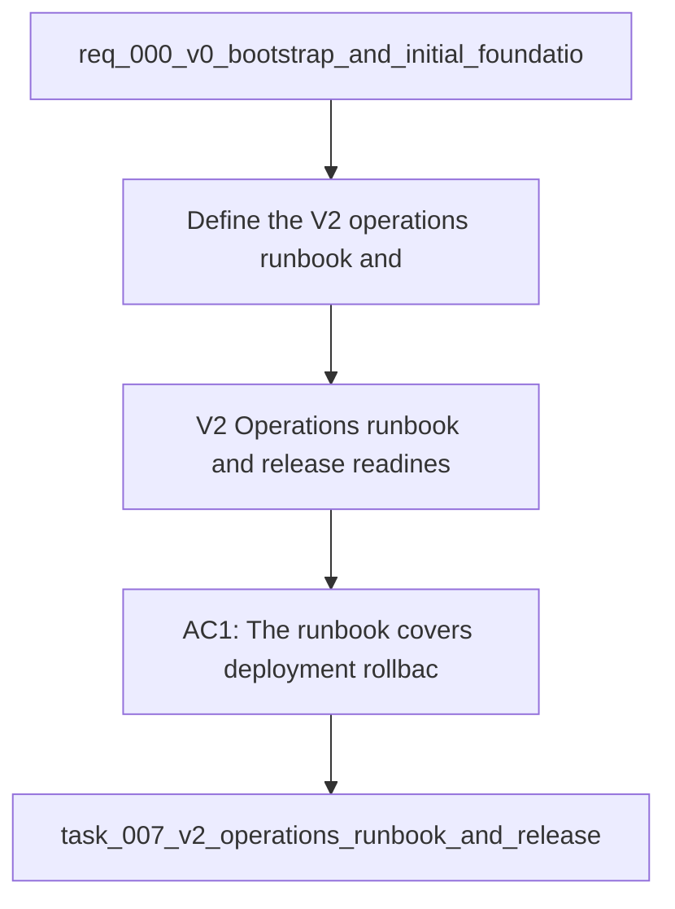

## item_013_v2_operations_runbook_and_release_readiness - V2 — Operations runbook and release readiness
> From version: 1.0.0
> Schema version: 1.0
> Status: Ready
> Understanding: 94%
> Confidence: 90%
> Progress: 0%
> Complexity: Medium
> Theme: General
> Reminder: Update status/understanding/confidence/progress and linked request/task references when you edit this doc.

# Problem
- Define the V2 operations runbook and release readiness slice so the hosted rollout can happen safely.

# Scope
- In: deploy, rollback, disable, and smoke-check guidance for the hosted DeepVault runtime.
- In: release readiness gates for secrets, monitoring, approvals, and incident response.
- In: a bounded checklist that keeps V2 launch work operationally safe.
- Out: unrelated product redesign, Teams UX work, or broad platform re-architecture.

# Acceptance criteria
- AC1: The runbook covers deployment, rollback, disable, and smoke-check paths for V2.
- AC2: The readiness checklist covers secrets, monitoring, and launch approval gates.
- AC3: The slice stays bounded and does not widen into unrelated product or UX work.

# AC Traceability
- AC1 -> Scope: Deploy, rollback, disable, and smoke-check guidance for the hosted DeepVault runtime. Proof: capture validation evidence in this doc.
- AC2 -> Scope: Release readiness gates for secrets, monitoring, approvals, and incident response. Proof: capture validation evidence in this doc.
- AC3 -> Scope: A bounded checklist that keeps V2 launch work operationally safe. Proof: capture validation evidence in this doc.

# Decision framing
- Product framing: Not needed
- Product signals: production readiness, supportability, release safety
- Product follow-up: Keep the hosted production brief aligned with the readiness criteria.
- Architecture framing: Required
- Architecture signals: Azure release process, rollback, secrets, audit boundaries
- Architecture follow-up: Keep the hosted backend and security ADRs aligned with this slice.

# Links
- Product brief(s): `logics/product/prod_002_hosted_production_strategy_with_teams_at_the_end.md`
- Architecture decision(s): `logics/architecture/adr_006_runtime_configuration_and_operations.md`, `logics/architecture/adr_013_hosted_backend_and_teams_chat_channel.md`, `logics/architecture/adr_015_deepvault_security_audit_logging_and_retention_boundaries.md`
- Request: `logics/request/req_000_v0_bootstrap_and_initial_foundations.md`
- Primary task(s): `task_024_v2_operations_runbook_and_release_readiness`

# AI Context
- Summary: V2 operations runbook and release readiness for DeepVault
- Keywords: operations, runbook, release, readiness, rollback, secrets
- Use when: Use when implementing or reviewing the V2 launch readiness slice.
- Skip when: Skip when the change is unrelated to this delivery slice or its linked request.
# Used by
- `logics/tasks/task_024_v2_operations_runbook_and_release_readiness.md`

# Priority
- Impact: High
- Urgency: High

# Notes
- Derived from request `req_000_v0_bootstrap_and_initial_foundations`.
- Source file: `logics/request/req_000_v0_bootstrap_and_initial_foundations.md`.
- Keep this backlog item bounded to the V2 operations slice; keep product and UI work in the sibling product and UI docs.
