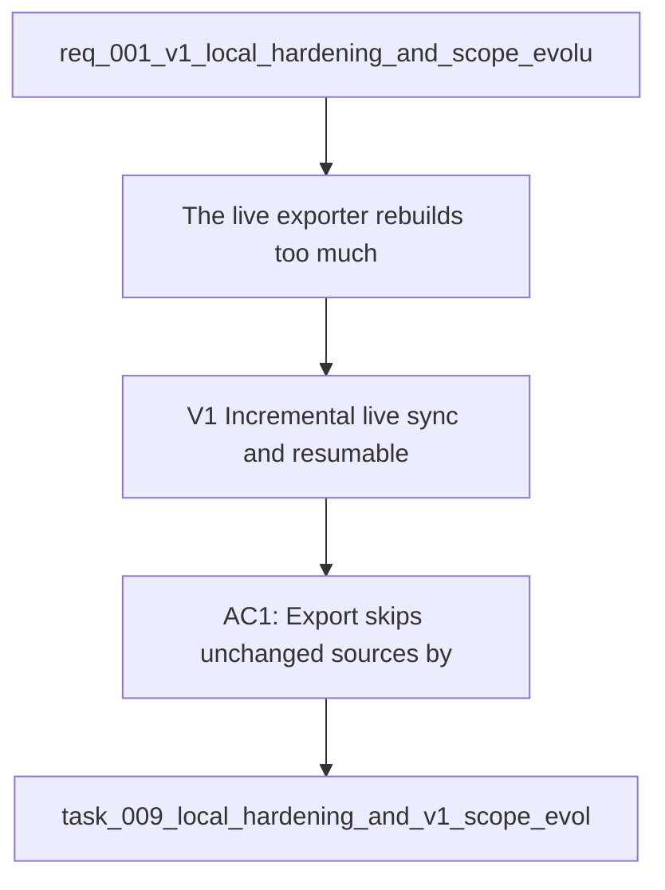

## item_014_v1_incremental_live_sync_and_resumable_export - V1 — Incremental live sync and resumable export
> From version: 1.0.2
> Schema version: 1.0
> Status: Done
> Understanding: 96%
> Confidence: 93%
> Progress: 100%
> Complexity: High
> Theme: Operations
> Reminder: Keep this slice focused on change detection, checkpointing, and resume behavior for the live export path.

# Problem
- The live exporter rebuilds too much on every run.
- Unchanged SharePoint content should not be reparsed when the source has not changed.
- Long live runs need a durable checkpoint so a failed crawl can resume without starting over.
- The current live export path needs to stay compatible with the existing mock and live corpus contract.

# Scope
- In: incremental change detection, checkpoint persistence, and resumable export behavior.
- Out: UI filtering, evaluation quality gates, and doc cleanup, which belong in sibling backlog items.

# Acceptance criteria
- AC1: Export skips unchanged sources by using stable change markers or equivalent checkpoint state.
- AC2: Export can resume after interruption without replaying the entire crawl from scratch.
- AC3: The generated live corpus and sync state remain internally consistent after a resumed run.
- AC4: Mock export mode continues to work so the pipeline can be validated without Graph access.

# AC Traceability
- AC1 -> Scope: Incremental change detection and skip behavior for unchanged sources. Proof: TODO.
- AC2 -> Scope: Resume behavior after interruption through checkpoint persistence. Proof: TODO.
- AC3 -> Scope: Live corpus and sync state consistency after a resumed run. Proof: TODO.
- AC4 -> Scope: Mock export mode preserved for local validation. Proof: TODO.
- AC5 -> TODO: map this acceptance criterion to scope. Proof: TODO.
- AC6 -> TODO: map this acceptance criterion to scope. Proof: TODO.
- AC7 -> TODO: map this acceptance criterion to scope. Proof: TODO.
- AC8 -> TODO: map this acceptance criterion to scope. Proof: TODO.

# Decision framing
- Product framing: Required
- Product signals: freshness, reliability, local validation
- Product follow-up: Keep the local-first strategy current as the export path changes.
- Architecture framing: Required
- Architecture signals: data model and persistence, state and sync
- Architecture follow-up: Keep the sync policy and storage layout decisions current.

# Links
- Product brief(s): `logics/product/prod_001_local_first_development_and_test_strategy.md`
- Architecture decision(s): `logics/architecture/adr_010_sharepoint_sync_orchestration_and_refresh_policy.md`, `logics/architecture/adr_015_deepvault_security_audit_logging_and_retention_boundaries.md`
- Request: `logics/request/req_001_v1_local_hardening_and_scope_evolution.md`
- Primary task(s): `logics/tasks/task_009_local_hardening_and_v1_scope_evolution.md`

# AI Context
- Summary: Incremental live sync and resumable export slice for the DeepVault live corpus pipeline.
- Keywords: incremental sync, checkpoints, resume, live export, delta detection
- Use when: Use when implementing the live export foundation before the UI and eval slices.
- Skip when: Skip when the work is about the explorer UI or evaluation quality gates.

# Priority
- Impact: High
- Urgency: High

# Notes
- Derived from request `req_001_v1_local_hardening_and_scope_evolution`.
- Source file: `logics/request/req_001_v1_local_hardening_and_scope_evolution.md`.
- Keep this backlog item bounded to export and sync behavior only.
- Completed in `logics/tasks/task_009_local_hardening_and_v1_scope_evolution.md`.
