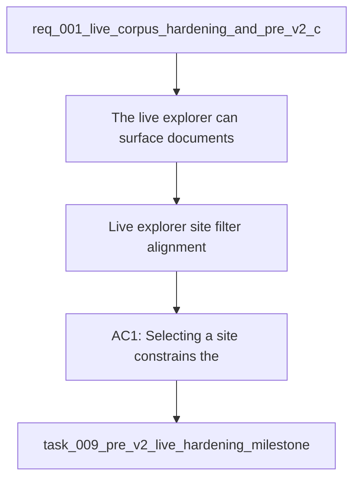

## item_015_v1_live_explorer_site_filter_alignment - V1 — Live explorer site filter alignment
> From version: 1.0.2
> Schema version: 1.0
> Status: Ready
> Understanding: 96%
> Confidence: 93%
> Progress: 0%
> Complexity: Medium
> Theme: UI
> Reminder: Keep the selected site, visible results, and detail pane aligned in the live explorer.

# Problem
- The live explorer can surface documents from a broader scope than the selected site.
- Site selection needs to behave as a real filter, not just a visual chip.
- The filtered view must stay consistent across list, detail, and navigation states.

# Scope
- In: site filter behavior, result alignment, and live explorer consistency.
- Out: live export mechanics, evaluation datasets, and doc cleanup.

# Acceptance criteria
- AC1: Selecting a site constrains the visible document list to that site.
- AC2: The detail pane stays within the selected site scope.
- AC3: The live explorer and mock explorer behave consistently for site filtering.
- AC4: Navigation state and filter state do not diverge during normal use.

# AC Traceability
- AC1 -> Scope: Site selection constrains the visible document list.
- AC2 -> Scope: Detail pane remains within selected site scope.
- AC3 -> Scope: Live and mock explorer behavior remains consistent.
- AC4 -> Scope: Navigation state and filter state remain aligned.

# Decision framing
- Product framing: Required
- Product signals: navigation and discoverability, UX trust
- Product follow-up: Keep the local first product strategy aligned with the explorer experience.
- Architecture framing: Required
- Architecture signals: state and sync, data model and persistence
- Architecture follow-up: Keep the explorer and runtime ADRs aligned with the site scope contract.

# Links
- Product brief(s): `logics/product/prod_001_local_first_development_and_test_strategy.md`
- Architecture decision(s): `logics/architecture/adr_005_explorer_ui_for_sharepoint_navigation.md`, `logics/architecture/adr_012_local_companion_runtime_for_explorer_and_chat.md`
- Request: `logics/request/req_001_v1_local_hardening_and_scope_evolution.md`
- Primary task(s): `logics/tasks/task_009_pre_v2_live_hardening_milestone.md`

# AI Context
- Summary: Live explorer filtering slice for the DeepVault local UI.
- Keywords: explorer, site filter, live corpus, navigation, detail pane
- Use when: Use when fixing the live explorer scope behavior before broader pipeline work.
- Skip when: Skip when the work is about export, evaluation, or doc cleanup.

# Priority
- Impact: High
- Urgency: Medium

# Notes
- Derived from request `req_001_v1_local_hardening_and_scope_evolution`.
- Source file: `logics/request/req_001_v1_local_hardening_and_scope_evolution.md`.
- Keep this backlog item bounded to explorer scope behavior only.
