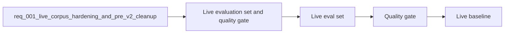

## item_016_live_evaluation_set_and_quality_gate - Live evaluation set and quality gate
> From version: 1.0.0
> Schema version: 1.0
> Status: Ready
> Understanding: 95%
> Confidence: 92%
> Progress: 0%
> Complexity: High
> Theme: Operations
> Reminder: Keep the live quality gate aligned to exported SharePoint content, not just the mock corpus.

# Problem
- The current evaluation flow is not calibrated tightly enough to the live corpus.
- The live path needs a small but meaningful evaluation set with traceable expected sources.
- The pipeline needs a gate that can say whether the live export is usable, not just whether it runs.

# Scope
- In: live evaluation prompts, source expectations, scoring thresholds, and quality gate output.
- Out: export checkpointing, explorer filtering, and doc cleanup.

# Acceptance criteria
- AC1: The evaluation set uses live corpus content and traceable source expectations.
- AC2: The quality gate produces a deterministic pass or fail result for the live corpus.
- AC3: The evaluation output makes it easy to spot source coverage gaps.
- AC4: The live evaluation path remains separate from the mock baseline path.

# AC Traceability
- AC1 -> Scope: Live corpus content and traceable expected sources.
- AC2 -> Scope: Deterministic pass or fail quality gate.
- AC3 -> Scope: Evaluation output exposes coverage gaps.
- AC4 -> Scope: Live evaluation remains distinct from mock baseline.

# Decision framing
- Product framing: Required
- Product signals: answer quality, freshness, trust
- Product follow-up: Keep the local validation strategy aligned with the live quality gate.
- Architecture framing: Required
- Architecture signals: data model and persistence, retrieval ranking and quality
- Architecture follow-up: Keep the retrieval and quality policy ADRs current.

# Links
- Product brief(s): `logics/product/prod_001_local_first_development_and_test_strategy.md`
- Architecture decision(s): `logics/architecture/adr_003_hybrid_knowledge_store_and_retrieval_model.md`, `logics/architecture/adr_014_deepvault_retrieval_ranking_quality_and_cost_policy.md`
- Request: `logics/request/req_001_live_corpus_hardening_and_pre_v2_cleanup.md`
- Primary task(s): `logics/tasks/task_009_pre_v2_live_hardening_milestone.md`

# AI Context
- Summary: Live evaluation set and quality gate slice for the DeepVault live corpus pipeline.
- Keywords: live evaluation, quality gate, baseline, coverage, retrieval quality
- Use when: Use when validating the live corpus with a dedicated evaluation set.
- Skip when: Skip when the work is about crawling or UI filtering.

# Priority
- Impact: High
- Urgency: Medium

# Notes
- Derived from request `req_001_live_corpus_hardening_and_pre_v2_cleanup`.
- Source file: `logics/request/req_001_live_corpus_hardening_and_pre_v2_cleanup.md`.
- Keep this backlog item bounded to evaluation and gating only.
