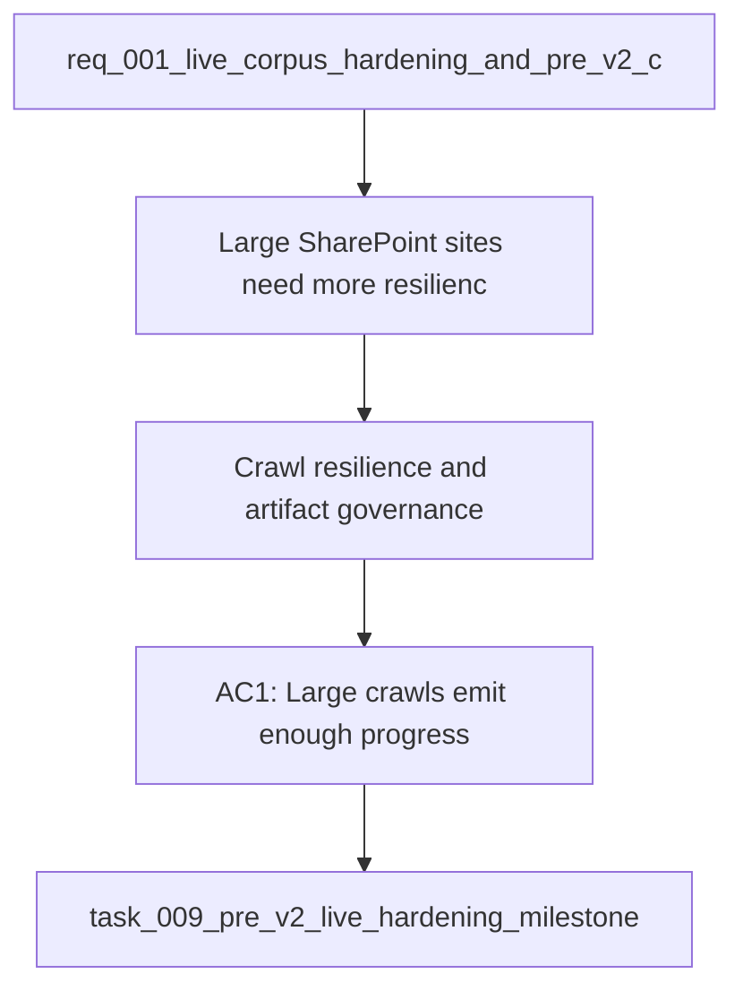

## item_017_v1_crawl_resilience_and_artifact_governance - V1 — Crawl resilience and artifact governance
> From version: 1.0.2
> Schema version: 1.0
> Status: Ready
> Understanding: 96%
> Confidence: 93%
> Progress: 0%
> Complexity: High
> Theme: Operations
> Reminder: Keep large-site crawl behavior observable and keep generated live artifacts governed locally.

# Problem
- Large SharePoint sites need more resilience than a one-shot crawl.
- Progress reporting must stay useful while the crawl iterates through pages and libraries.
- Live artifacts can contain business content and need explicit retention and redaction rules.

# Scope
- In: crawl checkpoints, progress logs, memory guards, and artifact governance for generated outputs.
- Out: explorer filtering and evaluation-set design.

# Acceptance criteria
- AC1: Large crawls emit enough progress information to show where the run is spending time.
- AC2: The crawl can resume from a checkpoint or equivalent durable state after interruption.
- AC3: Large binaries or oversized content do not destabilize the export pipeline.
- AC4: Generated live artifacts follow explicit local retention and redaction rules.

# AC Traceability
- AC1 -> Scope: Progress information for large crawls.
- AC2 -> Scope: Resume from checkpoint or durable state.
- AC3 -> Scope: Oversized content does not destabilize the export pipeline.
- AC4 -> Scope: Generated artifacts follow retention and redaction rules.

# Decision framing
- Product framing: Required
- Product signals: reliability, operational trust, local safety
- Product follow-up: Keep the local validation strategy aligned with crawl observability.
- Architecture framing: Required
- Architecture signals: state and sync, data model and persistence
- Architecture follow-up: Keep the sync policy and storage boundary ADRs current.

# Links
- Product brief(s): `logics/product/prod_001_local_first_development_and_test_strategy.md`
- Architecture decision(s): `logics/architecture/adr_010_sharepoint_sync_orchestration_and_refresh_policy.md`, `logics/architecture/adr_015_deepvault_security_audit_logging_and_retention_boundaries.md`
- Request: `logics/request/req_001_v1_local_hardening_and_scope_evolution.md`
- Primary task(s): `logics/tasks/task_009_pre_v2_live_hardening_milestone.md`

# AI Context
- Summary: Crawl resilience and artifact governance slice for the DeepVault live export path.
- Keywords: crawl resilience, checkpoints, pagination, retention, redaction
- Use when: Use when hardening large live exports and governing the generated artifacts.
- Skip when: Skip when the work is about explorer filtering or evaluation quality.

# Priority
- Impact: High
- Urgency: High

# Notes
- Derived from request `req_001_v1_local_hardening_and_scope_evolution`.
- Source file: `logics/request/req_001_v1_local_hardening_and_scope_evolution.md`.
- Keep this backlog item bounded to crawl resilience and artifact governance only.
