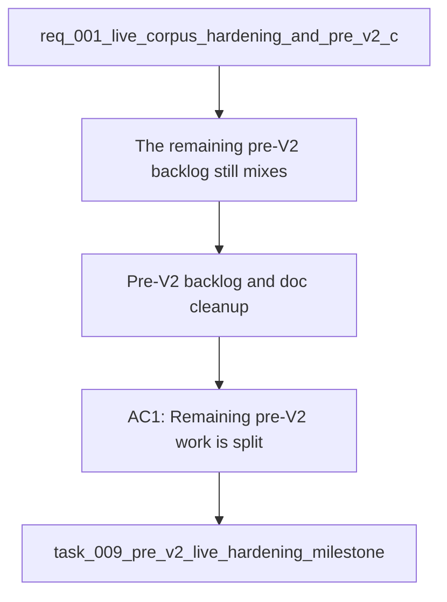

## item_018_v1_pre_v2_backlog_and_doc_cleanup - V1 — Pre-V2 backlog and doc cleanup
> From version: 1.0.2
> Schema version: 1.0
> Status: Ready
> Understanding: 96%
> Confidence: 93%
> Progress: 0%
> Complexity: Medium
> Theme: General
> Reminder: Use this slice to separate the remaining pre-V2 work from hosted backend and Teams delivery.

# Problem
- The remaining pre-V2 backlog still mixes local hardening, live quality, and cleanup concerns.
- The request and related docs need to stay split into smaller, clearer slices before V2 starts.
- The roadmap should make it obvious which work is still pre-V2 and which work belongs to hosted delivery.

# Scope
- In: backlog cleanup, doc framing cleanup, and separation of pre-V2 work from hosted V2 work.
- Out: implementing product features or backend behavior.

# Acceptance criteria
- AC1: Remaining pre-V2 work is split into smaller, clearly bounded backlog items.
- AC2: The request and related docs no longer blur pre-V2 hardening with hosted V2 delivery.
- AC3: The roadmap and supporting views make the pre-V2 versus V2 split obvious.
- AC4: The cleanup work does not introduce new product scope beyond organizational hygiene.

# AC Traceability
- AC1 -> Scope: Smaller, clearly bounded backlog items.
- AC2 -> Scope: Pre-V2 hardening separated from hosted V2 delivery.
- AC3 -> Scope: Roadmap and supporting views show the split clearly.
- AC4 -> Scope: Cleanup stays limited to organizational hygiene.

# Decision framing
- Product framing: Required
- Product signals: roadmap clarity, scope hygiene
- Product follow-up: Keep the local-first strategy aligned with the cleaned backlog structure.
- Architecture framing: Not needed
- Architecture signals: (none detected)
- Architecture follow-up: No new architecture decision is expected from this slice.

# Links
- Product brief(s): `logics/product/prod_001_local_first_development_and_test_strategy.md`
- Architecture decision(s): `logics/architecture/adr_016_deepvault_persistence_and_storage_layout.md`
- Request: `logics/request/req_001_v1_local_hardening_and_scope_evolution.md`
- Primary task(s): `logics/tasks/task_009_pre_v2_live_hardening_milestone.md`

# AI Context
- Summary: Pre-V2 backlog cleanup and doc framing slice for DeepVault.
- Keywords: backlog cleanup, doc hygiene, roadmap, pre-v2, scope split
- Use when: Use when cleaning up the remaining pre-V2 work before hosted delivery.
- Skip when: Skip when the work is product implementation or backend delivery.

# Priority
- Impact: Medium
- Urgency: Medium

# Notes
- Derived from request `req_001_v1_local_hardening_and_scope_evolution`.
- Source file: `logics/request/req_001_v1_local_hardening_and_scope_evolution.md`.
- Keep this backlog item limited to hygiene and routing of remaining work.
