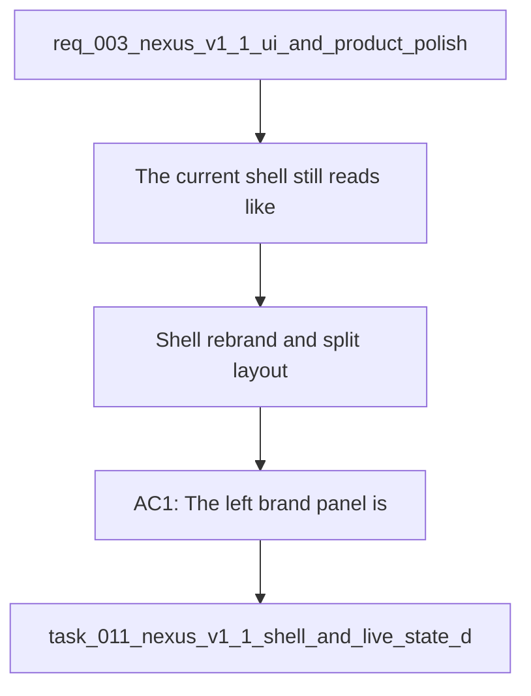

## item_019_shell_rebrand_and_split_layout - Shell rebrand and split layout
> From version: 1.0.0
> Schema version: 1.0
> Status: Done
> Understanding: 96%
> Confidence: 94%
> Progress: 100%
> Complexity: Medium
> Theme: UI
> Reminder: Update status/understanding/confidence/progress and linked request/task references when you edit this doc.

# Problem
- The current shell still reads like an internal validation workspace instead of a polished product surface.
- The shell branding, title, subtitle, and top-level copy need to feel like Nexus rather than a developer dashboard.
- The page layout still behaves like a single long page instead of a split shell with stable navigation.

# Scope
- In: remove the left brand panel, rename the main title to `Nexus`, show the real repo version in the subtitle, rewrite the top-level copy, add the Nexus favicon, and make the left menu fixed while the right content scrolls independently.
- Out: compact live-state panels, hover-only sync details, and live-state color treatment.

# Acceptance criteria
- AC1: The left brand panel is removed from the shell.
- AC2: The main header title is `Nexus`.
- AC3: The subtitle shows the real repository version from `VERSION`.
- AC4: The top-level explanatory copy reads as a more commercial product description.
- AC5: The application favicon is added or replaced with a Nexus-branded icon.
- AC6: The shell uses a split layout with a fixed left menu and an independently scrolling right content area.
- AC7: The shell still feels coherent on desktop and does not lose the core local validation surfaces.

# AC Traceability
- AC1 -> Scope: The left brand panel is removed from the shell. Proof: capture validation evidence in this doc.
- AC2 -> Scope: The main header title is `Nexus`. Proof: capture validation evidence in this doc.
- AC3 -> Scope: The subtitle shows the real repository version from `VERSION`. Proof: capture validation evidence in this doc.
- AC4 -> Scope: The top-level explanatory copy reads as a more commercial product description. Proof: capture validation evidence in this doc.
- AC5 -> Scope: The application favicon is added or replaced with a Nexus-branded icon. Proof: capture validation evidence in this doc.
- AC6 -> Scope: The shell uses a split layout with a fixed left menu and an independently scrolling right content area. Proof: capture validation evidence in this doc.
- AC7 -> Scope: The shell still feels coherent on desktop and does not lose the core local validation surfaces. Proof: capture validation evidence in this doc.
- AC10 -> TODO: map this acceptance criterion to scope. Proof: TODO.
- AC8 -> TODO: map this acceptance criterion to scope. Proof: TODO.
- AC9 -> TODO: map this acceptance criterion to scope. Proof: TODO.

# Decision framing
- Product framing: Consider
- Product signals: navigation and discoverability
- Product follow-up: Keep the product-facing copy aligned with the Nexus shell.
- Architecture framing: Not needed
- Architecture signals: (none detected)
- Architecture follow-up: No architecture decision is expected from this slice.

# Links
- Product brief(s): `logics/product/prod_001_local_first_development_and_test_strategy.md`
- Architecture decision(s): (none yet)
- Request: `logics/request/req_003_nexus_v1_1_ui_and_product_polish.md`
- Primary task(s): `logics/tasks/task_011_nexus_v1_1_shell_and_live_state_delivery.md`

# AI Context
- Summary: V1.1 shell and product polish request for the local Nexus surface.
- Keywords: nexus, v1.1, shell, polish, compact status, commercial copy
- Use when: Use when polishing the local shell and product-facing copy before the next release.
- Skip when: Skip when the work is about backend behavior, sync logic, or non-UI infrastructure.
# References
- `logics/skills/logics-ui-steering/SKILL.md`

# Priority
- Impact: High
- Urgency: Medium

# Notes
- Derived from request `req_003_nexus_v1_1_ui_and_product_polish`.
- Source file: `logics/request/req_003_nexus_v1_1_ui_and_product_polish.md`.
- Keep this backlog item limited to shell branding, title, copy, favicon, and split layout.
- Request context seeded into this backlog item from `logics/request/req_003_nexus_v1_1_ui_and_product_polish.md`.
