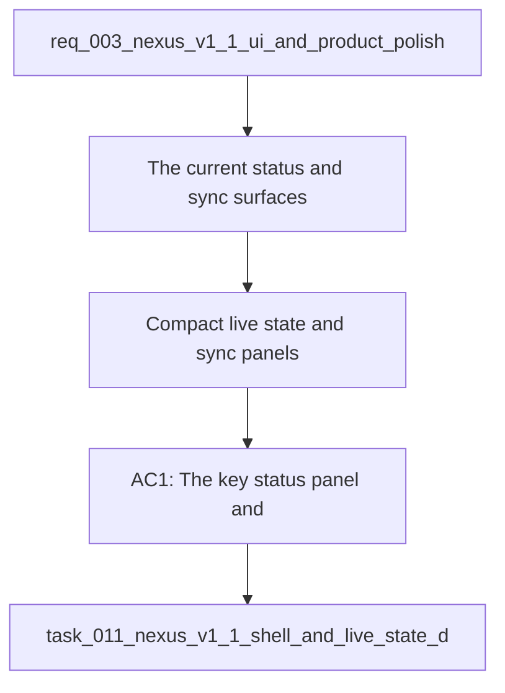

## item_020_compact_live_state_and_sync_panels - Compact live state and sync panels
> From version: 1.0.0
> Schema version: 1.0
> Status: Done
> Understanding: 96%
> Confidence: 94%
> Progress: 100%
> Complexity: Medium
> Theme: UI
> Reminder: Update status/understanding/confidence/progress and linked request/task references when you edit this doc.

# Problem
- The current status and sync surfaces are too tall and too narrative for the available space.
- The live-state badge and hover behavior do not yet make it obvious whether the app is loaded from live data, falling back, or failing.
- The dense operational panels need to keep visibility while reducing inline explanatory text.

# Scope
- In: compact the key status panel, compact the recent sync runs area, make the live state color treatment distinct per state, and expose live corpus details on hover.
- Out: shell branding, title, copy, favicon, and split layout.

# Acceptance criteria
- AC1: The key status panel and recent sync runs area become compact and move supporting descriptions into hover-only affordances.
- AC2: The live state uses a distinct visual color treatment for loaded, fallback, and error states.
- AC3: Hovering the live state surfaces the messages `Live corpus loaded`, `Live corpus missing, fallback to mock`, and `Live corpus error` with detail.
- AC4: The shell still feels coherent on desktop and does not lose the core local validation surfaces.

# AC Traceability
- AC1 -> Scope: The key status panel and recent sync runs area become compact and move supporting descriptions into hover-only affordances. Proof: capture validation evidence in this doc.
- AC2 -> Scope: The live state uses a distinct visual color treatment for loaded, fallback, and error states. Proof: capture validation evidence in this doc.
- AC3 -> Scope: Hovering the live state surfaces the messages `Live corpus loaded`, `Live corpus missing, fallback to mock`, and `Live corpus error` with detail. Proof: capture validation evidence in this doc.
- AC4 -> Scope: The shell still feels coherent on desktop and does not lose the core local validation surfaces. Proof: capture validation evidence in this doc.

# Decision framing
- Product framing: Consider
- Product signals: operational visibility and user trust
- Product follow-up: Keep the hover copy and color cues aligned with the live data story.
- Architecture framing: Not needed
- Architecture signals: (none detected)
- Architecture follow-up: No architecture decision is expected from this slice.

# Links
- Product brief(s): `logics/product/prod_001_local_first_development_and_test_strategy.md`
- Architecture decision(s): (none yet)
- Request: `logics/request/req_003_nexus_v1_1_ui_and_product_polish.md`
- Primary task(s): `logics/tasks/task_011_nexus_v1_1_shell_and_live_state_delivery.md`

# AI Context
- Summary: V1.1 shell and product polish request for the local Nexus surface.
- Keywords: nexus, v1.1, shell, polish, compact status, commercial copy
- Use when: Use when polishing the local shell and product-facing copy before the next release.
- Skip when: Skip when the work is about backend behavior, sync logic, or non-UI infrastructure.
# References
- `logics/skills/logics-ui-steering/SKILL.md`

# Priority
- Impact: High
- Urgency: High

# Notes
- Derived from request `req_003_nexus_v1_1_ui_and_product_polish`.
- Source file: `logics/request/req_003_nexus_v1_1_ui_and_product_polish.md`.
- Keep this backlog item limited to panel density, live-state color, and hover details.
- Request context seeded into this backlog item from `logics/request/req_003_nexus_v1_1_ui_and_product_polish.md`.
