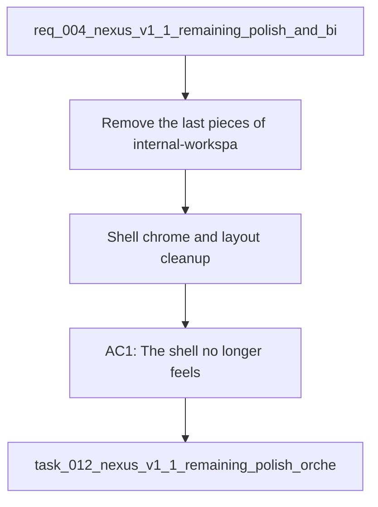

## item_021_shell_chrome_and_layout_cleanup - Shell chrome and layout cleanup
> From version: 1.0.0
> Schema version: 1.0
> Status: Done
> Understanding: 93%
> Confidence: 91%
> Progress: 100%
> Complexity: High
> Theme: UI
> Reminder: Update status/understanding/confidence/progress and linked request/task references when you edit this doc.

# Problem
- Remove the last pieces of internal-workspace framing from the shell so the app reads as Nexus first, not as a validation tool.
- Remove the page subtitle entirely so the page does not show `Version 1.0.0` under the main title.
- Keep the shell split into a fixed left rail and an independently scrolling right content area.
- Remove the left-menu analytics block that currently shows `State`, `visible documents`, and `estimated chunks`.
- Make the top-level product copy feel more commercial and product-facing while still staying grounded in the local validation story.
- Keep the live-state presentation unmistakable by using color and hover detail to explain loaded, fallback, and error states.
- Rename the live state pill from `Live data` to `Live`.
- Reduce the rendered size of the `Last refresh` value so the timestamp fits on one line in the compact status row.
- Tighten the compact status surfaces so the key stats and recent sync runs remain scannable without long inline narrative text.
- Make Bishop feel less instant and more like a grounded assistant flow by adding a clearer thinking or answer-building transition.
- Give Bishop a more natural response pattern with a visible thinking state, a disabled send button while the answer is being built, a short animated delay before the answer appears, and an optional draft to answering to answered progression.
- Preserve provenance and retrieval traceability without making the answer panel feel heavy or overly technical.
- Keep the browser tab identity complete with a Nexus favicon.
- Keep any file or folder path shown in the app concise inline, while revealing the full path on hover.
- - V1 stabilized the core local validation surface, but the current UI still carries a few internal-looking patterns that should be polished before V1.1.
- - The earlier V1.1 request covered the first shell polish slice, so this follow-up request captures the remaining feedback that still needs to land.

# Scope
- In: one coherent delivery slice from the source request.
- Out: unrelated sibling slices that should stay in separate backlog items instead of widening this doc.

# Acceptance criteria
- AC1: The shell no longer feels like an internal validation workspace and instead reads as Nexus.
- AC2: The page subtitle is removed so the page does not show `Version 1.0.0` under the main title.
- AC3: The left rail stays fixed while the right content area scrolls independently.
- AC4: The left menu no longer shows the `State`, `visible documents`, and `estimated chunks` analytics block.
- AC5: The top-level copy feels more commercial and product-facing than the current technical phrasing.
- AC6: The live state uses color and hover text to distinguish loaded, fallback, and error states.
- AC7: The compact status and sync surfaces keep their details discoverable without long inline paragraphs.
- AC8: Bishop includes a visible thinking state, a disabled send button during answer generation, and a short answer-building transition.
- AC9: The live state pill label is shortened to `Live`.
- AC10: The `Last refresh` value fits on one line in the compact status row.
- AC11: The browser tab uses a Nexus favicon.
- AC12: File and folder paths in the app display a concise inline label and reveal the full path on hover.
- AC13: The request is clear enough to be split into backlog items without losing the user intent.

# AC Traceability
- AC1 -> Scope: The shell no longer feels like an internal validation workspace and instead reads as Nexus.. Proof: capture validation evidence in this doc.
- AC2 -> Scope: The page subtitle is removed so the page does not show `Version 1.0.0` under the main title.. Proof: capture validation evidence in this doc.
- AC3 -> Scope: The left rail stays fixed while the right content area scrolls independently.. Proof: capture validation evidence in this doc.
- AC4 -> Scope: The left menu no longer shows the `State`, `visible documents`, and `estimated chunks` analytics block.. Proof: capture validation evidence in this doc.
- AC5 -> Scope: The top-level copy feels more commercial and product-facing than the current technical phrasing.. Proof: capture validation evidence in this doc.
- AC6 -> Scope: The live state uses color and hover text to distinguish loaded, fallback, and error states.. Proof: capture validation evidence in this doc.
- AC7 -> Scope: The compact status and sync surfaces keep their details discoverable without long inline paragraphs.. Proof: capture validation evidence in this doc.
- AC8 -> Scope: Bishop includes a visible thinking state, a disabled send button during answer generation, and a short answer-building transition.. Proof: capture validation evidence in this doc.
- AC9 -> Scope: The live state pill label is shortened to `Live`.. Proof: capture validation evidence in this doc.
- AC10 -> Scope: The `Last refresh` value fits on one line in the compact status row.. Proof: capture validation evidence in this doc.
- AC11 -> Scope: The browser tab uses a Nexus favicon.. Proof: capture validation evidence in this doc.
- AC12 -> Scope: File and folder paths in the app display a concise inline label and reveal the full path on hover.. Proof: capture validation evidence in this doc.
- AC13 -> Scope: The request is clear enough to be split into backlog items without losing the user intent.. Proof: capture validation evidence in this doc.

# Decision framing
- Product framing: Consider
- Product signals: navigation and discoverability
- Product follow-up: Review whether a product brief is needed before scope becomes harder to change.
- Architecture framing: Required
- Architecture signals: data model and persistence, state and sync
- Architecture follow-up: Create or link an architecture decision before irreversible implementation work starts.

# Links
- Product brief(s): (none yet)
- Architecture decision(s): `logics/architecture/adr_018_split_the_app_shell_and_ui_state_boundaries.md`
- Request: `req_004_nexus_v1_1_remaining_polish_and_bishop_ux_follow_up`
- Primary task(s): `task_012_nexus_v1_1_remaining_polish_orchestration`

# AI Context
- Summary: Remaining V1 feedback for the Nexus V1.1 polish pass and Bishop UX follow-up.
- Keywords: nexus, v1.1, polish, shell, live state, bishop, loading, favicon
- Use when: Use when framing the remaining V1 polish work before splitting into backlog items.
- Skip when: Skip when the work is about backend sync behavior, unrelated features, or release work outside V1.1.
# References
- `logics/skills/logics-ui-steering/SKILL.md`

# Priority
- Impact:
- Urgency:

# Notes
- Derived from request `req_004_nexus_v1_1_remaining_polish_and_bishop_ux_follow_up`.
- Source file: `logics/request/req_004_nexus_v1_1_remaining_polish_and_bishop_ux_follow_up.md`.
- Keep this backlog item as one bounded delivery slice; create sibling backlog items for the remaining request coverage instead of widening this doc.
- Request context seeded into this backlog item from `logics/request/req_004_nexus_v1_1_remaining_polish_and_bishop_ux_follow_up.md`.
- Implemented in task `task_012_nexus_v1_1_remaining_polish_orchestration` wave 1.
