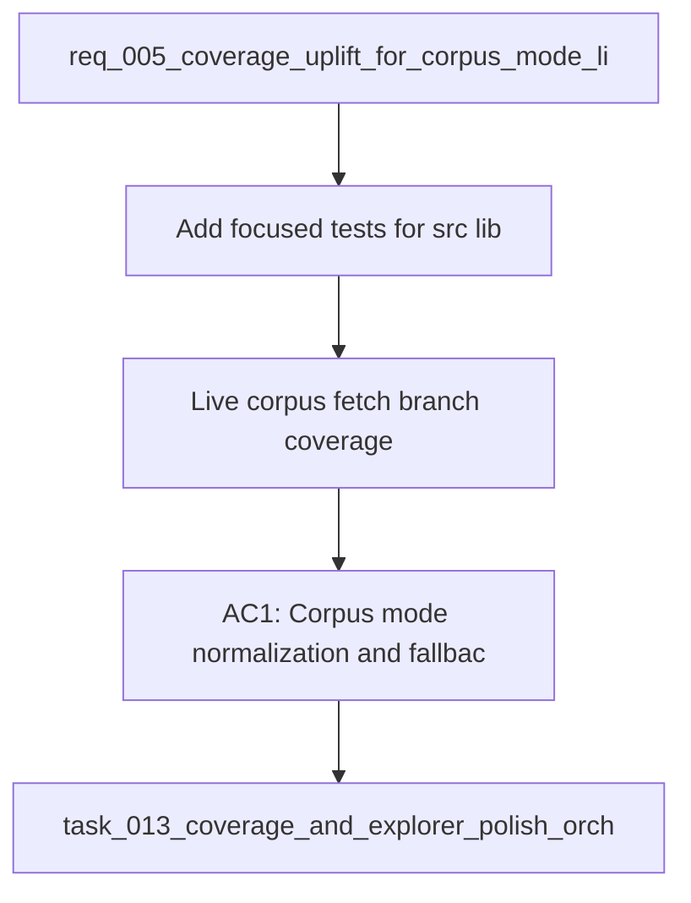

## item_026_live_corpus_fetch_branch_coverage - Live corpus fetch branch coverage
> From version: 1.0.0
> Schema version: 1.0
> Status: Ready
> Understanding: 90%
> Confidence: 90%
> Progress: 0%
> Complexity: Medium
> Theme: General
> Reminder: Update status/understanding/confidence/progress and linked request/task references when you edit this doc.

# Problem
- Add focused tests for `src/lib/corpus-mode.ts` to cover corpus mode normalization and fallback behavior.
- Extend `tests/corpus.spec.ts` so live corpus fetch success, missing corpus, and request error branches are covered.
- Add targeted tests for `src/lib/deepvault.ts` to cover no-answer, permission-boundary, and grounded-answer paths.
- - The current coverage report is already healthy overall, but a few branches and function paths remain under-covered.
- - `src/lib/corpus-mode.ts` is the weakest area for function coverage and should be exercised directly.

# Scope
- In: one coherent delivery slice from the source request.
- Out: unrelated sibling slices that should stay in separate backlog items instead of widening this doc.

# Acceptance criteria
- AC1: Corpus mode normalization and fallback behavior are covered by direct tests.
- AC2: Live corpus fetch success, missing corpus, and request error branches are covered.
- AC3: Deepvault retrieval tests cover no-answer, permission-boundary, and grounded-answer paths.
- AC4: The request is clear enough to split into backlog items without losing the test coverage intent.

# AC Traceability
- AC1 -> Scope: Corpus mode normalization and fallback behavior are covered by direct tests.. Proof: capture validation evidence in this doc.
- AC2 -> Scope: Live corpus fetch success, missing corpus, and request error branches are covered.. Proof: capture validation evidence in this doc.
- AC3 -> Scope: Deepvault retrieval tests cover no-answer, permission-boundary, and grounded-answer paths.. Proof: capture validation evidence in this doc.
- AC4 -> Scope: The request is clear enough to split into backlog items without losing the test coverage intent.. Proof: capture validation evidence in this doc.

# Decision framing
- Product framing: Not needed
- Product signals: (none detected)
- Product follow-up: No product brief follow-up is expected based on current signals.
- Architecture framing: Required
- Architecture signals: data model and persistence, runtime and boundaries, security and identity
- Architecture follow-up: Create or link an architecture decision before irreversible implementation work starts.

# Links
- Product brief(s): (none yet)
- Architecture decision(s): (none yet)
- Request: `req_005_coverage_uplift_for_corpus_mode_live_fetch_and_deepvault_core`
- Primary task(s): `task_013_coverage_and_explorer_polish_orchestration`

# AI Context
- Summary: Coverage uplift request for the corpus mode, live fetch, and deepvault core helpers.
- Keywords: coverage, corpus mode, live fetch, deepvault, tests
- Use when: Use when framing targeted test coverage work for the core data and retrieval helpers.
- Skip when: Skip when the work belongs to UI polish, unrelated features, or release management.
# References
- `logics/skills/logics-ui-steering/SKILL.md`

# Priority
- Impact:
- Urgency:

# Notes
- Derived from request `req_005_coverage_uplift_for_corpus_mode_live_fetch_and_deepvault_core`.
- Source file: `logics/request/req_005_coverage_uplift_for_corpus_mode_live_fetch_and_deepvault_core.md`.
- Keep this backlog item as one bounded delivery slice; create sibling backlog items for the remaining request coverage instead of widening this doc.
- Request context seeded into this backlog item from `logics/request/req_005_coverage_uplift_for_corpus_mode_live_fetch_and_deepvault_core.md`.
