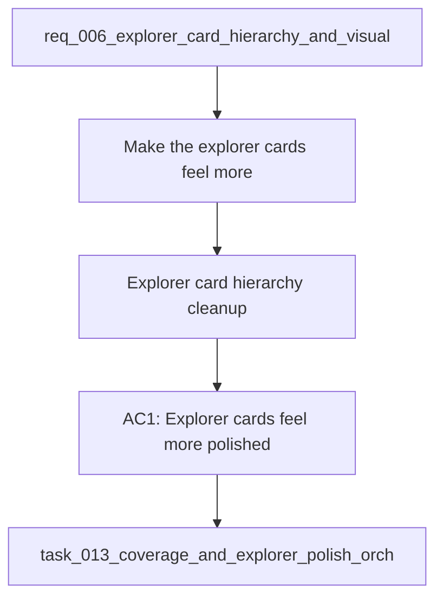

## item_028_explorer_card_hierarchy_cleanup - Explorer card hierarchy cleanup
> From version: 1.0.0
> Schema version: 1.0
> Status: Done
> Understanding: 93%
> Confidence: 90%
> Progress: 100%
> Complexity: Medium
> Theme: UI
> Reminder: Update status/understanding/confidence/progress and linked request/task references when you edit this doc.

# Problem
- Make the explorer cards feel more polished and less like a technical list.
- Reduce the visual weight of the repeated score badge so it supports the card instead of dominating it.
- Tighten the hierarchy inside each card so the title, metadata, and source detail read as a deliberate stack.
- Reduce or restyle the `Source:` line if it is duplicating information already visible in the title.
- Give the list a stronger point of focus per card so the result set feels easier to scan.
- Keep the existing search and selection behavior intact while improving the card presentation.
- - The current explorer cards are functional, but they still feel a bit utilitarian and mechanically repeated.
- - The score badge appears too prominent across every row, which makes the cards feel more like raw results than polished product surfaces.

# Scope
- In: one coherent delivery slice from the source request.
- Out: unrelated sibling slices that should stay in separate backlog items instead of widening this doc.

# Acceptance criteria
- AC1: Explorer cards feel more polished and less like a technical list.
- AC2: The score badge is less visually dominant and supports the card instead of competing with the title.
- AC3: The title, metadata, and source detail read as a deliberate visual hierarchy.
- AC4: The `Source:` line is reduced or restyled so it does not duplicate the title awkwardly.
- AC5: The result list is easier to scan at a glance without changing the underlying explorer behavior.
- AC6: The request is clear enough to be split into backlog items without losing the intended UI refinement.

# AC Traceability
- AC1 -> Scope: Explorer cards feel more polished and less like a technical list.. Proof: capture validation evidence in this doc.
- AC2 -> Scope: The score badge is less visually dominant and supports the card instead of competing with the title.. Proof: capture validation evidence in this doc.
- AC3 -> Scope: The title, metadata, and source detail read as a deliberate visual hierarchy.. Proof: capture validation evidence in this doc.
- AC4 -> Scope: The `Source:` line is reduced or restyled so it does not duplicate the title awkwardly.. Proof: capture validation evidence in this doc.
- AC5 -> Scope: The result list is easier to scan at a glance without changing the underlying explorer behavior.. Proof: capture validation evidence in this doc.
- AC6 -> Scope: The request is clear enough to be split into backlog items without losing the intended UI refinement.. Proof: capture validation evidence in this doc.

# Decision framing
- Product framing: Consider
- Product signals: navigation and discoverability
- Product follow-up: Review whether a product brief is needed before scope becomes harder to change.
- Architecture framing: Required
- Architecture signals: data model and persistence, state and sync
- Architecture follow-up: Create or link an architecture decision before irreversible implementation work starts.

# Links
- Product brief(s): (none yet)
- Architecture decision(s): (none yet)
- Request: `req_006_explorer_card_hierarchy_and_visual_polish`
- Primary task(s): `task_013_coverage_and_explorer_polish_orchestration`

# AI Context
- Summary: Explorer card hierarchy and visual polish for the result list.
- Keywords: explorer, cards, hierarchy, scanability, ui
- Use when: Use when framing a visual refinement pass on the explorer result cards.
- Skip when: Skip when the work targets retrieval logic, sync behavior, or unrelated UI surfaces.
# References
- `logics/skills/logics-ui-steering/SKILL.md`

# Priority
- Impact:
- Urgency:

# Notes
- Derived from request `req_006_explorer_card_hierarchy_and_visual_polish`.
- Source file: `logics/request/req_006_explorer_card_hierarchy_and_visual_polish.md`.
- Keep this backlog item as one bounded delivery slice; create sibling backlog items for the remaining request coverage instead of widening this doc.
- Request context seeded into this backlog item from `logics/request/req_006_explorer_card_hierarchy_and_visual_polish.md`.
- Implemented in task `task_013_coverage_and_explorer_polish_orchestration` wave 2.
