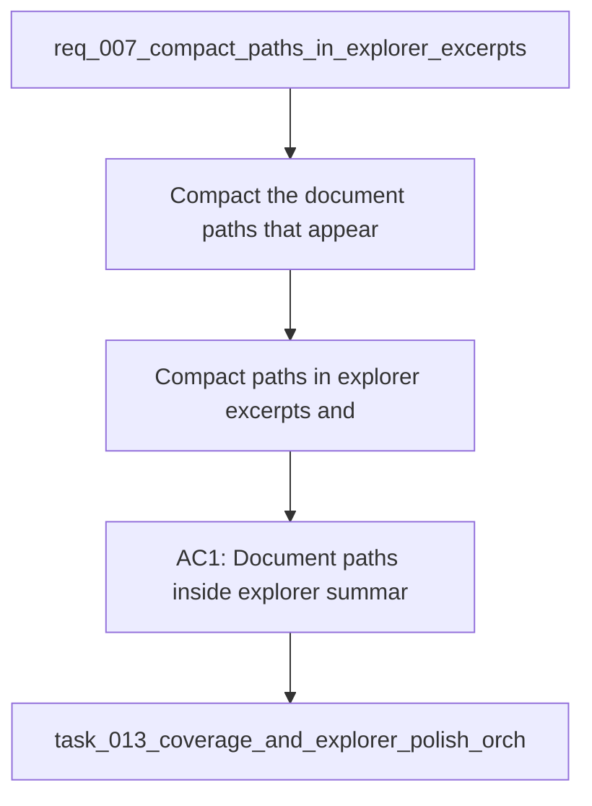

## item_030_compact_paths_in_explorer_excerpts_and_summaries - Compact paths in explorer excerpts and summaries
> From version: 1.0.0
> Schema version: 1.0
> Status: Done
> Understanding: 93%
> Confidence: 90%
> Progress: 100%
> Complexity: Medium
> Theme: UI
> Reminder: Update status/understanding/confidence/progress and linked request/task references when you edit this doc.

# Problem
- Compact the document paths that appear inside explorer summaries and source excerpts so they do not dominate the text.
- Preserve the full path in a hover affordance so users can inspect the original location when needed.
- Keep the explorer summary and source excerpt content readable and grounded rather than visually noisy.
- Apply the same compact-path treatment consistently wherever those raw excerpt strings are rendered in the explorer detail pane.
- Keep the existing document content intact while changing only the visual treatment of the embedded path text.
- - The explorer currently compacted the path labels in cards and traces, but the raw excerpt content still prints full SharePoint-style paths inline.
- - That makes the detail pane feel visually heavier than the rest of the shell, especially for long paths with many nested folders.

# Scope
- In: one coherent delivery slice from the source request.
- Out: unrelated sibling slices that should stay in separate backlog items instead of widening this doc.

# Acceptance criteria
- AC1: Document paths inside explorer summaries and source excerpts are compacted inline.
- AC2: The full path remains available on hover for inspectability.
- AC3: The content stays readable and the explorer detail pane feels less visually noisy.
- AC4: The change is limited to presentation and does not alter the underlying document content.
- AC5: The request is clear enough to be split into backlog items without losing the intended UI refinement.

# AC Traceability
- AC1 -> Scope: Document paths inside explorer summaries and source excerpts are compacted inline.. Proof: capture validation evidence in this doc.
- AC2 -> Scope: The full path remains available on hover for inspectability.. Proof: capture validation evidence in this doc.
- AC3 -> Scope: The content stays readable and the explorer detail pane feels less visually noisy.. Proof: capture validation evidence in this doc.
- AC4 -> Scope: The change is limited to presentation and does not alter the underlying document content.. Proof: capture validation evidence in this doc.
- AC5 -> Scope: The request is clear enough to be split into backlog items without losing the intended UI refinement.. Proof: capture validation evidence in this doc.

# Decision framing
- Product framing: Not needed
- Product signals: (none detected)
- Product follow-up: No product brief follow-up is expected based on current signals.
- Architecture framing: Consider
- Architecture signals: data model and persistence
- Architecture follow-up: Review whether an architecture decision is needed before implementation becomes harder to reverse.

# Links
- Product brief(s): (none yet)
- Architecture decision(s): (none yet)
- Request: `req_007_compact_paths_in_explorer_excerpts_and_summaries`
- Primary task(s): `task_013_coverage_and_explorer_polish_orchestration`

# AI Context
- Summary: Compact path rendering for explorer excerpts and summaries.
- Keywords: explorer, path, excerpts, summaries, hover
- Use when: Use when refining how raw document paths are displayed inside the explorer detail pane.
- Skip when: Skip when the work targets retrieval logic, indexing, or unrelated UI surfaces.
# References
- `logics/skills/logics-ui-steering/SKILL.md`

# Priority
- Impact:
- Urgency:

# Notes
- Derived from request `req_007_compact_paths_in_explorer_excerpts_and_summaries`.
- Source file: `logics/request/req_007_compact_paths_in_explorer_excerpts_and_summaries.md`.
- Keep this backlog item as one bounded delivery slice; create sibling backlog items for the remaining request coverage instead of widening this doc.
- Request context seeded into this backlog item from `logics/request/req_007_compact_paths_in_explorer_excerpts_and_summaries.md`.
