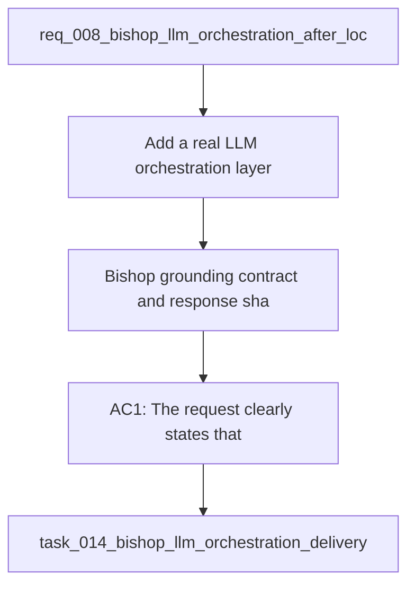

## item_031_bishop_grounding_contract_and_response_shape - Bishop grounding contract and response shape
> From version: 1.0.0
> Schema version: 1.0
> Status: Done
> Understanding: 94%
> Confidence: 92%
> Progress: 100%
> Complexity: Medium
> Theme: General
> Reminder: Update status/understanding/confidence/progress and linked request/task references when you edit this doc.

# Problem
- Add a real LLM orchestration layer for Bishop after local retrieval and permission checks.
- Keep the current local grounding boundary intact so the UI never calls a model directly.
- Preserve a fallback path so Bishop still works when the model layer is unavailable.
- Keep the answer trace, sources, and status states readable for users and testable for the repo.
- - Bishop currently answers with deterministic local synthesis after retrieval.
- - The intended future flow is local grounding first, then a Bishop orchestration layer that calls the model with only grounded context.

# Scope
- In: one coherent delivery slice from the source request.
- Out: unrelated sibling slices that should stay in separate backlog items instead of widening this doc.

# Acceptance criteria
- AC1: The request clearly states that Bishop must ground locally before any LLM call.
- AC2: The request explicitly keeps the UI free of direct model calls.
- AC3: The request captures the fallback requirement when the model layer is unavailable.
- AC4: The request explains that trace, sources, and status must remain visible and testable.
- AC5: The request is clear enough to be split into backlog items without losing the architectural intent.

# AC Traceability
- AC1 -> Scope: The request clearly states that Bishop must ground locally before any LLM call.. Proof: capture validation evidence in this doc.
- AC2 -> Scope: The request explicitly keeps the UI free of direct model calls.. Proof: capture validation evidence in this doc.
- AC3 -> Scope: The request captures the fallback requirement when the model layer is unavailable.. Proof: capture validation evidence in this doc.
- AC4 -> Scope: The request explains that trace, sources, and status must remain visible and testable.. Proof: capture validation evidence in this doc.
- AC5 -> Scope: The request is clear enough to be split into backlog items without losing the architectural intent.. Proof: capture validation evidence in this doc.

# Decision framing
- Product framing: Not needed
- Product signals: (none detected)
- Product follow-up: No product brief follow-up is expected based on current signals.
- Architecture framing: Required
- Architecture signals: data model and persistence, contracts and integration, runtime and boundaries, state and sync, security and identity
- Architecture follow-up: Create or link an architecture decision before irreversible implementation work starts.

# Links
- Product brief(s): (none yet)
- Architecture decision(s): `adr_017_bishop_llm_orchestration_after_local_grounding`
- Request: `req_008_bishop_llm_orchestration_after_local_grounding`
- Primary task(s): `task_014_bishop_llm_orchestration_delivery`

# AI Context
- Summary: Bishop request for a real LLM orchestration layer after local grounding.
- Keywords: bishop, llm, orchestration, grounding, fallback, trace
- Use when: Use when splitting the ADR into executable backlog items.
- Skip when: Skip when the work stays purely in the local retrieval layer or UI polish.
# References
- `logics/skills/logics-ui-steering/SKILL.md`

# Priority
- Impact:
- Urgency:

# Notes
- Derived from request `req_008_bishop_llm_orchestration_after_local_grounding`.
- Source file: `logics/request/req_008_bishop_llm_orchestration_after_local_grounding.md`.
- Keep this backlog item as one bounded delivery slice; create sibling backlog items for the remaining request coverage instead of widening this doc.
- Request context seeded into this backlog item from `logics/request/req_008_bishop_llm_orchestration_after_local_grounding.md`.
