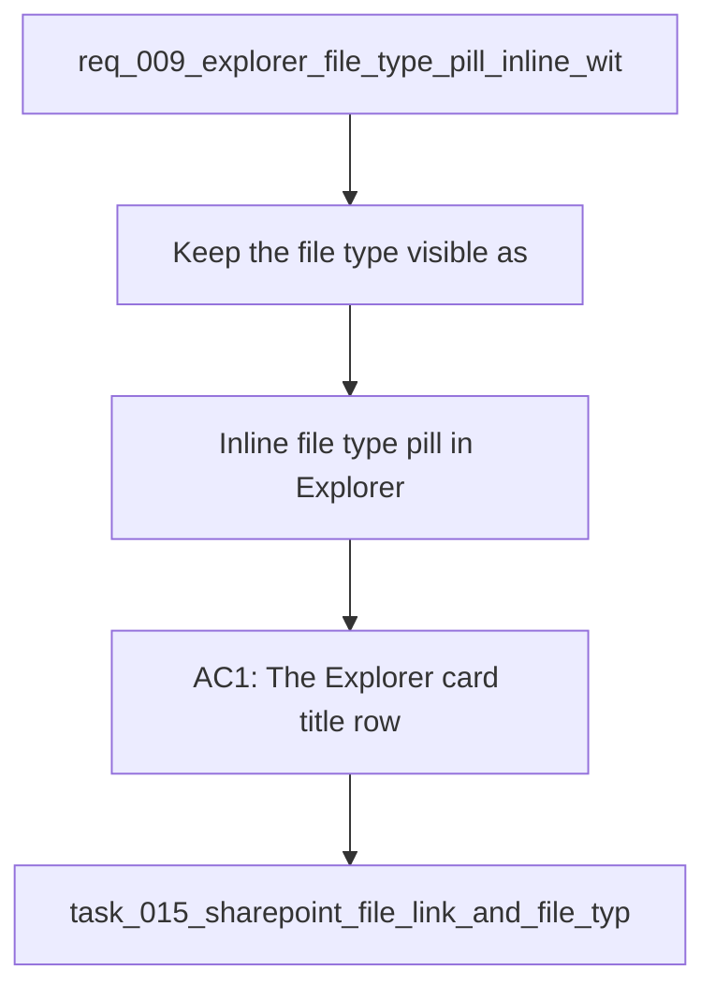

## item_034_inline_file_type_pill_in_explorer_title_row - Inline file type pill in Explorer title row
> From version: 1.0.0
> Schema version: 1.0
> Status: Done
> Understanding: 92%
> Confidence: 90%
> Progress: 100%
> Complexity: Low
> Theme: UI
> Reminder: Update status/understanding/confidence/progress and linked request/task references when you edit this doc.

# Problem
- Keep the file type visible as a compact pill on the same line as the Explorer title.
- Make the title and file type feel like one atomic header row with only a small gap between them.
- Avoid adding a separate metadata line for the file type.
- Preserve the existing title click behavior and file opening behavior.
- Keep the layout compact so the list can scale to more rows without becoming tall.
- - In the current Explorer card layout, the file type sits on its own line and reads like a disconnected label.
- - The desired pattern is a tight title row where the title remains dominant and the file type appears as a small pill adjacent to it.

# Scope
- In: one coherent delivery slice from the source request.
- Out: unrelated sibling slices that should stay in separate backlog items instead of widening this doc.

# Acceptance criteria
- AC1: The Explorer card title row shows the file type as a compact pill on the same line as the title.
- AC2: The spacing between title and file type feels tight and intentional, not like two separate rows.
- AC3: The file type no longer appears as a standalone metadata line.
- AC4: The layout remains compact and readable when many Explorer rows are shown.

# AC Traceability
- AC1 -> Scope: The Explorer card title row shows the file type as a compact pill on the same line as the title.. Proof: capture validation evidence in this doc.
- AC2 -> Scope: The spacing between title and file type feels tight and intentional, not like two separate rows.. Proof: capture validation evidence in this doc.
- AC3 -> Scope: The file type no longer appears as a standalone metadata line.. Proof: capture validation evidence in this doc.
- AC4 -> Scope: The layout remains compact and readable when many Explorer rows are shown.. Proof: capture validation evidence in this doc.

# Decision framing
- Product framing: Not needed
- Product signals: (none detected)
- Product follow-up: No product brief follow-up is expected based on current signals.
- Architecture framing: Consider
- Architecture signals: data model and persistence
- Architecture follow-up: Review whether an architecture decision is needed before implementation becomes harder to reverse.

# Links
- Product brief(s): (none yet)
- Architecture decision(s): (none yet)
- Request: `req_009_explorer_file_type_pill_inline_with_title`
- Primary task(s): `task_015_sharepoint_file_link_and_file_type_ui_delivery`

# AI Context
- Summary: Explorer file type pill inline with document title
- Keywords: explorer, file type, pill, title row, compact, metadata
- Use when: Use when framing scope, context, and acceptance checks for Explorer file type pill inline with document title.
- Skip when: Skip when the work targets another feature, repository, or workflow stage.
# References
- `logics/skills/logics-ui-steering/SKILL.md`

# Priority
- Impact: High
- Urgency: High

# Notes
- Derived from request `req_009_explorer_file_type_pill_inline_with_title`.
- Source file: `logics/request/req_009_explorer_file_type_pill_inline_with_title.md`.
- Keep this backlog item as one bounded delivery slice; create sibling backlog items for the remaining request coverage instead of widening this doc.
- Request context seeded into this backlog item from `logics/request/req_009_explorer_file_type_pill_inline_with_title.md`.
- Completed in wave 1 of `task_015_sharepoint_file_link_and_file_type_ui_delivery`.
