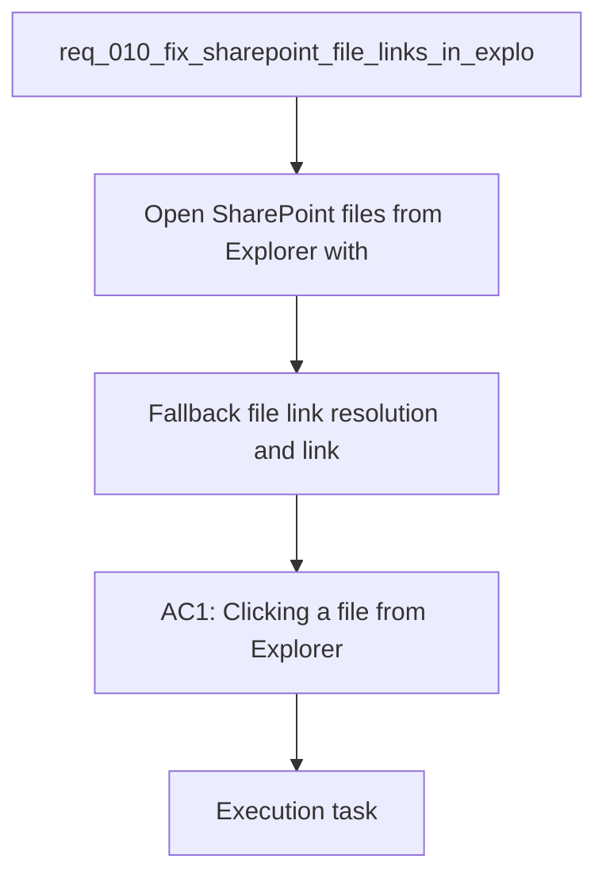

## item_037_fallback_file_link_resolution_and_link_tests - Fallback file link resolution and link tests
> From version: 1.0.0
> Schema version: 1.0
> Status: Done
> Understanding: 94%
> Confidence: 92%
> Progress: 100%
> Complexity: Medium
> Theme: UI
> Reminder: Update status/understanding/confidence/progress and linked request/task references when you edit this doc.

# Problem
- Open SharePoint files from Explorer with the native web page for the file.
- Prefer the canonical `webUrl` when the export provides it.
- Keep a safe fallback path when the corpus does not yet expose a usable file URL.
- Avoid broken reconstructed URLs that can 404 on SharePoint.
- Preserve the current compact path label behavior in the UI.
- - The current Explorer file click behavior needs to open the SharePoint web version of the file.
- - A reconstructed URL based only on site URL and path can point to the wrong location and return a 404.

# Scope
- In: one coherent delivery slice from the source request.
- Out: unrelated sibling slices that should stay in separate backlog items instead of widening this doc.

# Acceptance criteria
- AC1: Clicking a file from Explorer opens the SharePoint web page for that file in a new tab.
- AC2: When the corpus exposes a native file `webUrl`, the UI uses it instead of rebuilding a path-based URL.
- AC3: If no native `webUrl` is available, the UI still falls back to a safe SharePoint URL path.
- AC4: The compact inline path presentation remains intact and does not regress the layout.
- AC5: The fix is covered by UI tests that assert the link behavior.

# AC Traceability
- AC1 -> Scope: Clicking a file from Explorer opens the SharePoint web page for that file in a new tab.. Proof: capture validation evidence in this doc.
- AC2 -> Scope: When the corpus exposes a native file `webUrl`, the UI uses it instead of rebuilding a path-based URL.. Proof: capture validation evidence in this doc.
- AC3 -> Scope: If no native `webUrl` is available, the UI still falls back to a safe SharePoint URL path.. Proof: capture validation evidence in this doc.
- AC4 -> Scope: The compact inline path presentation remains intact and does not regress the layout.. Proof: capture validation evidence in this doc.
- AC5 -> Scope: The fix is covered by UI tests that assert the link behavior.. Proof: capture validation evidence in this doc.

# Decision framing
- Product framing: Consider
- Product signals: navigation and discoverability
- Product follow-up: Review whether a product brief is needed before scope becomes harder to change.
- Architecture framing: Consider
- Architecture signals: data model and persistence
- Architecture follow-up: Review whether an architecture decision is needed before implementation becomes harder to reverse.

# Links
- Product brief(s): (none yet)
- Architecture decision(s): (none yet)
- Request: `req_010_fix_sharepoint_file_links_in_explorer`
- Primary task(s): `task_015_sharepoint_file_link_and_file_type_ui_delivery`

# AI Context
- Summary: Fix SharePoint file links in Explorer
- Keywords: sharepoint, webUrl, explorer, file links, new tab, fallback
- Use when: Use when framing scope, context, and acceptance checks for Fix SharePoint file links in Explorer.
- Skip when: Skip when the work targets another feature, repository, or workflow stage.
# References
- `logics/skills/logics-ui-steering/SKILL.md`

# Priority
- Impact: High
- Urgency: High

# Notes
- Derived from request `req_010_fix_sharepoint_file_links_in_explorer`.
- Source file: `logics/request/req_010_fix_sharepoint_file_links_in_explorer.md`.
- Keep this backlog item as one bounded delivery slice; create sibling backlog items for the remaining request coverage instead of widening this doc.
- Request context seeded into this backlog item from `logics/request/req_010_fix_sharepoint_file_links_in_explorer.md`.
- Completed in wave 2 of `task_015_sharepoint_file_link_and_file_type_ui_delivery`.
