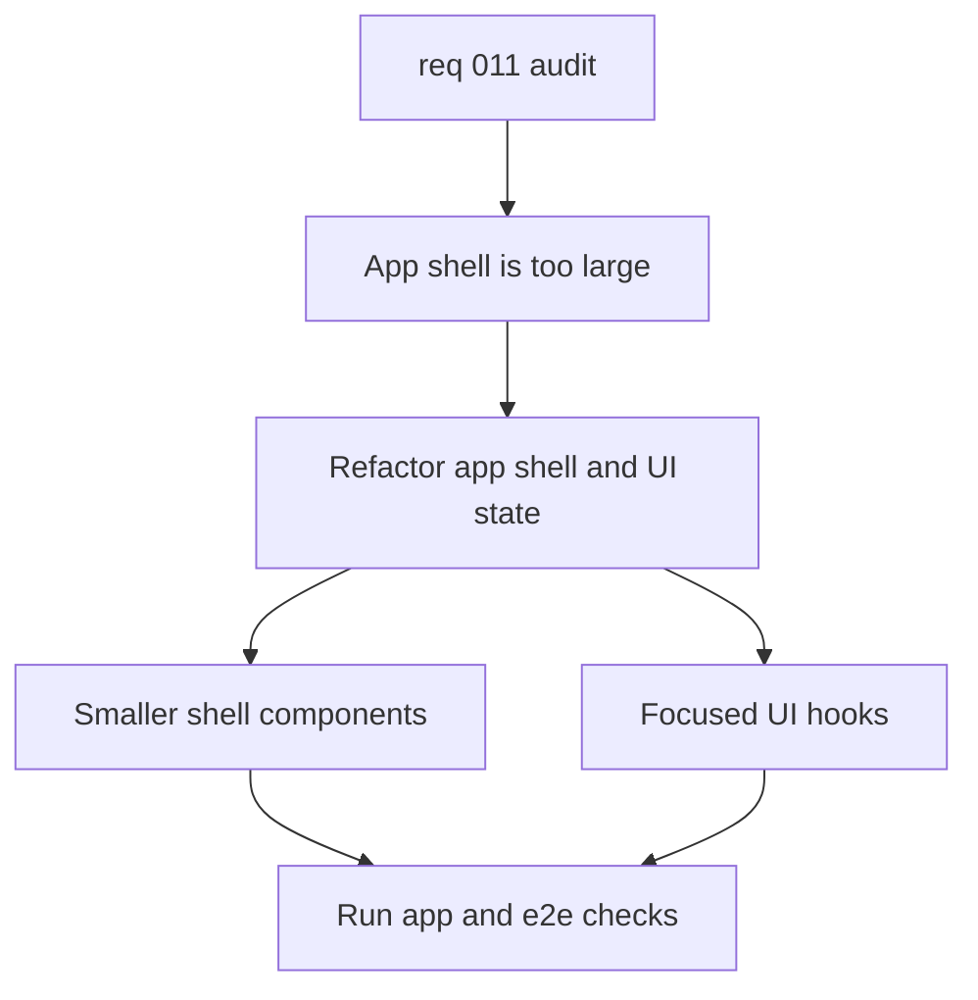

## item_038_refactor_app_shell_and_ui_state - Refactor app shell and UI state
> From version: 1.0.0
> Schema version: 1.0
> Status: Ready
> Understanding: 95%
> Confidence: 90%
> Progress: 0%
> Complexity: High
> Theme: UI
> Reminder: Update status, understanding, confidence, progress, and linked request or task references when you edit this doc.

# Problem
- `src/App.tsx` is too large and mixes application state, live corpus loading, navigation state, and view rendering.
- The current structure makes the shell, explorer, Bishop view, and sync view harder to isolate, test, and evolve independently.
- The current app is healthy functionally, so the goal is maintainability and clearer boundaries rather than a behavior fix.

# Scope
- In: extract the app shell into smaller components and hooks, keep the current behavior, and reduce coupling between loading, selection, and rendering concerns.
- In: preserve the current explorer, Bishop, and sync flows, including existing tests and user-facing text where possible.
- Out: retrieval scoring changes, Bishop contract changes, live export changes, and Logics workflow cleanup.

# Acceptance criteria
- AC1: `src/App.tsx` is decomposed into smaller components or hooks with clearer ownership of state and rendering.
- AC2: Explorer, Bishop, and Sync behaviors remain functionally equivalent from the user perspective.
- AC3: Existing lint, typecheck, unit test, build, and e2e checks still pass after the refactor.
- AC4: The refactor reduces the amount of cross-cutting logic inside the main app entrypoint without changing the product scope.

# AC Traceability
- AC1 -> Scope: extract the app shell into smaller components and hooks, keep the current behavior, and reduce coupling between loading, selection, and rendering concerns. Proof: verify component and hook boundaries in `src/App.tsx` and related files.
- AC2 -> Scope: preserve the current explorer, Bishop, and sync flows, including existing tests and user-facing text where possible. Proof: compare the UI and test coverage before and after.
- AC3 -> Scope: preserve the current explorer, Bishop, and sync flows, including existing tests and user-facing text where possible. Proof: run the standard validation commands listed in the task.
- AC4 -> Scope: extract the app shell into smaller components and hooks, keep the current behavior, and reduce coupling between loading, selection, and rendering concerns. Proof: confirm the entrypoint is thinner and delegated logic moved out.

# Decision framing
- Product framing: Not needed
- Product signals: none
- Product follow-up: No product brief follow-up is expected.
- Architecture framing: Required
- Architecture signals: runtime and boundaries, state and sync, contracts and integration
- Architecture follow-up: Create or link an architecture decision if the refactor changes boundaries or shared state ownership.

# Links
- Product brief(s): (none yet)
- Architecture decision(s): `adr_018_split_the_app_shell_and_ui_state_boundaries`
- Request: `req_011_audit_de_dette_technique_et_cleanup_structurel`
- Primary task(s): `task_016_orchestrate_technical_debt_cleanup_waves`

# AI Context
- Summary: Refactor the DeepVault app shell and UI state management.
- Keywords: app shell, state, hooks, components, explorer, bishop, sync
- Use when: Use when splitting the main React entrypoint into smaller units.
- Skip when: Skip when the work is about retrieval, export, or workflow documentation.

# References
- `src/App.tsx`
- `tests/app.spec.tsx`

# Priority
- Impact: High
- Urgency: High

# Notes
- Derived from request `req_011_audit_de_dette_technique_et_cleanup_structurel`.
- Source file: `logics/request/req_011_audit_de_dette_technique_et_cleanup_structurel.md`.
- Keep this slice narrowly focused on the app shell and UI state; do not absorb retrieval or export work.
