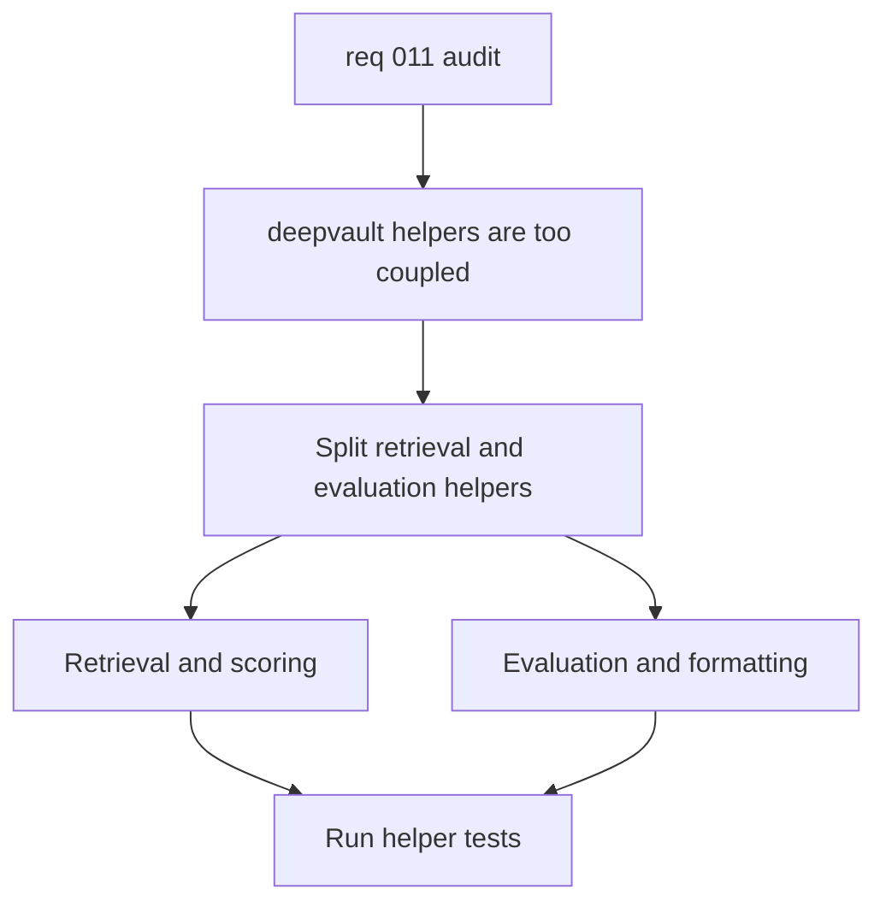

## item_039_split_deepvault_retrieval_and_evaluation_helpers - Split deepvault retrieval and evaluation helpers
> From version: 1.0.0
> Schema version: 1.0
> Status: Ready
> Understanding: 95%
> Confidence: 90%
> Progress: 0%
> Complexity: High
> Theme: Backend
> Reminder: Update status, understanding, confidence, progress, and linked request or task references when you edit this doc.

# Problem
- `src/lib/deepvault.ts` combines text normalization, retrieval scoring, permission-aware grounding, evaluation rows, and formatting in one file.
- The current module structure makes the retrieval logic harder to tune and the evaluation helpers harder to reuse in isolation.
- The public behavior is already stable, so this is a separation and maintainability slice, not a functional rewrite.

# Scope
- In: split the retrieval, scoring, evaluation, and formatting helpers into clearer modules while preserving the current public behavior.
- In: keep the existing tests green and update imports so the app and scripts continue to work without behavioral drift.
- Out: Bishop orchestration contract changes, live export changes, and Logics workflow cleanup.

# Acceptance criteria
- AC1: Retrieval and scoring logic live in a dedicated module or module set, separate from evaluation and formatting helpers.
- AC2: Existing corpus and retrieval behavior remains unchanged from the user point of view.
- AC3: Helper tests continue to pass, and new tests cover the new module boundaries where needed.
- AC4: The code structure makes it easier to reason about retrieval tuning independently from evaluation reporting.

# AC Traceability
- AC1 -> Scope: split the retrieval, scoring, evaluation, and formatting helpers into clearer modules while preserving the current public behavior. Proof: inspect the resulting module boundaries and imports.
- AC2 -> Scope: keep the existing tests green and update imports so the app and scripts continue to work without behavioral drift. Proof: run the relevant test files and the full suite.
- AC3 -> Scope: keep the existing tests green and update imports so the app and scripts continue to work without behavioral drift. Proof: add or update tests for the new module seams.
- AC4 -> Scope: split the retrieval, scoring, evaluation, and formatting helpers into clearer modules while preserving the current public behavior. Proof: verify the new module layout separates responsibilities cleanly.

# Decision framing
- Product framing: Not needed
- Product signals: none
- Product follow-up: No product brief follow-up is expected.
- Architecture framing: Required
- Architecture signals: data model and persistence, contracts and integration, runtime and boundaries
- Architecture follow-up: Create or link an architecture decision if the module split changes shared contracts or ranking policy ownership.

# Links
- Product brief(s): (none yet)
- Architecture decision(s): `adr_019_split_deepvault_retrieval_and_evaluation_helpers`
- Request: `req_011_audit_de_dette_technique_et_cleanup_structurel`
- Primary task(s): `task_016_orchestrate_technical_debt_cleanup_waves`

# AI Context
- Summary: Split the DeepVault retrieval and evaluation helpers into cleaner modules.
- Keywords: retrieval, scoring, evaluation, formatting, deepvault, helpers
- Use when: Use when separating ranking and evaluation concerns into maintainable modules.
- Skip when: Skip when the work is about the React shell, Bishop orchestration, or export scripts.

# References
- `src/lib/deepvault.ts`
- `tests/deepvault.spec.ts`

# Priority
- Impact: High
- Urgency: Medium

# Notes
- Derived from request `req_011_audit_de_dette_technique_et_cleanup_structurel`.
- Source file: `logics/request/req_011_audit_de_dette_technique_et_cleanup_structurel.md`.
- Keep this slice focused on module boundaries and shared helpers, not on UI or export orchestration.
