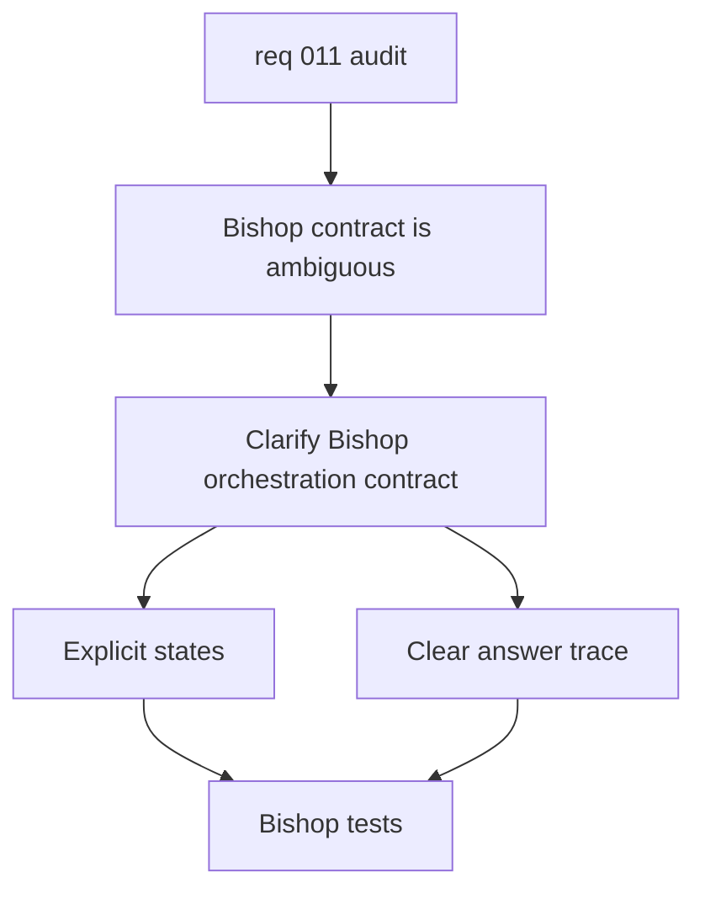

## item_040_clarify_bishop_orchestration_contract - Clarify Bishop orchestration contract
> From version: 1.0.0
> Schema version: 1.0
> Status: Done
> Understanding: 95%
> Confidence: 90%
> Progress: 100%
> Complexity: Medium
> Theme: Backend
> Reminder: Update status, understanding, confidence, progress, and linked request or task references when you edit this doc.

# Problem
- `src/lib/bishop.ts` currently collapses multiple orchestration outcomes into a single flow, which makes traceability and fallback behavior harder to interpret.
- The response contract should make grounded-only, local fallback, and remote orchestration states explicit.
- Better contract clarity will make evaluation traces, UI diagnostics, and future backend integration easier to trust.

# Scope
- In: refine the Bishop orchestration states and response shape so each outcome is explicit and testable.
- In: keep the current local fallback behavior available while making the orchestration mode and status easier to inspect.
- Out: React shell refactors, deepvault module splitting, live export changes, and Logics workflow cleanup.

# Acceptance criteria
- AC1: The Bishop orchestration contract exposes explicit outcome states for grounded-only, fallback, and remote execution.
- AC2: The answer trace in the UI and tests can distinguish those outcomes without guessing from implicit defaults.
- AC3: The current fallback behavior remains functional and is covered by tests.
- AC4: The orchestration payload and response shape are easier to compare in evaluation runs.

# AC Traceability
- AC1 -> Scope: refine the Bishop orchestration states and response shape so each outcome is explicit and testable. Proof: verify the response types and state transitions.
- AC2 -> Scope: refine the Bishop orchestration states and response shape so each outcome is explicit and testable. Proof: inspect the UI trace and orchestration tests.
- AC3 -> Scope: keep the current local fallback behavior available while making the orchestration mode and status easier to inspect. Proof: run the Bishop tests that cover fallback and remote behavior.
- AC4 -> Scope: keep the current local fallback behavior available while making the orchestration mode and status easier to inspect. Proof: compare evaluation payloads before and after the change.

# Decision framing
- Product framing: Not needed
- Product signals: none
- Product follow-up: No product brief follow-up is expected.
- Architecture framing: Required
- Architecture signals: contracts and integration, runtime and boundaries, state and sync, security and identity
- Architecture follow-up: Create or link an architecture decision if the contract change affects shared response semantics or remote integration.

# Links
- Product brief(s): (none yet)
- Architecture decision(s): `adr_020_clarify_bishop_orchestration_states_and_response_contract`
- Request: `req_011_audit_de_dette_technique_et_cleanup_structurel`
- Primary task(s): `task_016_orchestrate_technical_debt_cleanup_waves`

# AI Context
- Summary: Clarify Bishop orchestration states and response contract.
- Keywords: bishop, orchestration, fallback, remote, grounded, trace
- Use when: Use when making Bishop execution outcomes explicit and observable.
- Skip when: Skip when the work targets the React shell or the retrieval module split.

# References
- `src/lib/bishop.ts`
- `tests/bishop.spec.ts`

# Priority
- Impact: High
- Urgency: Medium

# Notes
- Derived from request `req_011_audit_de_dette_technique_et_cleanup_structurel`.
- Source file: `logics/request/req_011_audit_de_dette_technique_et_cleanup_structurel.md`.
- Keep this slice focused on orchestration semantics and traceability, not on UI layout or export scripts.
