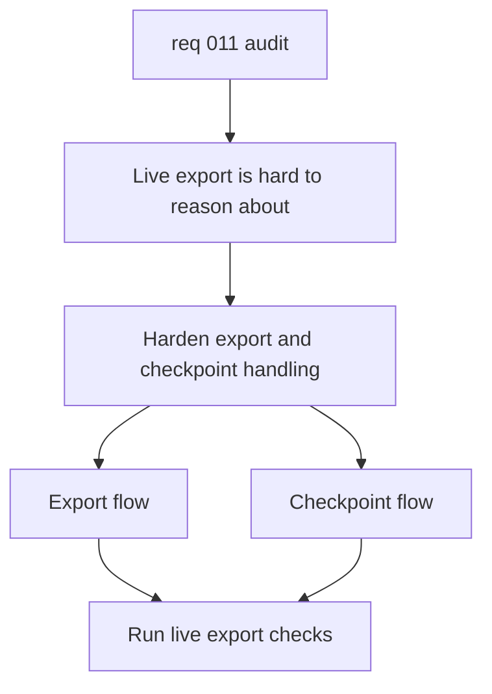

## item_041_harden_live_export_and_checkpoint_handling - Harden live export and checkpoint handling
> From version: 1.0.0
> Schema version: 1.0
> Status: Done
> Understanding: 95%
> Confidence: 90%
> Progress: 100%
> Complexity: High
> Theme: Operations
> Reminder: Update status, understanding, confidence, progress, and linked request or task references when you edit this doc.

# Problem
- `scripts/export-live.ts` and `scripts/deepvault-graph.ts` mix CLI parsing, Graph auth, export execution, checkpointing, and output writing.
- The current flow works, but the control flow is hard to audit when checkpoint resume, partial failure, or env validation changes.
- Hardening this path will make the live corpus workflow safer to run and easier to diagnose.

# Scope
- In: separate the live export orchestration concerns so resume, checkpoint, and failure handling are easier to reason about.
- In: keep mock and live export behaviors working, and preserve the current output shape unless there is a clear reason to change it.
- Out: UI refactors, deepvault module splitting, Bishop contract changes, and Logics workflow cleanup.

# Acceptance criteria
- AC1: The live export flow has clearer boundaries for CLI parsing, auth, export execution, and checkpoint persistence.
- AC2: Resume and partial-failure behavior are explicit and covered by tests or scripted validation.
- AC3: The mock and live export modes continue to produce the expected corpus artifacts.
- AC4: Operational logging or summary output is sufficient to diagnose a failed export run without reading the entire script.

# AC Traceability
- AC1 -> Scope: separate the live export orchestration concerns so resume, checkpoint, and failure handling are easier to reason about. Proof: inspect the refactored modules and call graph.
- AC2 -> Scope: keep mock and live export behaviors working, and preserve the current output shape unless there is a clear reason to change it. Proof: add coverage for resume and failure branches.
- AC3 -> Scope: keep mock and live export behaviors working, and preserve the current output shape unless there is a clear reason to change it. Proof: run the export scripts in mock and live-safe validation modes.
- AC4 -> Scope: separate the live export orchestration concerns so resume, checkpoint, and failure handling are easier to reason about. Proof: verify the logs or summary output expose the needed operational signals.

# Decision framing
- Product framing: Not needed
- Product signals: none
- Product follow-up: No product brief follow-up is expected.
- Architecture framing: Required
- Architecture signals: data model and persistence, contracts and integration, runtime and boundaries, state and sync, security and identity
- Architecture follow-up: Create or link an architecture decision if export persistence, checkpoint format, or auth boundaries change.

# Links
- Product brief(s): (none yet)
- Architecture decision(s): `adr_021_harden_live_export_and_checkpoint_boundaries`
- Request: `req_011_audit_de_dette_technique_et_cleanup_structurel`
- Primary task(s): `task_016_orchestrate_technical_debt_cleanup_waves`

# AI Context
- Summary: Harden the live export and checkpoint workflow for DeepVault Nexus.
- Keywords: live export, checkpoint, resume, graph, operations, export
- Use when: Use when making the live corpus export pipeline safer and more observable.
- Skip when: Skip when the work is about the app shell, retrieval helpers, or Bishop orchestration.

# References
- `scripts/export-live.ts`
- `scripts/deepvault-graph.ts`
- `tests/corpus.spec.ts`

# Priority
- Impact: High
- Urgency: High

# Notes
- Derived from request `req_011_audit_de_dette_technique_et_cleanup_structurel`.
- Source file: `logics/request/req_011_audit_de_dette_technique_et_cleanup_structurel.md`.
- Keep this slice focused on export orchestration and checkpoint resilience.
- Completed with a dedicated runtime-state split in `scripts/live-export-state.ts`, a checkpoint corpus builder, and unit coverage for CLI parsing and checkpoint recovery.
