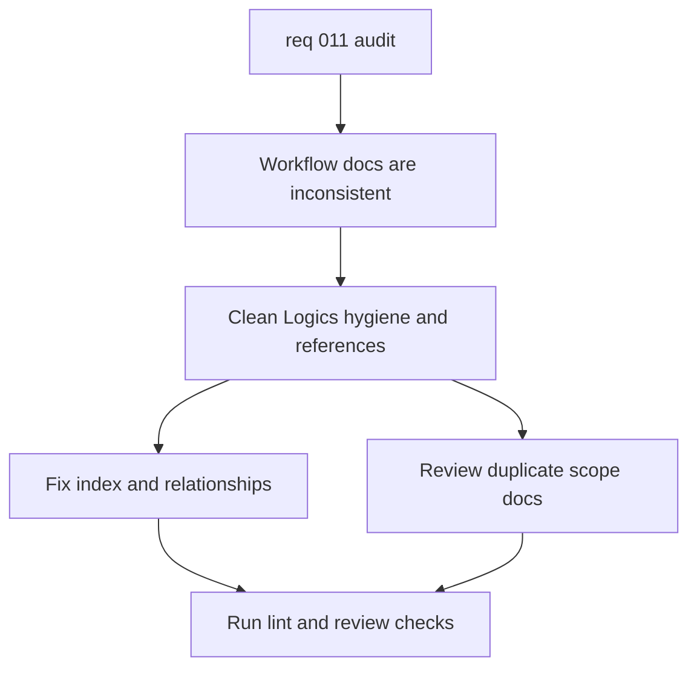

## item_042_clean_logics_workflow_hygiene_and_references - Clean Logics workflow hygiene and references
> From version: 1.0.0
> Schema version: 1.0
> Status: Ready
> Understanding: 96%
> Confidence: 92%
> Progress: 10%
> Complexity: Medium
> Theme: Documentation
> Reminder: Update status, understanding, confidence, progress, and linked request or task references when you edit this doc.

# Problem
- The Logics workflow has stale or malformed references, including the broken `adr_014` row in `logics/INDEX.md`.
- The duplicate detector found several overlapping request, backlog, and ADR pairs that should be reviewed before the workflow expands further.
- The project docs and validation path should stay aligned so the repository remains easy to operate and review.

# Scope
- In: fix index and relationship hygiene, review duplicate-scope docs, and align any conflicting workflow references.
- In: keep request, backlog, task, index, and relationship docs synchronized after the cleanup.
- Out: React refactors, retrieval changes, Bishop contract changes, and live export changes.

# Acceptance criteria
- AC1: `logics/INDEX.md` no longer contains malformed rows or broken labels for the current document set.
- AC2: Strong duplicate candidates are either merged, renamed, or clearly differentiated with documented intent.
- AC3: Request, backlog, and task links remain consistent after the cleanup.
- AC4: The repository validation and workflow guidance stay aligned with the actual commands in use.

# AC Traceability
- AC1 -> Scope: fix index and relationship hygiene, review duplicate-scope docs, and align any conflicting workflow references. Proof: regenerate or repair the index and verify the malformed row is gone.
- AC2 -> Scope: fix index and relationship hygiene, review duplicate-scope docs, and align any conflicting workflow references. Proof: document the resolution for the duplicate candidates.
- AC3 -> Scope: keep request, backlog, task, index, and relationship docs synchronized after the cleanup. Proof: verify cross-links in the affected docs.
- AC4 -> Scope: keep request, backlog, task, index, and relationship docs synchronized after the cleanup. Proof: confirm README and script guidance match the actual validation path.

# Decision framing
- Product framing: Not needed
- Product signals: none
- Product follow-up: No product brief follow-up is expected.
- Architecture framing: Not needed
- Architecture signals: none
- Architecture follow-up: None expected unless a documentation decision reveals a broader workflow change.

# Links
- Product brief(s): (none yet)
- Architecture decision(s): (none yet)
- Request: `req_011_audit_de_dette_technique_et_cleanup_structurel`
- Primary task(s): `task_016_orchestrate_technical_debt_cleanup_waves`

# AI Context
- Summary: Clean up Logics workflow hygiene, references, and duplicate scope docs.
- Keywords: logics, index, relationships, duplicates, hygiene, references
- Use when: Use when repairing workflow metadata and cross-links.
- Skip when: Skip when the work is about product code or runtime behavior.

# References
- `logics/INDEX.md`
- `logics/RELATIONSHIPS.md`
- `README.md`

# Priority
- Impact: Medium
- Urgency: High

# Notes
- Derived from request `req_011_audit_de_dette_technique_et_cleanup_structurel`.
- Source file: `logics/request/req_011_audit_de_dette_technique_et_cleanup_structurel.md`.
- Keep this slice focused on documentation and workflow integrity only.
- Duplicate candidates reviewed in the current audit include:
  - `item_004_v2_teams_bot_chat_and_permissions` and `item_012_v2_teams_bot_channel_and_permissions` as a same-layer naming conflict that should be renamed or merged if work starts.
  - `item_001_v1_sharepoint_ingestion_and_sync_pipeline` and `adr_002_sharepoint_ingestion_and_sync_pipeline` as an expected request-versus-architecture overlap.
  - `item_003_v1_explorer_ui_for_sharepoint_navigation` and `item_008_v1_local_explorer_shell_and_navigation` as related but separable explorer slices.
- The goal is to keep the workflow readable and intentionally differentiated, not to eliminate all semantic overlap across layers.
