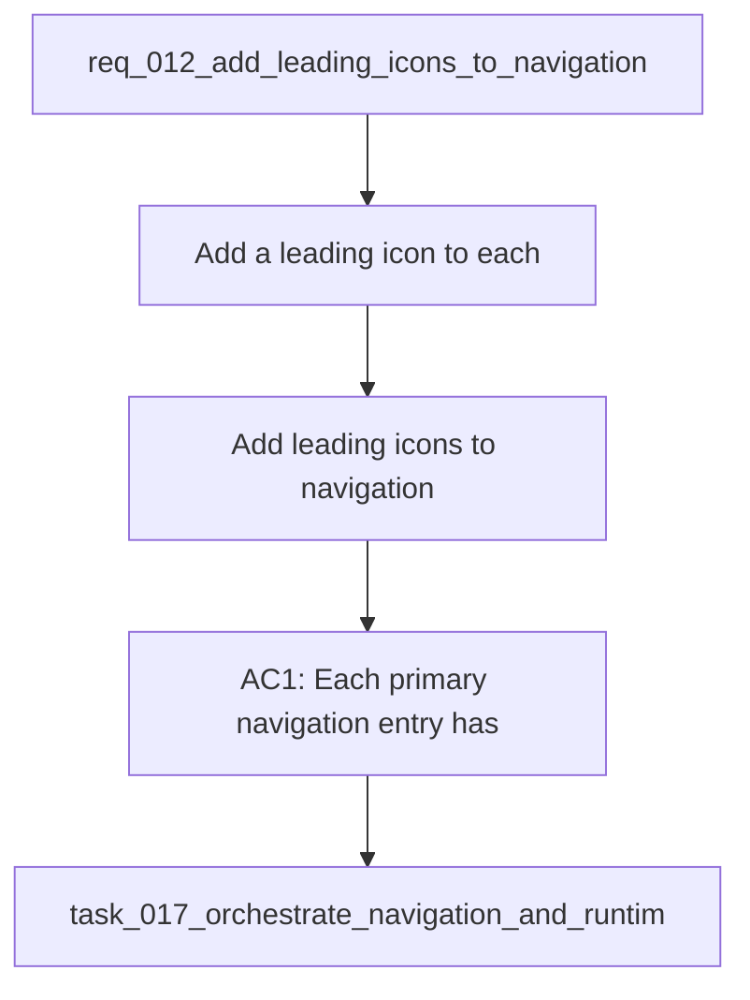

## item_043_add_leading_icons_to_navigation - Add leading icons to navigation
> From version: 1.0.0
> Schema version: 1.0
> Status: Done
> Understanding: 96%
> Confidence: 92%
> Progress: 100%
> Complexity: Medium
> Theme: UI
> Reminder: Update status/understanding/confidence/progress and linked request/task references when you edit this doc.

# Problem
- Add a leading icon to each primary navigation entry in the sidebar so the menu is easier to scan and visually distinct.
- Keep the current navigation structure and labels intact while improving the menu affordance.
- Preserve keyboard accessibility and avoid cluttering the sidebar on smaller screens.
- The sidebar currently shows text-only navigation entries for Explorer, Bishop, and Sync status.
- The new icons should appear before each label and should match the existing visual tone of the app.

# Scope
- In: one coherent delivery slice from the source request.
- Out: unrelated sibling slices that should stay in separate backlog items instead of widening this doc.

# Acceptance criteria
- AC1: Each primary navigation entry has a leading icon.
- AC2: The text labels, tab order, and click behavior remain unchanged.
- AC3: The icons are visually aligned and readable in active and inactive states.
- AC4: The sidebar remains usable on smaller screens without awkward wrapping or overlap.

# AC Traceability
- AC1 -> Scope: Each primary navigation entry has a leading icon.. Proof: capture validation evidence in this doc.
- AC2 -> Scope: The text labels, tab order, and click behavior remain unchanged.. Proof: capture validation evidence in this doc.
- AC3 -> Scope: The icons are visually aligned and readable in active and inactive states.. Proof: capture validation evidence in this doc.
- AC4 -> Scope: The sidebar remains usable on smaller screens without awkward wrapping or overlap.. Proof: capture validation evidence in this doc.

# Decision framing
- Product framing: Required
- Product signals: navigation and discoverability
- Product follow-up: Create or link a product brief before implementation moves deeper into delivery.
- Architecture framing: Required
- Architecture signals: data model and persistence, state and sync
- Architecture follow-up: Create or link an architecture decision before irreversible implementation work starts.

# Links
- Product brief(s): `prod_003_navigation_and_runtime_control_clarity`
- Architecture decision(s): (none yet)
- Request: `req_012_add_leading_icons_to_navigation`
- Primary task(s): `task_017_orchestrate_navigation_and_runtime_ui_changes`

# AI Context
- Summary: Add leading icons to the sidebar navigation entries.
- Keywords: navigation, sidebar, icon, ui, accessibility
- Use when: Use when framing the menu icon refresh for the main navigation.
- Skip when: Skip when the work targets layout, routing, or content changes instead of navigation affordances.
# References
- `logics/skills/logics-ui-steering/SKILL.md`

# Priority
- Impact: Medium
- Urgency: Medium

# Notes
- Derived from request `req_012_add_leading_icons_to_navigation`.
- Source file: `logics/request/req_012_add_leading_icons_to_navigation.md`.
- Keep this backlog item as one bounded delivery slice; create sibling backlog items for the remaining request coverage instead of widening this doc.
- Request context seeded into this backlog item from `logics/request/req_012_add_leading_icons_to_navigation.md`.
- Task `task_017_orchestrate_navigation_and_runtime_ui_changes` was finished via `logics_flow.py finish task` on 2026-04-11.
