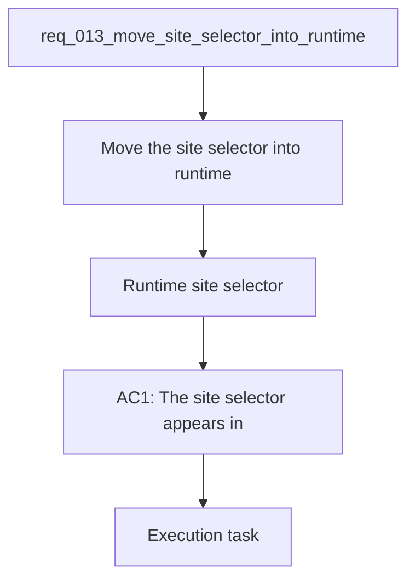

## item_044_move_site_selector_into_runtime - Move site selector into runtime
> From version: 1.0.0
> Schema version: 1.0
> Status: Done
> Understanding: 96%
> Confidence: 92%
> Progress: 100%
> Complexity: Medium
> Theme: UI
> Reminder: Update status/understanding/confidence/progress and linked request/task references when you edit this doc.

# Problem
- Move the site selector into the runtime controls so it behaves like a global execution context rather than an explorer-only filter.
- Make the selected site scope visible and editable alongside role and provider.
- Keep the current corpus behavior stable when no site is selected or when all sites remain active.
- The current sidebar treats site selection like a separate pilot-site filter.
- The runtime controls already group execution-wide parameters such as role and provider.

# Scope
- In: one coherent delivery slice from the source request.
- Out: unrelated sibling slices that should stay in separate backlog items instead of widening this doc.

# Acceptance criteria
- AC1: The site selector appears in the runtime controls next to role and provider.
- AC2: The selected site scope is clearly labeled and remains easy to change.
- AC3: Explorer, Bishop, and sync views use the same active corpus scope.
- AC4: Keyboard navigation and tab order remain usable after the move.
- AC5: The UI still works when all sites are active or when the scope is narrowed to a single site.

# AC Traceability
- AC1 -> Scope: The site selector appears in the runtime controls next to role and provider.. Proof: capture validation evidence in this doc.
- AC2 -> Scope: The selected site scope is clearly labeled and remains easy to change.. Proof: capture validation evidence in this doc.
- AC3 -> Scope: Explorer, Bishop, and sync views use the same active corpus scope.. Proof: capture validation evidence in this doc.
- AC4 -> Scope: Keyboard navigation and tab order remain usable after the move.. Proof: capture validation evidence in this doc.
- AC5 -> Scope: The UI still works when all sites are active or when the scope is narrowed to a single site.. Proof: capture validation evidence in this doc.

# Decision framing
- Product framing: Consider
- Product signals: navigation and discoverability
- Product follow-up: Review whether a product brief is needed before scope becomes harder to change.
- Architecture framing: Required
- Architecture signals: data model and persistence, contracts and integration, state and sync
- Architecture follow-up: Create or link an architecture decision before irreversible implementation work starts.

# Links
- Product brief(s): `prod_003_navigation_and_runtime_control_clarity`
- Architecture decision(s): (none yet)
- Request: `req_013_move_site_selector_into_runtime`
- Primary task(s): `task_017_orchestrate_navigation_and_runtime_ui_changes`

# AI Context
- Summary: Move the site selector into runtime controls.
- Keywords: runtime, site scope, selector, explorer, bishop
- Use when: Use when framing the navigation/runtime context selection change.
- Skip when: Skip when the work only touches explorer-local filtering or unrelated UI controls.
# References
- `logics/skills/logics-ui-steering/SKILL.md`

# Priority
- Impact: High
- Urgency: Medium

# Notes
- Derived from request `req_013_move_site_selector_into_runtime`.
- Source file: `logics/request/req_013_move_site_selector_into_runtime.md`.
- Keep this backlog item as one bounded delivery slice; create sibling backlog items for the remaining request coverage instead of widening this doc.
- Request context seeded into this backlog item from `logics/request/req_013_move_site_selector_into_runtime.md`.
- Task `task_017_orchestrate_navigation_and_runtime_ui_changes` was finished via `logics_flow.py finish task` on 2026-04-11.
