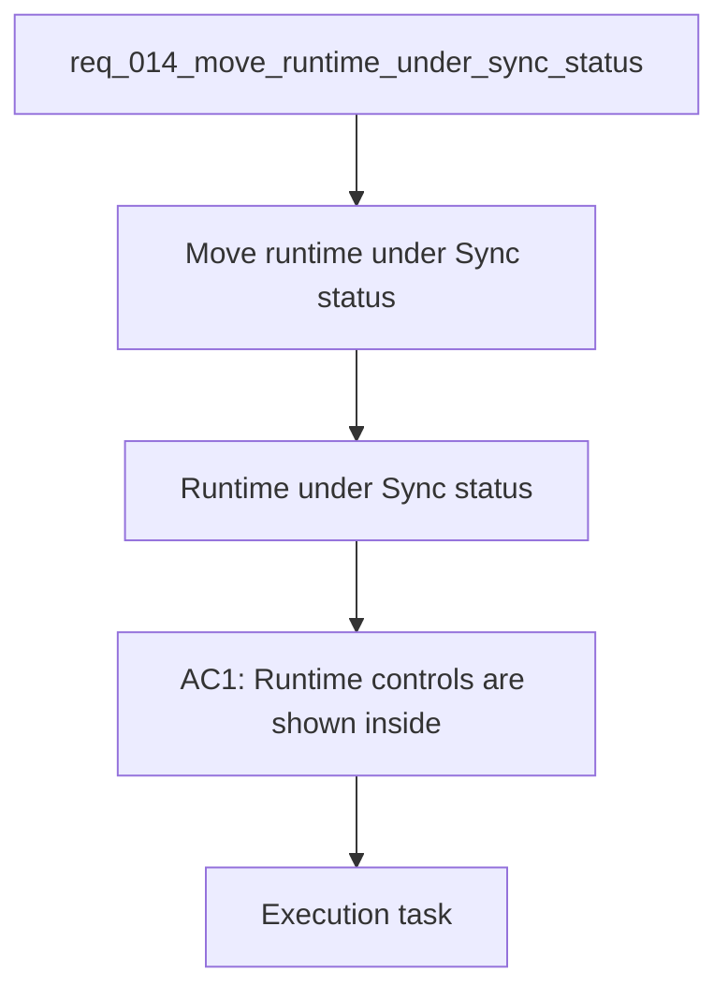

## item_045_move_runtime_under_sync_status - Move runtime under Sync status
> From version: 1.0.0
> Schema version: 1.0
> Status: Done
> Understanding: 96%
> Confidence: 92%
> Progress: 100%
> Complexity: Medium
> Theme: UI
> Reminder: Update status/understanding/confidence/progress and linked request/task references when you edit this doc.

# Problem
- Move the runtime controls into the Sync status page so the execution context lives with the operational state it controls.
- Keep role, provider, and site scope visible together in one place.
- Avoid changing the underlying behavior of the controls or the corpus scope they apply to.
- The current UI treats Runtime like a standalone sidebar section.
- Sync status already groups operational information about corpus state, sync coverage, and refresh history.

# Scope
- In: one coherent delivery slice from the source request.
- Out: unrelated sibling slices that should stay in separate backlog items instead of widening this doc.

# Acceptance criteria
- AC1: Runtime controls are shown inside the Sync status page rather than as a standalone sidebar section.
- AC2: Role, provider, and site scope remain editable in the runtime panel.
- AC3: The active runtime context is clearly visible without changing the existing control behavior.
- AC4: Keyboard navigation and tab order remain usable after the move.
- AC5: The Sync status page still reads well on smaller screens and does not become cluttered.

# AC Traceability
- AC1 -> Scope: Runtime controls are shown inside the Sync status page rather than as a standalone sidebar section.. Proof: capture validation evidence in this doc.
- AC2 -> Scope: Role, provider, and site scope remain editable in the runtime panel.. Proof: capture validation evidence in this doc.
- AC3 -> Scope: The active runtime context is clearly visible without changing the existing control behavior.. Proof: capture validation evidence in this doc.
- AC4 -> Scope: Keyboard navigation and tab order remain usable after the move.. Proof: capture validation evidence in this doc.
- AC5 -> Scope: The Sync status page still reads well on smaller screens and does not become cluttered.. Proof: capture validation evidence in this doc.

# Decision framing
- Product framing: Consider
- Product signals: navigation and discoverability
- Product follow-up: Review whether a product brief is needed before scope becomes harder to change.
- Architecture framing: Required
- Architecture signals: data model and persistence, contracts and integration, state and sync
- Architecture follow-up: Create or link an architecture decision before irreversible implementation work starts.

# Links
- Product brief(s): `prod_003_navigation_and_runtime_control_clarity`
- Architecture decision(s): (none yet)
- Request: `req_014_move_runtime_under_sync_status`
- Primary task(s): `task_017_orchestrate_navigation_and_runtime_ui_changes`

# AI Context
- Summary: Move runtime controls into the Sync status page.
- Keywords: runtime, sync status, site scope, role, provider, ui
- Use when: Use when framing the UI move that groups runtime controls with operational status.
- Skip when: Skip when the work only changes sidebar labels or explorer-local filters.
# References
- `logics/skills/logics-ui-steering/SKILL.md`

# Priority
- Impact: High
- Urgency: Medium

# Notes
- Derived from request `req_014_move_runtime_under_sync_status`.
- Source file: `logics/request/req_014_move_runtime_under_sync_status.md`.
- Keep this backlog item as one bounded delivery slice; create sibling backlog items for the remaining request coverage instead of widening this doc.
- Request context seeded into this backlog item from `logics/request/req_014_move_runtime_under_sync_status.md`.
- Task `task_017_orchestrate_navigation_and_runtime_ui_changes` was finished via `logics_flow.py finish task` on 2026-04-11.
