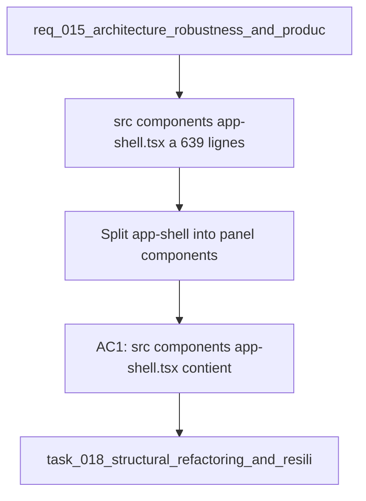

## item_046_split_app_shell_into_panel_components - Split app-shell into panel components
> From version: 1.0.0
> Schema version: 1.0
> Status: Done
> Understanding: 92%
> Confidence: 88%
> Progress: 100%
> Complexity: Medium
> Theme: Architecture
> Reminder: Update status/understanding/confidence/progress and linked request/task references when you edit this doc.

# Problem
- `src/components/app-shell.tsx` à 639 lignes mélange layout, navigation et trois panneaux distincts.
- Le fichier approche la limite soft de 1000 lignes du CONTRIBUTING.md et rend les revues de code coûteuses.
- Les panneaux Explorer, Bishop et Sync sont difficiles à tester en isolation car ils sont inlinés dans le même composant.

# Scope
- In: extraction des panneaux en `src/components/panels/explorer-panel.tsx`, `bishop-panel.tsx`, `sync-panel.tsx` ; app-shell.tsx conserve uniquement le layout et la navigation.
- Out: changements de comportement, de style ou de logique métier dans les panneaux extraits.

# Acceptance criteria
- AC1: `src/components/app-shell.tsx` contient uniquement le layout et la navigation ; aucun JSX de panneau inline.
- AC2: `src/components/panels/explorer-panel.tsx`, `bishop-panel.tsx`, `sync-panel.tsx` existent et exportent leurs composants respectifs.
- AC3: `npm run check` passe sans régression après le refactoring.
- AC4: Les tests de composant existants (`tests/app.spec.tsx`) passent sans modification de logique.

# AC Traceability
- AC1 -> Scope: app-shell.tsx réduit au layout et navigation. Proof: capture validation evidence in this doc.
- AC2 -> Scope: trois fichiers panels/ créés. Proof: capture validation evidence in this doc.
- AC3 -> Scope: npm run check passe. Proof: capture validation evidence in this doc.
- AC4 -> Scope: tests app.spec.tsx inchangés. Proof: capture validation evidence in this doc.

# Decision framing
- Product framing: Not needed
- Architecture framing: Required
- Architecture signals: component boundaries, testability, file size limits
- Architecture follow-up: Valider que les imports entre panels et app-shell ne créent pas de dépendances circulaires.

# Links
- Product brief(s): (none yet)
- Architecture decision(s): `adr_018_split_the_app_shell_and_ui_state_boundaries`
- Request: `req_015_architecture_robustness_and_product_improvements`
- Primary task(s): `task_018_structural_refactoring_and_resilience_foundation`

# AI Context
- Summary: Extraire les panneaux Explorer, Bishop et Sync de app-shell.tsx vers des fichiers dédiés sous src/components/panels/.
- Keywords: refactoring, app-shell, panels, component split, explorer, bishop, sync
- Use when: Use when tackling the app-shell size limit or improving panel testability.
- Skip when: Skip when the work targets styling, business logic, or Bishop orchestration.

# References
- `logics/skills/logics-ui-steering/SKILL.md`

# Used by
- `logics/tasks/task_018_structural_refactoring_and_resilience_foundation.md`

# Priority
- Impact: Medium
- Urgency: Medium

# Notes
- Derived from request `req_015_architecture_robustness_and_product_improvements`.
- Prerequisite for item_048 (Error Boundaries) qui wrappera les composants panels/ une fois extraits.

# Report
- Wave 1 completed: `src/components/app-shell.tsx` no longer inlines the Explorer, Bishop, or Sync panel JSX.
- Wave 1 completed: extracted `src/components/panels/explorer-panel.tsx`, `bishop-panel.tsx`, and `sync-panel.tsx`, plus export helpers for the app shell.
- Validation passed: `rtk npm run test -- tests/app.spec.tsx tests/deepvault-graph.spec.ts tests/live-export-state.spec.ts tests/corpus-loader.spec.ts`
- Validation passed: `rtk npm run typecheck`
- Validation passed: `rtk npm run lint`
- Validation passed: `rtk npm run build`
- Validation passed: `rtk npm run check`
