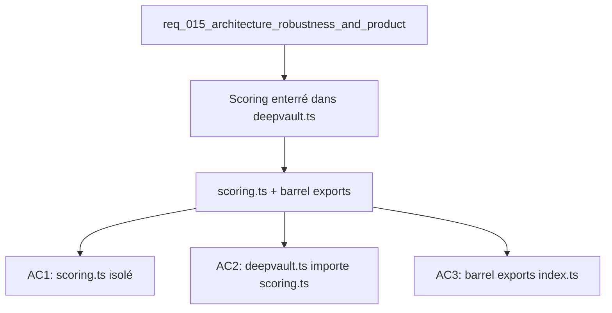

## item_047_extract_scoring_module_and_barrel_exports - Extract scoring module and add barrel exports
> From version: 1.0.0
> Schema version: 1.0
> Status: Ready
> Understanding: 90%
> Confidence: 87%
> Progress: 0%
> Complexity: Low
> Theme: Architecture
> Reminder: Update status/understanding/confidence/progress and linked request/task references when you edit this doc.

# Problem
- Les poids de scoring (title=8, summary=6, content=4, tags=5, path=2) et la logique de tokenisation sont enterrés dans `src/lib/deepvault.ts`.
- Ces paramètres métier ne sont pas testables indépendamment du reste du module de retrieval.
- Les chemins relatifs profonds (`../../lib/deepvault`) sont fragiles lors des refactorings.

# Scope
- In: extraction de la logique de scoring vers `src/lib/scoring.ts` ; ajout de `index.ts` dans `src/lib/`, `src/hooks/`, `src/components/`.
- Out: changement des poids de scoring, modification de l'algorithme de retrieval.

# Acceptance criteria
- AC1: `src/lib/scoring.ts` existe, exporte les poids de scoring et la fonction de calcul de score par champ.
- AC2: `src/lib/deepvault.ts` importe depuis `scoring.ts` sans dupliquer les poids.
- AC3: Un `index.ts` existe dans `src/lib/`, `src/hooks/`, et `src/components/` exposant les exports publics.
- AC4: Les tests de retrieval existants passent sans modification de comportement (`npm run test`).

# AC Traceability
- AC1 -> Scope: scoring.ts isolé. Proof: capture validation evidence in this doc.
- AC2 -> Scope: deepvault.ts importe scoring. Proof: capture validation evidence in this doc.
- AC3 -> Scope: barrel exports créés. Proof: capture validation evidence in this doc.
- AC4 -> Scope: tests passent. Proof: capture validation evidence in this doc.

# Decision framing
- Product framing: Not needed
- Architecture framing: Consider
- Architecture signals: module boundaries, testability
- Architecture follow-up: Vérifier que le barrel export de components/ ne crée pas de cycles avec panels/ (item_046).

# Links
- Product brief(s): (none yet)
- Architecture decision(s): `adr_019_split_deepvault_retrieval_and_evaluation_helpers`
- Request: `req_015_architecture_robustness_and_product_improvements`
- Primary task(s): `task_018_structural_refactoring_and_resilience_foundation`

# AI Context
- Summary: Extraire la logique de scoring de deepvault.ts vers scoring.ts et ajouter des barrel exports par dossier.
- Keywords: scoring, poids, barrel exports, index.ts, deepvault, retrieval, refactoring
- Use when: Use when working on retrieval algorithm changes or reducing import path fragility.
- Skip when: Skip when the work targets UI, Bishop orchestration, or Graph export.

# Used by
- `logics/tasks/task_018_structural_refactoring_and_resilience_foundation.md`

# Priority
- Impact: Low
- Urgency: Low

# Notes
- Derived from request `req_015_architecture_robustness_and_product_improvements`.
- Item_051 (tests scoring) dépend de cet item — extraire scoring.ts d'abord rend les tests unitaires isolés plus naturels.
