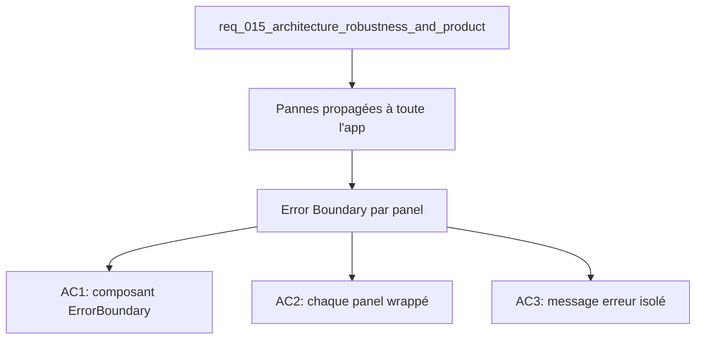

## item_048_react_error_boundaries_for_panels - React Error Boundaries for panels
> From version: 1.0.0
> Schema version: 1.0
> Status: Ready
> Understanding: 93%
> Confidence: 90%
> Progress: 0%
> Complexity: Low
> Theme: Architecture / Quality
> Reminder: Update status/understanding/confidence/progress and linked request/task references when you edit this doc.

# Problem
- Aucun Error Boundary React n'existe dans l'app actuellement.
- Une exception levée dans le rendu de Bishop, Explorer ou Sync plante toute l'application.
- Les utilisateurs voient un écran blanc sans message explicatif ni moyen de récupérer.

# Scope
- In: création d'un composant `<ErrorBoundary>` générique ; wrapping de chaque panel (Explorer, Bishop, Sync) ; message d'erreur isolé par panel.
- Out: gestion des erreurs dans les hooks (useAppModel, useBishopConversation) — cela reste du domaine try/catch.

# Acceptance criteria
- AC1: Un composant `<ErrorBoundary>` générique existe dans `src/components/` avec une prop `fallback` ou un rendu par défaut.
- AC2: Les panneaux Explorer, Bishop et Sync sont chacun wrappés dans un `<ErrorBoundary>` distinct dans app-shell.tsx (ou panels/ si item_046 est réalisé avant).
- AC3: Lorsqu'un panel throw pendant le rendu, les deux autres panels restent fonctionnels et le panel fautif affiche un message d'erreur clair.
- AC4: `npm run check` passe sans régression.

# AC Traceability
- AC1 -> Scope: composant ErrorBoundary créé. Proof: capture validation evidence in this doc.
- AC2 -> Scope: wrapping des trois panels. Proof: capture validation evidence in this doc.
- AC3 -> Scope: isolation des pannes. Proof: capture validation evidence in this doc.
- AC4 -> Scope: npm run check passe. Proof: capture validation evidence in this doc.

# Decision framing
- Product framing: Not needed
- Architecture framing: Consider
- Architecture signals: resilience, component boundaries
- Architecture follow-up: Décider si le fallback Error Boundary doit proposer un bouton "Réessayer" (retry via resetErrorBoundary) ou juste afficher le message.

# Links
- Product brief(s): (none yet)
- Architecture decision(s): (none yet)
- Request: `req_015_architecture_robustness_and_product_improvements`
- Primary task(s): `task_018_structural_refactoring_and_resilience_foundation`

# AI Context
- Summary: Ajouter des Error Boundaries React autour de chaque panel pour isoler les pannes et éviter un écran blanc global.
- Keywords: error boundary, react, resilience, panels, fallback, explorer, bishop, sync
- Use when: Use when hardening the UI against runtime exceptions in panels.
- Skip when: Skip when the work targets hook-level error handling or network failures.

# References
- `logics/skills/logics-ui-steering/SKILL.md`

# Used by
- `logics/tasks/task_018_structural_refactoring_and_resilience_foundation.md`

# Priority
- Impact: High
- Urgency: High

# Notes
- Derived from request `req_015_architecture_robustness_and_product_improvements`.
- Peut être réalisé avant item_046 (split app-shell) — le wrapping se fait dans app-shell.tsx directement si les panels ne sont pas encore extraits.
