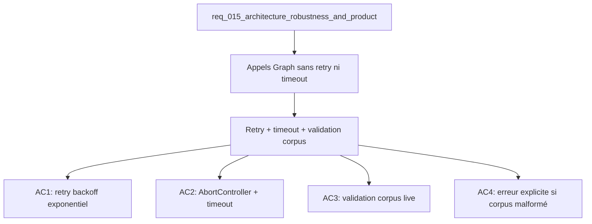

## item_049_graph_api_retry_timeout_and_corpus_validation - Graph API retry, timeout and corpus validation
> From version: 1.0.0
> Schema version: 1.0
> Status: Done
> Understanding: 91%
> Confidence: 87%
> Progress: 100%
> Complexity: Medium
> Theme: Quality / Infrastructure
> Reminder: Update status/understanding/confidence/progress and linked request/task references when you edit this doc.

# Problem
- `scripts/deepvault-graph.ts` fait des appels `fetch()` sans retry ni timeout — un rate limit 429 ou un réseau dégradé peut bloquer l'export indéfiniment.
- Le corpus live est chargé avec un fallback silencieux sur `src/data/corpus.ts` : des données malformées passent sans diagnostic.
- Les erreurs transientes de l'API Graph (429, 503) ne sont pas distinguées des erreurs permanentes.

# Scope
- In: wrapper fetch Graph avec retry (max 3, backoff 1s/2s/4s) et `AbortController` + timeout configurable ; validation de schéma du corpus live au chargement (Zod ou assertions TypeScript).
- Out: changement de la logique de checkpoint, modification du schéma de corpus, retry sur les appels non-Graph.

# Acceptance criteria
- AC1: Tous les appels fetch vers Microsoft Graph passent par un wrapper qui retente jusqu'à 3 fois avec backoff exponentiel (1s, 2s, 4s) sur les codes 429 et 5xx.
- AC2: Chaque appel Graph est protégé par un `AbortController` avec un timeout configurable (défaut : 30s) ; un timeout levé loggue l'URL concernée.
- AC3: Le corpus live est validé au chargement contre un schéma de structure minimale (présence de `documents[]`, champs obligatoires par document).
- AC4: Si la validation échoue, une erreur explicite est levée avec le champ fautif identifié — pas de fallback silencieux vers le mock.
- AC5: `npm run export:live` et `npm run ingest:live` passent avec les wrappers en place (testé en mock réseau ou dry-run).

# AC Traceability
- AC1 -> Scope: retry backoff exponentiel. Proof: capture validation evidence in this doc.
- AC2 -> Scope: AbortController timeout. Proof: capture validation evidence in this doc.
- AC3 -> Scope: validation schéma corpus. Proof: capture validation evidence in this doc.
- AC4 -> Scope: erreur explicite. Proof: capture validation evidence in this doc.
- AC5 -> Scope: scripts livrent avec wrappers. Proof: capture validation evidence in this doc.

# Report
- Wave 1 completed: the corpus loader now rejects malformed payloads with an explicit error, checkpoint corpus reads ignore invalid payloads, and the existing Graph client retry/timeout behavior remains in place.
- Validation passed:
  - `rtk npm run test -- tests/corpus-loader.spec.ts tests/live-export-state.spec.ts tests/corpus.spec.ts`
  - `rtk npm run typecheck`
  - `rtk npm run lint`
  - `rtk npm run build`
  - `rtk npm run ingest:live -- --mode mock`
  - `rtk npm run export:live -- --mode mock --output tmp/export-live-mock.json`

# Decision framing
- Product framing: Not needed
- Architecture framing: Required
- Architecture signals: resilience, contracts and integration, runtime and boundaries
- Architecture follow-up: Décider si Zod est ajouté comme dépendance runtime ou si des assertions TypeScript suffisent pour la validation corpus.

# Links
- Product brief(s): (none yet)
- Architecture decision(s): (none yet)
- Request: `req_015_architecture_robustness_and_product_improvements`
- Primary task(s): `task_019_infrastructure_hardening_graph_and_corpus`

# AI Context
- Summary: Hardening des appels Microsoft Graph avec retry/backoff/timeout et validation de schéma du corpus live au chargement.
- Keywords: graph api, retry, backoff, timeout, abortcontroller, corpus, validation, zod, resilience
- Use when: Use when working on live export reliability or corpus loading robustness.
- Skip when: Skip when the work targets UI components or mock corpus data.

# Used by
- `logics/tasks/task_019_infrastructure_hardening_graph_and_corpus.md`

# Priority
- Impact: High
- Urgency: Medium

# Notes
- Derived from request `req_015_architecture_robustness_and_product_improvements`.
- Décision Zod vs assertions TypeScript à documenter dans un ADR avant implémentation.
