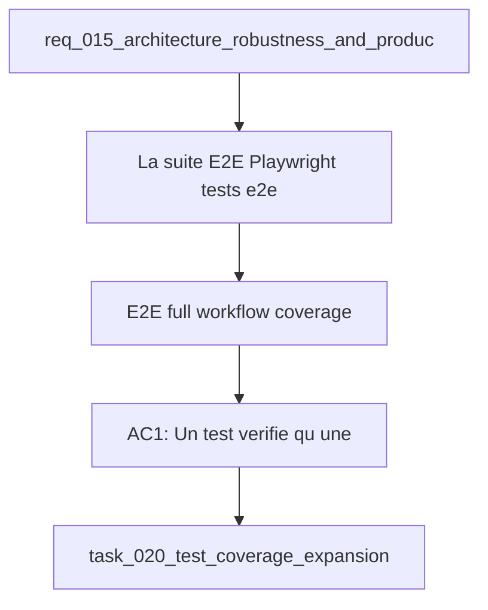

## item_050_e2e_full_workflow_coverage - E2E full workflow coverage
> From version: 1.0.0
> Schema version: 1.0
> Status: Done
> Understanding: 89%
> Confidence: 85%
> Progress: 100%
> Complexity: Medium
> Theme: Quality
> Reminder: Update status/understanding/confidence/progress and linked request/task references when you edit this doc.

# Problem
- La suite E2E Playwright (`tests/e2e/smoke.spec.ts`) se limite à un smoke test de chargement.
- Les parcours critiques (recherche vide, sources restreintes, changement de rôle, switch mock↔live) ne sont pas couverts.
- Une régression sur ces parcours peut passer en CI sans être détectée.

# Scope
- In: nouveaux scénarios Playwright dans `tests/e2e/` couvrant les 4 parcours prioritaires ; pas de modification du code applicatif.
- Out: tests unitaires (couverts par item_051), tests de performance, tests visuels (screenshot diff).

# Acceptance criteria
- AC1: Un test vérifie qu'une recherche avec un terme sans résultat affiche un état "aucun résultat" sans erreur JS.
- AC2: Un test avec le rôle `guest` vérifie que les sources restricted n'apparaissent pas dans les résultats Bishop.
- AC3: Un test change le rôle de `guest` à `admin` et vérifie que le nombre de sources visibles augmente.
- AC4: Un test switch le corpus de mock à live (si disponible) et back, vérifiant que l'UI reflète le changement de mode.
- AC5: `npm run e2e` passe avec les nouveaux tests inclus sans timeout excessif (< 30s par test).

# AC Traceability
- AC1 -> Scope: recherche 0 résultats. Proof: capture validation evidence in this doc.
- AC2 -> Scope: sources restricted en guest. Proof: capture validation evidence in this doc.
- AC3 -> Scope: changement rôle guest → admin. Proof: capture validation evidence in this doc.
- AC4 -> Scope: switch mock↔live. Proof: capture validation evidence in this doc.
- AC5 -> Scope: e2e passe sous 30s/test. Proof: capture validation evidence in this doc.

# Decision framing
- Product framing: Not needed
- Architecture framing: Not needed
- Architecture follow-up: Vérifier que le switch mock↔live en test ne nécessite pas un corpus live réel (peut être simulé via fixture).

# Links
- Product brief(s): (none yet)
- Architecture decision(s): (none yet)
- Request: `req_015_architecture_robustness_and_product_improvements`
- Primary task(s): `task_020_test_coverage_expansion`

# AI Context
- Summary: Étendre la suite E2E Playwright avec des parcours fonctionnels complets : recherche vide, restriction de rôle, changement de rôle, switch corpus.
- Keywords: playwright, e2e, tests, workflow, role, corpus, mock, live, bishop, explorer
- Use when: Use when improving regression coverage for critical user workflows.
- Skip when: Skip when the work targets unit tests or library-level logic.

# Used by
- `logics/tasks/task_020_test_coverage_expansion.md`

# Priority
- Impact: High
- Urgency: Medium

# Notes
- Derived from request `req_015_architecture_robustness_and_product_improvements`.
- AC4 (switch mock↔live) peut nécessiter une fixture de corpus live minimal — à clarifier avant implémentation.

# Report
- Item completed: added Playwright coverage for empty search results, guest-restricted Bishop output, role changes from guest to admin, and live-mode badge verification.
- Validation passed: `rtk npm run e2e` and `VITE_DEEPVAULT_DATA_MODE=live rtk npm run e2e -- tests/e2e/live-mode.spec.ts`.
