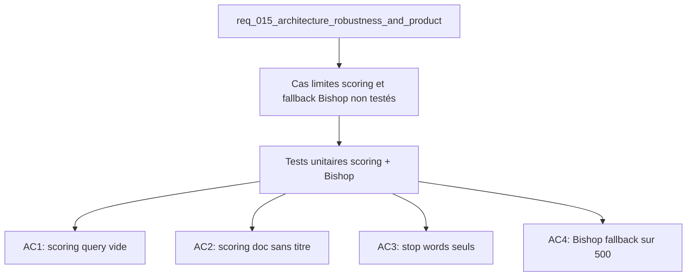

## item_051_unit_tests_scoring_and_bishop_contract - Unit tests for scoring and Bishop fallback contract
> From version: 1.0.0
> Schema version: 1.0
> Status: Ready
> Understanding: 90%
> Confidence: 88%
> Progress: 0%
> Complexity: Low
> Theme: Quality
> Reminder: Update status/understanding/confidence/progress and linked request/task references when you edit this doc.

# Problem
- La logique de scoring (poids par champ, tokenisation) n'a pas de tests dédiés pour les cas limites : query vide, document sans titre, stop words seuls.
- Le fallback local de Bishop quand le remote endpoint renvoie une 500 n'est pas couvert par des tests.
- Ces lacunes laissent des régressions silencieuses possibles lors de changements dans deepvault.ts ou bishop.ts.

# Scope
- In: nouveaux tests unitaires Vitest pour la logique de scoring (cas limites) et le contrat de fallback Bishop (remote 500) ; dans les fichiers spec existants ou nouveaux fichiers dédiés.
- Out: tests E2E (item_050), tests de composant, changements du code applicatif.

# Acceptance criteria
- AC1: Un test vérifie que scorer une query vide (`""`) retourne un score 0 sans exception.
- AC2: Un test vérifie que scorer un document sans champ `title` (ou `title: ""`) ne crashe pas et retourne un score basé sur les autres champs.
- AC3: Un test vérifie qu'une query composée uniquement de stop words retourne 0 résultats ou résultats à score 0.
- AC4: Un test Bishop simule un remote endpoint qui retourne 500 et vérifie que le fallback local est activé avec un résultat valide.
- AC5: `npm run test:coverage` maintient les seuils (90% lignes, 85% branches) après ajout des tests.

# AC Traceability
- AC1 -> Scope: scoring query vide. Proof: capture validation evidence in this doc.
- AC2 -> Scope: scoring doc sans titre. Proof: capture validation evidence in this doc.
- AC3 -> Scope: stop words seuls. Proof: capture validation evidence in this doc.
- AC4 -> Scope: Bishop fallback 500. Proof: capture validation evidence in this doc.
- AC5 -> Scope: seuils coverage maintenus. Proof: capture validation evidence in this doc.

# Decision framing
- Product framing: Not needed
- Architecture framing: Not needed
- Architecture follow-up: Si item_047 (extraction scoring.ts) est fait avant, placer les tests dans `tests/scoring.spec.ts`.

# Links
- Product brief(s): (none yet)
- Architecture decision(s): (none yet)
- Request: `req_015_architecture_robustness_and_product_improvements`
- Primary task(s): `task_020_test_coverage_expansion`

# AI Context
- Summary: Tests unitaires pour les cas limites du scoring (query vide, doc sans titre, stop words) et le contrat de fallback Bishop sur erreur remote 500.
- Keywords: vitest, unit tests, scoring, bishop, fallback, stop words, coverage, deepvault
- Use when: Use when improving test coverage for retrieval edge cases or Bishop resilience.
- Skip when: Skip when the work targets E2E flows or UI components.

# Used by
- `logics/tasks/task_020_test_coverage_expansion.md`

# Priority
- Impact: Medium
- Urgency: Low

# Notes
- Derived from request `req_015_architecture_robustness_and_product_improvements`.
- Idéalement réalisé après item_047 (scoring.ts extrait) pour des tests mieux isolés.
