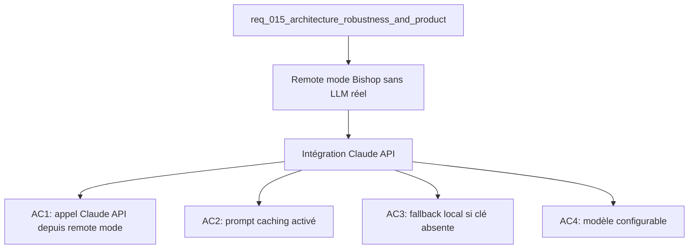

## item_052_bishop_claude_api_integration - Bishop Claude API integration
> From version: 1.0.0
> Schema version: 1.0
> Status: Ready
> Understanding: 88%
> Confidence: 82%
> Progress: 0%
> Complexity: High
> Theme: Product / Architecture
> Reminder: Update status/understanding/confidence/progress and linked request/task references when you edit this doc.

# Problem
- Bishop remote mode est architecturalement prêt (orchestration layer + fallback local) mais ne branche pas encore de vrai provider LLM.
- Les réponses Bishop sont aujourd'hui déterministes et locales — pas de génération de langage naturel.
- L'orchestration layer dans `src/lib/bishop.ts` attend un endpoint remote mais aucun n'est branché.

# Scope
- In: intégration `@anthropic-ai/sdk` sur le remote mode Bishop ; prompt caching activé ; fallback local si `ANTHROPIC_API_KEY` absent ; modèle configurable via env.
- Out: changement du grounding local (retrieval reste local), UI Bishop (pas de nouveau composant), intégration d'autres providers LLM.

# Acceptance criteria
- AC1: Le remote mode Bishop appelle `@anthropic-ai/sdk` avec le contexte groundé (documents + query) et retourne une réponse textuelle.
- AC2: Le prompt caching est activé via les headers `anthropic-beta: prompt-caching-2024-07-31` — le système prompt et le corpus groundé sont marqués comme cachables.
- AC3: Si `ANTHROPIC_API_KEY` n'est pas défini dans l'environnement, Bishop utilise automatiquement le fallback local sans erreur ni log intrusif.
- AC4: Le modèle utilisé est configurable via `VITE_BISHOP_MODEL` (défaut : `claude-sonnet-4-6`).
- AC5: Les tests Bishop existants passent sans régression ; un nouveau test vérifie le fallback sur clé absente.

# AC Traceability
- AC1 -> Scope: appel Claude API branché. Proof: capture validation evidence in this doc.
- AC2 -> Scope: prompt caching activé. Proof: capture validation evidence in this doc.
- AC3 -> Scope: fallback local sur clé absente. Proof: capture validation evidence in this doc.
- AC4 -> Scope: modèle configurable. Proof: capture validation evidence in this doc.
- AC5 -> Scope: tests existants passent. Proof: capture validation evidence in this doc.

# Decision framing
- Product framing: Consider
- Product signals: qualité des réponses Bishop, latence perçue
- Product follow-up: Définir le system prompt Bishop (ton, format de réponse, règles de citation des sources).
- Architecture framing: Required
- Architecture signals: contracts and integration, security and identity, runtime and boundaries
- Architecture follow-up: Créer un ADR pour le contrat d'appel Bishop → Claude (format du prompt, gestion des tokens, caching strategy).

# Links
- Product brief(s): (none yet)
- Architecture decision(s): `adr_017_bishop_llm_orchestration_after_local_grounding`
- Request: `req_015_architecture_robustness_and_product_improvements`
- Primary task(s): `task_021_bishop_intelligence_and_ux`

# AI Context
- Summary: Brancher Claude API (@anthropic-ai/sdk) sur le remote mode Bishop avec prompt caching, fallback local si clé absente, modèle configurable.
- Keywords: bishop, claude api, anthropic sdk, prompt caching, llm, remote mode, fallback, ANTHROPIC_API_KEY
- Use when: Use when implementing real LLM responses in Bishop or configuring the AI provider.
- Skip when: Skip when the work targets local retrieval, UI polish, or corpus export.

# Used by
- `logics/tasks/task_021_bishop_intelligence_and_ux.md`

# Priority
- Impact: Very High
- Urgency: Medium

# Notes
- Derived from request `req_015_architecture_robustness_and_product_improvements`.
- `ANTHROPIC_API_KEY` doit être ajouté au `.env.exemple` avec documentation.
- Prompt caching est critique pour réduire le coût sur les corpus volumineux — ne pas l'omettre.
