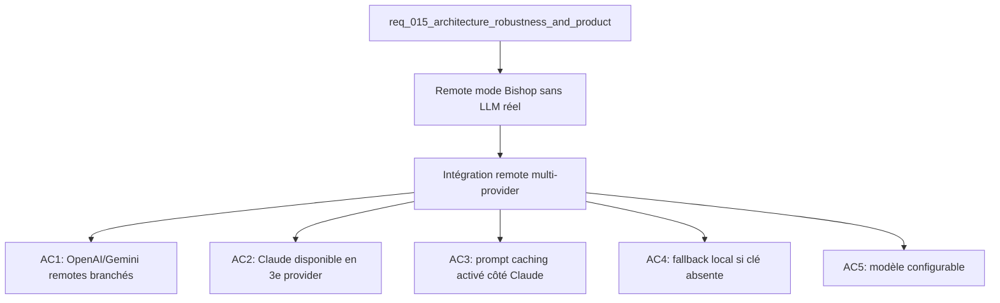

## item_052_bishop_claude_api_integration - Bishop Claude API integration
> From version: 1.0.0
> Schema version: 1.0
> Status: Done
> Understanding: 96%
> Confidence: 92%
> Progress: 100%
> Complexity: High
> Theme: Product / Architecture
> Reminder: Update status/understanding/confidence/progress and linked request/task references when you edit this doc.

# Problem
- Bishop remote mode est architecturalement prêt (orchestration layer + fallback local) mais ne branche pas encore de vrai provider LLM.
- Les réponses Bishop sont aujourd'hui déterministes et locales — pas de génération de langage naturel.
- L'orchestration layer dans `src/lib/bishop.ts` attend un endpoint remote mais aucun n'est branché.

# Scope
- In: intégration du remote mode Bishop sur les providers LLM réels ; OpenAI/Gemini restent les chemins principaux, Claude via `@anthropic-ai/sdk` est conservé comme 3e provider ; prompt caching activé côté Claude ; fallback local si la clé API correspondante est absente ; modèle configurable via env.
- Out: changement du grounding local (retrieval reste local), UI Bishop (pas de nouveau composant), ajout d'un 4e provider LLM.

# Acceptance criteria
- AC1: Le remote mode Bishop appelle le provider sélectionné avec le contexte groundé (documents + query) et retourne une réponse textuelle.
- AC2: OpenAI et Gemini restent disponibles comme providers principaux sans casser le fallback local.
- AC3: Claude reste disponible comme 3e provider via `@anthropic-ai/sdk` et le prompt caching est activé avec `prompt-caching-2024-07-31`.
- AC4: Si la clé API du provider sélectionné n'est pas définie dans l'environnement, Bishop utilise automatiquement le fallback local sans erreur ni log intrusif.
- AC5: Le modèle utilisé est configurable via `VITE_BISHOP_MODEL` (avec un défaut adapté au provider sélectionné).
- AC6: Les tests Bishop existants passent sans régression ; un nouveau test vérifie le fallback sur clé absente.

# AC Traceability
- AC1 -> Scope: provider sélectionné branché. Proof: capture validation evidence in this doc.
- AC2 -> Scope: providers principaux disponibles. Proof: capture validation evidence in this doc.
- AC3 -> Scope: prompt caching Claude activé. Proof: capture validation evidence in this doc.
- AC4 -> Scope: fallback local sur clé absente. Proof: capture validation evidence in this doc.
- AC5 -> Scope: modèle configurable. Proof: capture validation evidence in this doc.
- AC6 -> Scope: tests existants passent. Proof: capture validation evidence in this doc.

# Decision framing
- Product framing: Consider
- Product signals: qualité des réponses Bishop, latence perçue
- Product follow-up: Définir le system prompt Bishop (ton, format de réponse, règles de citation des sources) et valider le provider par défaut avec les utilisateurs cibles.
- Architecture framing: Required
- Architecture signals: contracts and integration, security and identity, runtime and boundaries
- Architecture follow-up: Créer/mettre à jour un ADR pour le contrat d'appel Bishop → providers (format du prompt, gestion des tokens, caching strategy).

# Links
- Product brief(s): (none yet)
- Architecture decision(s): `adr_017_bishop_llm_orchestration_after_local_grounding`
- Request: `req_015_architecture_robustness_and_product_improvements`
- Primary task(s): `task_021_bishop_intelligence_and_ux`

# AI Context
- Summary: Brancher le remote mode Bishop sur OpenAI/Gemini comme providers principaux et conserver Claude comme 3e provider avec prompt caching, fallback local si clé absente, modèle configurable.
- Keywords: bishop, openai api, gemini api, claude api, anthropic sdk, prompt caching, llm, remote mode, fallback, ANTHROPIC_API_KEY
- Use when: Use when implementing real LLM responses in Bishop or configuring the AI providers.
- Skip when: Skip when the work targets local retrieval, UI polish, or corpus export.

# Used by
- `logics/tasks/task_021_bishop_intelligence_and_ux.md`

# Priority
- Impact: Very High
- Urgency: Medium

# Notes
- Derived from request `req_015_architecture_robustness_and_product_improvements`.
- `ANTHROPIC_API_KEY` doit être ajouté au `.env.exemple` avec documentation.
- Prompt caching est critique pour réduire le coût sur les corpus volumineux — ne pas l'omettre.
