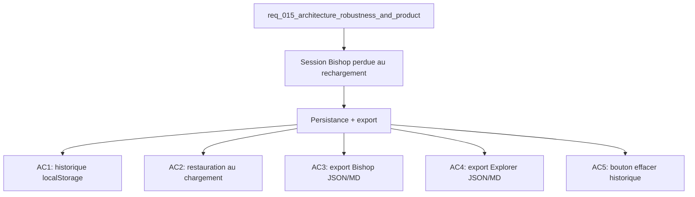

## item_053_bishop_session_persistence_and_export - Bishop session persistence and results export
> From version: 1.0.0
> Schema version: 1.0
> Status: Ready
> Understanding: 87%
> Confidence: 84%
> Progress: 0%
> Complexity: Medium
> Theme: Product / UX
> Reminder: Update status/understanding/confidence/progress and linked request/task references when you edit this doc.

# Problem
- L'historique de conversation Bishop est perdu au rechargement de la page — friction pour les workflows d'analyse récurrents.
- Aucun moyen d'exporter les résultats Bishop (conversation + sources) ni les résultats Explorer hors de l'app.
- Les analystes doivent recopier manuellement les réponses pour produire des livrables.

# Scope
- In: persistance de la session Bishop via `localStorage` ; bouton "Exporter" sur Bishop (JSON/MD) et sur Explorer (JSON/MD) ; bouton "Effacer l'historique".
- Out: synchronisation cloud, export vers SharePoint, partage de session entre utilisateurs.

# Acceptance criteria
- AC1: L'historique de conversation Bishop est sauvegardé dans `localStorage` après chaque message (clé : `deepvault_bishop_history`).
- AC2: Au chargement de la page, l'historique est restauré depuis `localStorage` si disponible ; une conversation vide est affichée sinon.
- AC3: Un bouton "Exporter" sur le panel Bishop génère un fichier téléchargeable (JSON ou Markdown au choix) contenant les messages, sources citées et timestamps.
- AC4: Un bouton "Exporter" sur le panel Explorer génère un fichier JSON des résultats de recherche courants (documents, scores, métadonnées).
- AC5: Un bouton "Effacer l'historique" sur le panel Bishop efface le `localStorage` et remet la conversation à zéro.
- AC6: `npm run check` passe sans régression.

# AC Traceability
- AC1 -> Scope: sauvegarde localStorage. Proof: capture validation evidence in this doc.
- AC2 -> Scope: restauration au chargement. Proof: capture validation evidence in this doc.
- AC3 -> Scope: export Bishop. Proof: capture validation evidence in this doc.
- AC4 -> Scope: export Explorer. Proof: capture validation evidence in this doc.
- AC5 -> Scope: effacer historique. Proof: capture validation evidence in this doc.
- AC6 -> Scope: check passe. Proof: capture validation evidence in this doc.

# Decision framing
- Product framing: Consider
- Product signals: workflow analyste, productivité, livrables
- Product follow-up: Valider le format Markdown d'export avec les utilisateurs cibles (analystes) avant implémentation.
- Architecture framing: Not needed
- Architecture follow-up: Définir la taille max de l'historique en localStorage pour éviter de dépasser le quota (5MB).

# Links
- Product brief(s): (none yet)
- Architecture decision(s): (none yet)
- Request: `req_015_architecture_robustness_and_product_improvements`
- Primary task(s): `task_021_bishop_intelligence_and_ux`

# AI Context
- Summary: Persistance de la session Bishop via localStorage et boutons d'export des résultats (Bishop + Explorer) en JSON/Markdown.
- Keywords: bishop, session, localStorage, persistance, export, markdown, json, explorer, historique
- Use when: Use when improving analyst workflow or adding data portability features.
- Skip when: Skip when the work targets retrieval logic, LLM integration, or infrastructure.

# References
- `logics/skills/logics-ui-steering/SKILL.md`

# Used by
- `logics/tasks/task_021_bishop_intelligence_and_ux.md`

# Priority
- Impact: High
- Urgency: Low

# Notes
- Derived from request `req_015_architecture_robustness_and_product_improvements`.
- Prévoir un cap sur la taille de l'historique (ex : 50 messages max) pour éviter les problèmes localStorage sur des sessions longues.
