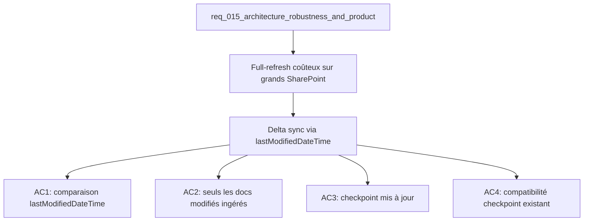

## item_054_corpus_delta_sync_via_graph_lastmodified - Corpus delta sync via Graph lastModifiedDateTime
> From version: 1.0.0
> Schema version: 1.0
> Status: Done
> Understanding: 85%
> Confidence: 78%
> Progress: 100%
> Complexity: High
> Theme: Infrastructure
> Reminder: Update status/understanding/confidence/progress and linked request/task references when you edit this doc.

# Problem
- L'export live (`scripts/export-live.ts`) fait un full-refresh à chaque exécution, même si peu de documents ont changé.
- Sur des SharePoint importants (milliers de fichiers), ce comportement est coûteux en temps et en appels API Graph.
- L'API Graph expose `lastModifiedDateTime` sur chaque élément — la base pour un delta sync est disponible.

# Scope
- In: utilisation de `lastModifiedDateTime` pour n'ingérer que les documents modifiés depuis le dernier checkpoint ; mise à jour du checkpoint avec la date du dernier sync.
- Out: sync bidirectionnel, suppression de documents retirés de SharePoint (tombstone), sync temps-réel (webhook Graph).

# Acceptance criteria
- AC1: `scripts/export-live.ts` compare `lastModifiedDateTime` de chaque document avec la date de dernier sync stockée dans le checkpoint avant de l'ingérer.
- AC2: Seuls les documents modifiés après le dernier sync (ou tous les documents si c'est le premier run) sont exportés et écrits dans le corpus.
- AC3: Après un export réussi, le checkpoint est mis à jour avec la date ISO du run courant (`syncedAt`).
- AC4: Le format de checkpoint existant (`scripts/live-export-state.ts`) est étendu sans casser la compatibilité avec les checkpoints existants.
- AC5: `npm run export:live` en mode dry-run affiche le nombre de documents skippés vs. ingérés.

# AC Traceability
- AC1 -> Scope: comparaison lastModifiedDateTime. Proof: capture validation evidence in this doc.
- AC2 -> Scope: seuls docs modifiés ingérés. Proof: capture validation evidence in this doc.
- AC3 -> Scope: checkpoint mis à jour. Proof: capture validation evidence in this doc.
- AC4 -> Scope: compatibilité checkpoint. Proof: capture validation evidence in this doc.
- AC5 -> Scope: dry-run avec stats. Proof: capture validation evidence in this doc.

# Report
- Wave 2 completed: `scripts/export-live.ts` now reuses the checkpoint corpus, compares `lastModifiedDateTime` against the last sync time, skips unchanged documents, writes `syncedAt` into the checkpoint, and supports dry-run output without writing files.
- Validation passed:
  - `rtk npm run test -- tests/deepvault-graph.spec.ts tests/live-export-state.spec.ts tests/corpus-loader.spec.ts tests/corpus.spec.ts`
  - `rtk npm run typecheck`
  - `rtk npm run lint`
  - `rtk npm run build`
  - `rtk npm run check`
  - `rtk npm run export:live -- --mode mock --dry-run --output tmp/export-live-dry-run.json`
  - `rtk python3 logics/skills/logics-doc-linter/scripts/logics_lint.py --require-status --format text`

# Decision framing
- Product framing: Not needed
- Architecture framing: Required
- Architecture signals: data model and persistence, contracts and integration, runtime and boundaries
- Architecture follow-up: Décider si les documents supprimés de SharePoint sont retirés du corpus local (tombstone) ou ignorés — hors scope mais à documenter.

# Links
- Product brief(s): (none yet)
- Architecture decision(s): (none yet)
- Request: `req_015_architecture_robustness_and_product_improvements`
- Primary task(s): `task_019_infrastructure_hardening_graph_and_corpus`

# AI Context
- Summary: Delta sync du corpus live en utilisant lastModifiedDateTime de l'API Graph pour éviter les full-refresh coûteux.
- Keywords: delta sync, graph api, lastModifiedDateTime, checkpoint, corpus, export-live, incremental
- Use when: Use when improving live export performance on large SharePoint tenants.
- Skip when: Skip when the work targets mock corpus, UI components, or Bishop orchestration.

# Used by
- `logics/tasks/task_019_infrastructure_hardening_graph_and_corpus.md`

# Priority
- Impact: High
- Urgency: Low

# Notes
- Derived from request `req_015_architecture_robustness_and_product_improvements`.
- Vérifier la compatibilité avec item_014 (incremental live sync) — possible overlap partiel à aligner avant démarrage.
- La suppression de documents (tombstone) est explicitement hors scope ici mais devra être adressée dans une request dédiée.
