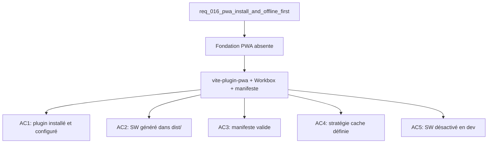

## item_055_pwa_vite_plugin_and_workbox_setup - PWA: vite-plugin-pwa and Workbox setup
> From version: 1.0.0
> Schema version: 1.0
> Status: Ready
> Understanding: 90%
> Confidence: 86%
> Progress: 0%
> Complexity: Medium
> Theme: Infrastructure / PWA
> Reminder: Update status/understanding/confidence/progress and linked request/task references when you edit this doc.

# Problem
- Aucun service worker ni manifeste n'existe dans l'app — l'installation PWA est impossible.
- La fondation PWA (plugin Vite, Workbox, manifeste) doit être en place avant d'ajouter le bouton d'installation et le bandeau de mise à jour.

# Scope
- In: ajout de `vite-plugin-pwa` en devDependency ; configuration Workbox dans `vite.config.ts` ; génération du service worker à chaque build ; `public/manifest.webmanifest` avec icônes ; stratégie de cache CacheFirst assets / NetworkFirst Graph.
- Out: bouton d'installation UI (item_056), bandeau de mise à jour UI (item_057), logique offline/fallback (item_058).

# Acceptance criteria
- AC1: `vite-plugin-pwa` est ajouté aux `devDependencies` et configuré dans `vite.config.ts` avec `registerType: 'autoUpdate'` (ou prompt selon item_057).
- AC2: `npm run build` génère un service worker valide (`dist/sw.js`) sans erreur de build.
- AC3: `public/manifest.webmanifest` définit `name`, `short_name`, `theme_color`, `background_color`, `display: standalone`, et au moins deux icônes (192×192, 512×512).
- AC4: La configuration Workbox utilise `CacheFirst` pour les assets statiques (JS, CSS, fonts) et `NetworkFirst` avec fallback cache pour les requêtes Graph.
- AC5: En mode dev (`npm run dev`), le service worker est désactivé (`devOptions: { enabled: false }`) pour éviter les conflits avec le HMR Vite.
- AC6: `npm run check` passe sans régression après ajout du plugin.

# AC Traceability
- AC1 -> Scope: plugin installé. Proof: capture validation evidence in this doc.
- AC2 -> Scope: SW dans dist/. Proof: capture validation evidence in this doc.
- AC3 -> Scope: manifeste valide. Proof: capture validation evidence in this doc.
- AC4 -> Scope: stratégie cache. Proof: capture validation evidence in this doc.
- AC5 -> Scope: SW désactivé en dev. Proof: capture validation evidence in this doc.
- AC6 -> Scope: check passe. Proof: capture validation evidence in this doc.

# Decision framing
- Product framing: Not needed
- Architecture framing: Required
- Architecture signals: runtime and boundaries, cache strategy
- Architecture follow-up: Créer un ADR pour la stratégie de cache (CacheFirst vs StaleWhileRevalidate pour les assets).

# Links
- Product brief(s): (none yet)
- Architecture decision(s): (none yet)
- Request: `req_016_pwa_install_and_offline_first`
- Primary task(s): `task_022_pwa_progressive_web_app_delivery`

# AI Context
- Summary: Fondation PWA : installation de vite-plugin-pwa, configuration Workbox, génération du service worker, manifeste et stratégie de cache.
- Keywords: pwa, vite-plugin-pwa, workbox, service worker, manifest, cache, CacheFirst, NetworkFirst, icons
- Use when: Use when setting up the PWA foundation before implementing install button or update banner.
- Skip when: Skip when the work targets UI install/update controls or offline fallback logic.

# References
- `logics/skills/logics-ui-steering/SKILL.md`

# Used by
- `logics/tasks/task_022_pwa_progressive_web_app_delivery.md`

# Priority
- Impact: High
- Urgency: High

# Notes
- Derived from request `req_016_pwa_install_and_offline_first`.
- Prérequis bloquant pour item_056, item_057 et item_058 — à réaliser en premier dans la wave PWA.
- Vérifier la compatibilité de `vite-plugin-pwa` avec Vite 6.x avant d'intégrer.
- Les icônes PWA doivent être créées ou extraites depuis les assets existants (`public/`) avant de finaliser le manifeste.
