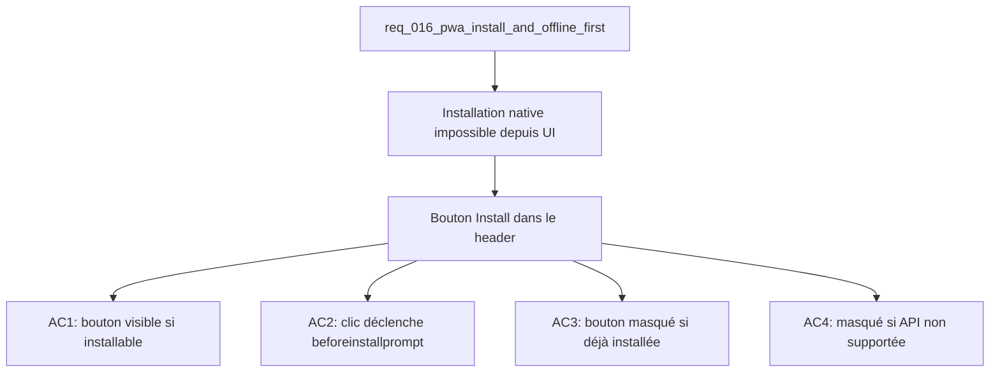

## item_056_pwa_install_button_in_header - PWA: install button in header
> From version: 1.0.0
> Schema version: 1.0
> Status: Ready
> Understanding: 91%
> Confidence: 88%
> Progress: 0%
> Complexity: Low
> Theme: UX / PWA
> Reminder: Update status/understanding/confidence/progress and linked request/task references when you edit this doc.

# Problem
- Il n'existe aucun moyen d'installer DeepVault Nexus comme application native depuis l'interface.
- L'événement `beforeinstallprompt` du navigateur n'est pas capté — l'invitation d'installation native ne peut pas être déclenchée sur demande.

# Scope
- In: capture de `beforeinstallprompt` et affichage d'un bouton "Installer" dans le header ; masquage du bouton si l'app est déjà installée ou si le navigateur ne supporte pas l'API.
- Out: logique de service worker (item_055), personnalisation de l'écran de splash, gestion des mises à jour (item_057).

# Acceptance criteria
- AC1: Le header affiche un bouton "Installer l'app" lorsque l'événement `beforeinstallprompt` est disponible (navigateur compatible + app non installée).
- AC2: Cliquer sur le bouton déclenche l'invite d'installation native du navigateur via `prompt()` sur l'événement capturé.
- AC3: Le bouton est masqué si l'app est déjà en mode `standalone` (détecté via `window.matchMedia('(display-mode: standalone)')`).
- AC4: Le bouton est masqué si le navigateur ne déclenche pas `beforeinstallprompt` (Firefox, Safari, navigateurs non compatibles).
- AC5: Après installation (choix de l'utilisateur), le bouton disparaît sans rechargement de page.

# AC Traceability
- AC1 -> Scope: bouton visible si installable. Proof: capture validation evidence in this doc.
- AC2 -> Scope: invite native déclenchée. Proof: capture validation evidence in this doc.
- AC3 -> Scope: masqué si standalone. Proof: capture validation evidence in this doc.
- AC4 -> Scope: masqué si non supporté. Proof: capture validation evidence in this doc.
- AC5 -> Scope: bouton disparaît après install. Proof: capture validation evidence in this doc.

# Decision framing
- Product framing: Consider
- Product signals: discoverability, onboarding
- Product follow-up: Valider le libellé du bouton ("Installer l'app" vs "Ajouter à l'écran d'accueil") avec les utilisateurs cibles.
- Architecture framing: Not needed

# Links
- Product brief(s): (none yet)
- Architecture decision(s): (none yet)
- Request: `req_016_pwa_install_and_offline_first`
- Primary task(s): `task_022_pwa_progressive_web_app_delivery`

# AI Context
- Summary: Bouton "Installer l'app" dans le header qui capture beforeinstallprompt et déclenche l'installation native PWA, masqué si déjà installée ou non supporté.
- Keywords: pwa, install button, beforeinstallprompt, header, standalone, progressive web app
- Use when: Use when implementing the PWA install flow in the UI.
- Skip when: Skip when the work targets service worker setup, update notifications, or offline logic.

# References
- `logics/skills/logics-ui-steering/SKILL.md`

# Used by
- `logics/tasks/task_022_pwa_progressive_web_app_delivery.md`

# Priority
- Impact: High
- Urgency: Medium

# Notes
- Derived from request `req_016_pwa_install_and_offline_first`.
- Dépend de item_055 (fondation PWA + manifeste) — le manifeste doit être valide pour que `beforeinstallprompt` soit déclenché.
- L'API `beforeinstallprompt` n'est pas supportée sur Safari/iOS — le bouton sera naturellement masqué sans code spécifique.
