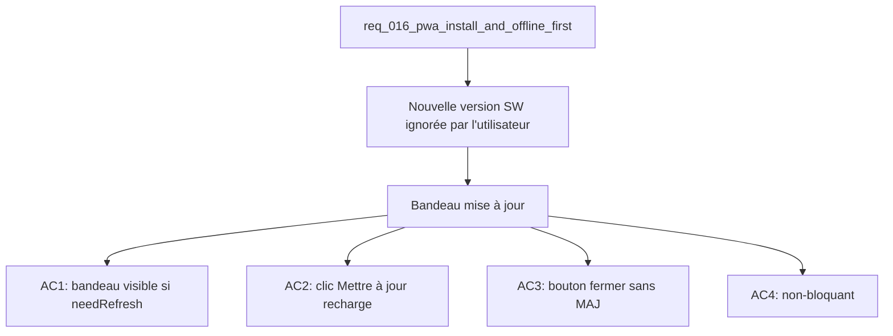

## item_057_pwa_update_banner - PWA: update banner
> From version: 1.0.0
> Schema version: 1.0
> Status: Done
> Understanding: 90%
> Confidence: 87%
> Progress: 100%
> Complexity: Low
> Theme: UX / PWA
> Reminder: Update status/understanding/confidence/progress and linked request/task references when you edit this doc.

# Problem
- Sans bandeau de mise à jour, les utilisateurs ignorent qu'une nouvelle version est disponible et continuent sur l'ancienne version du service worker.
- Le rechargement manuel est nécessaire pour activer un service worker en attente — expérience dégradée pour une app installée.

# Scope
- In: composant `<UpdateBanner>` utilisant le hook `useRegisterSW` de `vite-plugin-pwa` ; bouton "Mettre à jour" qui active le SW en attente et recharge ; bouton pour fermer sans mettre à jour.
- Out: notifications push, logique de versionning sémantique dans le bandeau, service worker setup (item_055).

# Acceptance criteria
- AC1: Lorsque `needRefresh` est `true` (nouveau service worker en attente), un bandeau non-bloquant apparaît en haut ou en bas de l'interface avec le message "Une nouvelle version est disponible".
- AC2: Cliquer sur "Mettre à jour" appelle `updateServiceWorker(true)` depuis `useRegisterSW`, ce qui active le SW en attente et recharge la page.
- AC3: Un bouton de fermeture ("×" ou "Ignorer") masque le bandeau sans déclencher la mise à jour — l'utilisateur peut continuer sur la version courante.
- AC4: Le bandeau ne bloque pas l'interaction avec l'app (pas de modale, pas de backdrop) et ne reparaît pas après fermeture dans la même session.

# AC Traceability
- AC1 -> Scope: bandeau si needRefresh. Proof: capture validation evidence in this doc.
- AC2 -> Scope: rechargement sur "Mettre à jour". Proof: capture validation evidence in this doc.
- AC3 -> Scope: fermeture sans MAJ. Proof: capture validation evidence in this doc.
- AC4 -> Scope: non-bloquant. Proof: capture validation evidence in this doc.

# Decision framing
- Product framing: Consider
- Product signals: UX app installée, confiance utilisateur
- Product follow-up: Valider le positionnement du bandeau (top vs bottom) avec les utilisateurs — bottom est moins intrusif.
- Architecture framing: Not needed

# Links
- Product brief(s): (none yet)
- Architecture decision(s): (none yet)
- Request: `req_016_pwa_install_and_offline_first`
- Primary task(s): `task_022_pwa_progressive_web_app_delivery`

# AI Context
- Summary: Bandeau de mise à jour PWA non-bloquant utilisant useRegisterSW avec bouton "Mettre à jour" (active SW + recharge) et bouton de fermeture.
- Keywords: pwa, update banner, useRegisterSW, service worker, needRefresh, updateServiceWorker, vite-plugin-pwa
- Use when: Use when implementing the PWA update notification flow.
- Skip when: Skip when the work targets install flow, offline cache, or service worker setup.

# References
- `logics/skills/logics-ui-steering/SKILL.md`

# Used by
- `logics/tasks/task_022_pwa_progressive_web_app_delivery.md`

# Priority
- Impact: Medium
- Urgency: Low

# Notes
- Derived from request `req_016_pwa_install_and_offline_first`.
- Dépend de item_055 (fondation PWA) pour l'accès au hook `useRegisterSW`.
- `registerType: 'prompt'` dans la config vite-plugin-pwa est nécessaire pour que `needRefresh` soit exposé (vs `autoUpdate` qui bypass le bandeau).

# Report
- Wave 3 completed: the shell now shows a non-blocking update banner when `needRefresh` is true, with `Mettre à jour` and `Ignorer` actions.
- Wave 3 validated: `rtk npm run test -- tests/pwa.spec.tsx tests/app.spec.tsx`, `rtk npm run typecheck`, and `rtk npm run lint` passed.
