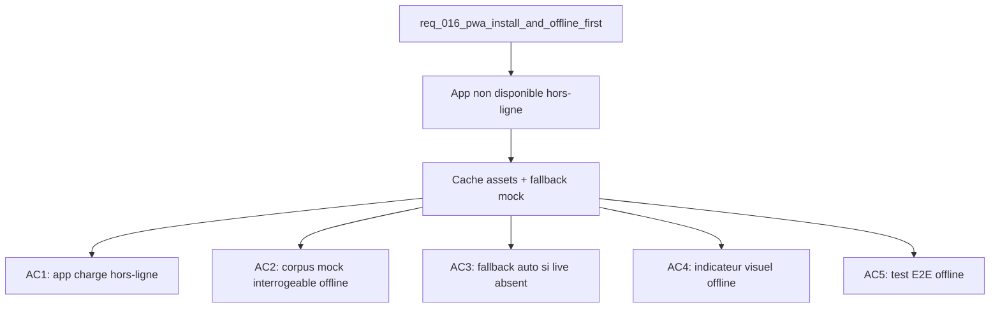

## item_058_pwa_offline_cache_and_mock_fallback - PWA: offline cache and mock corpus fallback
> From version: 1.0.0
> Schema version: 1.0
> Status: Done
> Understanding: 88%
> Confidence: 83%
> Progress: 100%
> Complexity: Medium
> Theme: Infrastructure / PWA
> Reminder: Update status/understanding/confidence/progress and linked request/task references when you edit this doc.

# Problem
- Sans cache service worker, l'app ne se charge pas hors-ligne et le corpus mock n'est pas accessible sans réseau.
- En mode live avec réseau absent, l'app échoue silencieusement sans indiquer à l'utilisateur qu'elle bascule sur le corpus mock.

# Scope
- In: mise en cache des assets statiques et du corpus mock (`pilot-corpus.json`) ; basculement automatique vers le corpus mock si live indisponible hors-ligne ; indicateur visuel "Offline — corpus mock actif".
- Out: mise en cache du corpus live (trop volumineux), background sync, service worker setup (item_055).

# Acceptance criteria
- AC1: Avec le réseau coupé après un premier chargement, l'app se charge complètement depuis le cache service worker (assets JS/CSS/HTML mis en cache).
- AC2: En mode hors-ligne, le corpus mock (`pilot-corpus.json`) est accessible via Explorer et Bishop sans appel réseau.
- AC3: Si le corpus live est sélectionné et que le réseau est absent, l'app bascule automatiquement vers le corpus mock sans afficher d'erreur bloquante.
- AC4: Lorsque le fallback vers le corpus mock est actif (réseau absent en mode live), un indicateur visuel discret "Hors-ligne — corpus mock" est affiché.
- AC5: Un test E2E Playwright vérifie que l'app se charge et le corpus mock est interrogeable avec le réseau simulé hors-ligne (`page.context().setOffline(true)`).

# AC Traceability
- AC1 -> Scope: chargement hors-ligne. Proof: capture validation evidence in this doc.
- AC2 -> Scope: corpus mock offline. Proof: capture validation evidence in this doc.
- AC3 -> Scope: basculement auto vers mock. Proof: capture validation evidence in this doc.
- AC4 -> Scope: indicateur visuel. Proof: capture validation evidence in this doc.
- AC5 -> Scope: test E2E offline. Proof: capture validation evidence in this doc.

# Decision framing
- Product framing: Consider
- Product signals: fiabilité, confiance utilisateur, usage terrain (connexion instable)
- Product follow-up: Valider si l'indicateur offline doit être persistant ou disparaître dès que le réseau revient.
- Architecture framing: Required
- Architecture signals: cache strategy, runtime and boundaries
- Architecture follow-up: Documenter dans l'ADR PWA pourquoi le corpus live n'est pas mis en cache (taille, fraîcheur des données).

# Links
- Product brief(s): (none yet)
- Architecture decision(s): (none yet)
- Request: `req_016_pwa_install_and_offline_first`
- Primary task(s): `task_022_pwa_progressive_web_app_delivery`

# AI Context
- Summary: Cache service worker pour le chargement offline et fallback automatique vers le corpus mock si le mode live est sélectionné sans réseau, avec indicateur visuel.
- Keywords: pwa, offline, service worker, cache, corpus mock, fallback, pilot-corpus, indicateur, playwright, setOffline
- Use when: Use when implementing offline support and live-to-mock fallback behavior.
- Skip when: Skip when the work targets install flow, update notifications, or service worker initial setup.

# References
- `logics/skills/logics-ui-steering/SKILL.md`

# Used by
- `logics/tasks/task_022_pwa_progressive_web_app_delivery.md`

# Priority
- Impact: High
- Urgency: Low

# Notes
- Derived from request `req_016_pwa_install_and_offline_first`.
- Dépend de item_055 (fondation PWA) — le cache Workbox doit être configuré avant d'ajouter le fallback mock.
- `pilot-corpus.json` est bundlé dans l'app, il sera naturellement dans le cache assets Workbox sans configuration supplémentaire si inclus dans le build output.
- `page.context().setOffline(true)` est l'API Playwright pour simuler le mode hors-ligne en test.

# Report
- Wave 4 completed: the app now falls back to the bundled mock corpus when live mode is unavailable offline, shows the offline indicator, and the offline Playwright scenario proves the cached app boots without network.
- Wave 4 validated: `rtk npm run test -- tests/corpus.spec.ts tests/live-corpus-hook.spec.tsx tests/app.spec.tsx`, `rtk npm run e2e`, and `VITE_DEEPVAULT_DATA_MODE=live rtk npm run e2e -- tests/e2e/live-mode.spec.ts` passed.
