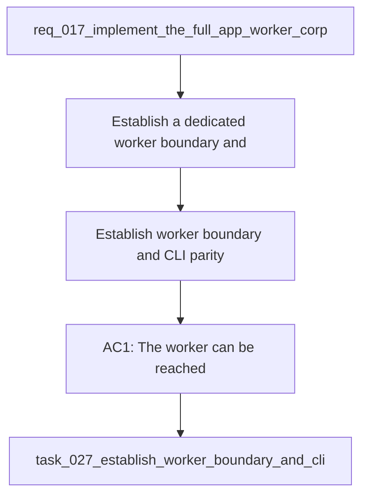

## item_059_establish_worker_boundary_and_cli_parity_with_shared_corpus_artifacts - Establish worker boundary and CLI parity with shared corpus artifacts
> From version: 1.1.0
> Schema version: 1.0
> Status: Done
> Understanding: 97%
> Confidence: 95%
> Progress: 100%
> Complexity: High
> Theme: General
> Reminder: Update status/understanding/confidence/progress and linked request/task references when you edit this doc.
> Maintenance edit: refreshed Mermaid signature after workflow sync.

# Problem
- Establish a dedicated worker boundary and keep the app and CLI operating against the same shared corpus artifacts.
- Make ingestion, live export, resume, and evaluate usable from both clients while preserving a remote-worker path.
- Avoid a split where the app owns one execution model and the CLI owns another.
- Make the config, checkpoint, manifest, and fallback story explicit enough to trust during long runs.

# Scope
- In: worker boundary, local and remote worker connection, shared config contract, HTTP control API, SSE events, checkpoint and manifest handling, corpus publication, CLI parity, and read-only fallback behavior.
- Out: ops-screen layout, theme polish, and corpus-quality metadata improvements that belong in separate items.

# Acceptance criteria
- AC1: The worker can be reached locally or remotely through a configurable connection.
- AC2: The app and CLI use the same shared corpus artifacts, checkpoint model, and run history model.
- AC3: Ingestion, live export, resume, and evaluate are operable from the CLI as well as the app.
- AC4: The worker connection, fallback mode, and effective config are explicit and testable.
- AC5: The shared artifact and job model is versioned and validated before publication or reuse.

# AC Traceability
- AC1 -> Scope: The worker can be reached locally or remotely through a configurable connection.. Proof: capture validation evidence in this doc.
- AC2 -> Scope: The app and CLI use the same shared corpus artifacts, checkpoint model, and run history model.. Proof: capture validation evidence in this doc.
- AC3 -> Scope: Ingestion, live export, resume, and evaluate are operable from the CLI as well as the app.. Proof: capture validation evidence in this doc.
- AC4 -> Scope: The worker connection, fallback mode, and effective config are explicit and testable.. Proof: capture validation evidence in this doc.
- AC5 -> Scope: The shared artifact and job model is versioned and validated before publication or reuse.. Proof: capture validation evidence in this doc.
- AC6 -> Scope: The request says the work must be implemented and tested, not just documented.. Proof: capture validation evidence in this doc and the downstream task.
- AC7 -> Scope: The request is clear enough to be split into bounded backlog items for execution.. Proof: capture validation evidence in this doc and the downstream task.

# Decision framing
- Product framing: Required
- Product signals: operational clarity, execution parity, experience scope
- Product follow-up: Keep the linked product brief aligned with the worker boundary plan.
- Architecture framing: Required
- Architecture signals: runtime and boundaries, data model and persistence, state and sync, security and identity
- Architecture follow-up: Keep the linked architecture decision aligned with the worker boundary plan.

# Links
- Product brief(s): `logics/product/prod_008_make_ingestion_and_live_export_operable_across_app_and_cli.md`
- Architecture decision(s): `logics/architecture/adr_023_split_execution_runtime_from_the_app_and_share_corpus_artifacts.md`
- Request: `req_017_implement_the_full_app_worker_corpus_and_shell_plan`
- Primary task(s): `task_027_establish_worker_boundary_and_cli_parity_with_shared_corpus_artifacts`
<!-- When creating a task from this file, add: Derived from `this file path` in the task # Links section -->

# AI Context
- Summary: Establish worker boundary and CLI parity with shared corpus artifacts.
- Keywords: worker, cli, parity, shared corpus, checkpoints, manifests, remote worker
- Use when: Use when implementing or reviewing the worker boundary and CLI parity stream.
- Skip when: Skip when the change is unrelated to execution parity or shared corpus artifacts.
# Priority
- Impact: High
- Urgency: High

# Notes
- Derived from request `req_017_implement_the_full_app_worker_corpus_and_shell_plan`.
