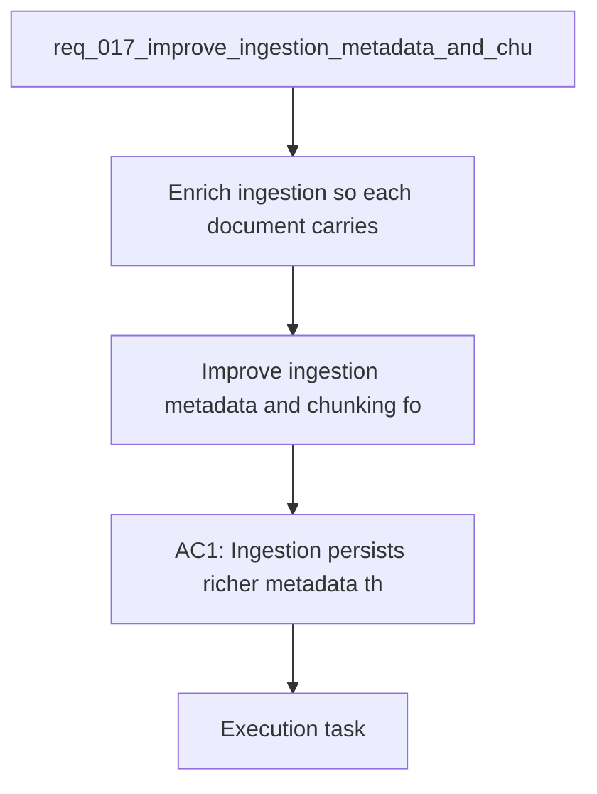

## item_059_improve_ingestion_metadata_and_chunking_for_bishop_hints - Improve ingestion metadata and chunking for Bishop hints
> From version: 1.1.0
> Schema version: 1.0
> Status: Ready
> Understanding: 88%
> Confidence: 84%
> Progress: 0%
> Complexity: Medium
> Theme: General
> Reminder: Update status/understanding/confidence/progress and linked request/task references when you edit this doc.

# Problem
- Enrich ingestion so each document carries more searchable context than title, summary, content, tags, and path alone.
- Make chunking preserve section and heading context so retrieval can rank the right passage more reliably.
- Improve the corpus signals that Bishop can use to explain what extra input would help the next answer.
- Reduce generic fallback hints that only say to add a better document title or site name.
- Keep permission-aware filtering and the local-first pipeline intact while improving retrieval quality.
- - Bishop currently emits a generic improvement hint when the retrieval signal is weak. That hint is driven mostly by answer status, source count, and chunk count.
- - The current retrieval path relies on a narrow set of document fields, so short or vague user questions often do not match strongly enough even when the corpus contains the right material.

# Scope
- In: one coherent delivery slice from the source request.
- Out: unrelated sibling slices that should stay in separate backlog items instead of widening this doc.

# Acceptance criteria
- AC1: Ingestion persists richer metadata that can be used for retrieval, including at least document title, site name, path, tags, and structural context from the source when available.
- AC2: Chunking preserves section or heading context so a chunk can be traced back to the part of the document that produced it.
- AC3: Short or vague questions surface more relevant sources when the corpus contains a matching document or section.
- AC4: Bishop improvement hints use the richer corpus signal and are no longer limited to a generic "add a better title or site name" fallback.
- AC5: The new ingestion and ranking behavior is covered by tests for corpus loading, retrieval quality, and Bishop hint generation.
- AC6: Permission-aware filtering and local-first behavior remain unchanged.

# AC Traceability
- AC1 -> Scope: Ingestion persists richer metadata that can be used for retrieval, including at least document title, site name, path, tags, and structural context from the source when available.. Proof: capture validation evidence in this doc.
- AC2 -> Scope: Chunking preserves section or heading context so a chunk can be traced back to the part of the document that produced it.. Proof: capture validation evidence in this doc.
- AC3 -> Scope: Short or vague questions surface more relevant sources when the corpus contains a matching document or section.. Proof: capture validation evidence in this doc.
- AC4 -> Scope: Bishop improvement hints use the richer corpus signal and are no longer limited to a generic "add a better title or site name" fallback.. Proof: capture validation evidence in this doc.
- AC5 -> Scope: The new ingestion and ranking behavior is covered by tests for corpus loading, retrieval quality, and Bishop hint generation.. Proof: capture validation evidence in this doc.
- AC6 -> Scope: Permission-aware filtering and local-first behavior remain unchanged.. Proof: capture validation evidence in this doc.

# Decision framing
- Product framing: Consider
- Product signals: navigation and discoverability
- Product follow-up: Review whether a product brief is needed before scope becomes harder to change.
- Architecture framing: Required
- Architecture signals: data model and persistence, state and sync, security and identity
- Architecture follow-up: Create or link an architecture decision before irreversible implementation work starts.

# Links
- Product brief(s): (none yet)
- Architecture decision(s): `logics/architecture/adr_003_hybrid_knowledge_store_and_retrieval_model.md`, `logics/architecture/adr_016_deepvault_persistence_and_storage_layout.md`
- Request: `req_017_improve_ingestion_metadata_and_chunking_for_bishop_hints`
- Primary task(s): `task_026_live_corpus_and_sidebar_theme_delivery_waves`
<!-- When creating a task from this item, add: Derived from `this file path` in the task # Links section -->

# AI Context
- Summary: Improve ingestion metadata and chunking for Bishop hints
- Keywords: ingestion, metadata, chunking, retrieval, ranking, bishop, hint, corpus
- Use when: Use when framing ingestion and retrieval quality work that should reduce generic Bishop hints.
- Skip when: Skip when the work targets UI polish, sync operations, or unrelated backend features.
# References
- `logics/skills/logics-ui-steering/SKILL.md`

# Priority
- Impact: High
- Urgency: Medium

# Notes
- Derived from request `req_017_improve_ingestion_metadata_and_chunking_for_bishop_hints`.
- Source file: `logics/request/req_017_improve_ingestion_metadata_and_chunking_for_bishop_hints.md`.
- Keep this backlog item as one bounded delivery slice; create sibling backlog items for the remaining request coverage instead of widening this doc.
- Request context seeded into this backlog item from `logics/request/req_017_improve_ingestion_metadata_and_chunking_for_bishop_hints.md`.
