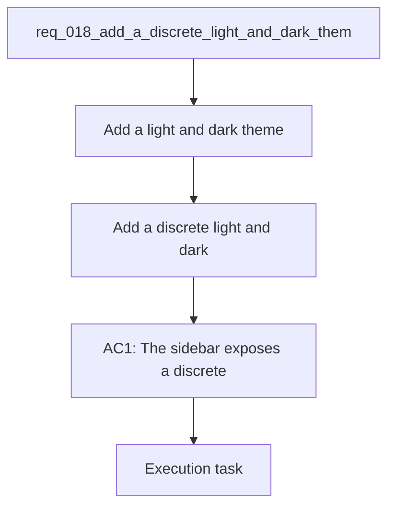

## item_060_add_a_discrete_light_and_dark_theme_switch_in_the_sidebar - Add a discrete light and dark theme switch in the sidebar
> From version: 1.1.0
> Schema version: 1.0
> Status: Ready
> Understanding: 92%
> Confidence: 88%
> Progress: 0%
> Complexity: Medium
> Theme: General
> Reminder: Update status/understanding/confidence/progress and linked request/task references when you edit this doc.

# Problem
- Add a light and dark theme toggle that feels native to the app shell.
- Place the control at the bottom of the sidebar so it stays discreet and does not compete with navigation.
- Use a slider-style affordance that looks refined instead of a generic checkbox or dropdown.
- Persist the selected theme locally so the app opens in the user's preferred mode.
- Keep the theme system compatible with the current local-first UI and CSS variable setup.
- - The app already uses a compact left sidebar and a visual language built around muted surfaces, pills, and panels.
- - The theme switch should live low in the sidebar rail, separated from the primary navigation and application sections.

# Scope
- In: one coherent delivery slice from the source request.
- Out: unrelated sibling slices that should stay in separate backlog items instead of widening this doc.

# Acceptance criteria
- AC1: The sidebar exposes a discrete light and dark theme control at the bottom of the menu.
- AC2: The control uses a slider-style interaction that feels visually refined and does not crowd the navigation.
- AC3: The selected theme is persisted locally and restored on reload.
- AC4: The theme applies consistently across the shell, panels, and modal surfaces.
- AC5: The request is clear enough to be promoted into a bounded backlog item.

# AC Traceability
- AC1 -> Scope: The sidebar exposes a discrete light and dark theme control at the bottom of the menu.. Proof: capture validation evidence in this doc.
- AC2 -> Scope: The control uses a slider-style interaction that feels visually refined and does not crowd the navigation.. Proof: capture validation evidence in this doc.
- AC3 -> Scope: The selected theme is persisted locally and restored on reload.. Proof: capture validation evidence in this doc.
- AC4 -> Scope: The theme applies consistently across the shell, panels, and modal surfaces.. Proof: capture validation evidence in this doc.
- AC5 -> Scope: The request is clear enough to be promoted into a bounded backlog item.. Proof: capture validation evidence in this doc.

# Decision framing
- Product framing: Required
- Product signals: navigation and discoverability, experience scope
- Product follow-up: Create or link a product brief before implementation moves deeper into delivery.
- Architecture framing: Required
- Architecture signals: data model and persistence, state and sync
- Architecture follow-up: Create or link an architecture decision before irreversible implementation work starts.

# Links
- Product brief(s): `logics/product/prod_003_navigation_and_runtime_control_clarity.md`
- Architecture decision(s): `logics/architecture/adr_022_separate_runtime_controls_from_sync_operations.md`
- Request: `req_018_add_a_discrete_light_and_dark_theme_switch_in_the_sidebar`
- Primary task(s): `task_026_live_corpus_and_sidebar_theme_delivery_waves`
<!-- When creating a task from this item, add: Derived from `this file path` in the task # Links section -->

# AI Context
- Summary: Add a discrete light and dark theme switch in the sidebar
- Keywords: theme, sidebar, light, dark, slider, toggle, persistence, shell
- Use when: Use when framing a compact theme selector for the app sidebar.
- Skip when: Skip when the work targets unrelated navigation, sync, or content features.
# References
- `logics/skills/logics-ui-steering/SKILL.md`

# Priority
- Impact: High
- Urgency: High

# Notes
- Derived from request `req_018_add_a_discrete_light_and_dark_theme_switch_in_the_sidebar`.
- Source file: `logics/request/req_018_add_a_discrete_light_and_dark_theme_switch_in_the_sidebar.md`.
- Keep this backlog item as one bounded delivery slice; create sibling backlog items for the remaining request coverage instead of widening this doc.
- Request context seeded into this backlog item from `logics/request/req_018_add_a_discrete_light_and_dark_theme_switch_in_the_sidebar.md`.
