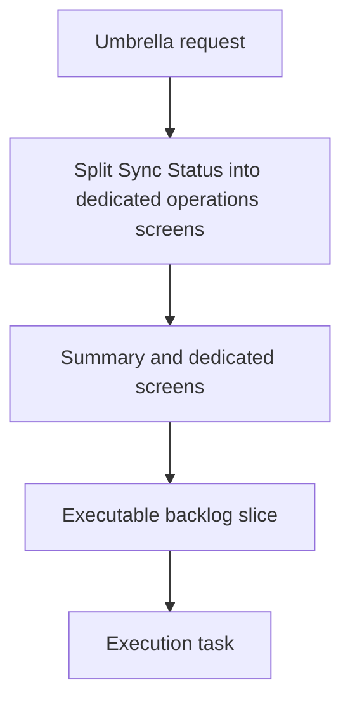

## item_060_split_sync_status_into_dedicated_operations_screens - Split Sync Status into dedicated operations screens
> From version: 1.1.0
> Schema version: 1.0
> Status: Done
> Understanding: 99%
> Confidence: 99%
> Progress: 100%
> Complexity: Medium
> Theme: General
> Reminder: Update status/understanding/confidence/progress and linked request/task references when you edit this doc.

# Problem
- Split the overloaded Sync Status experience into a concise summary and dedicated operational screens.
- Make the default path obvious for status, operations, history, config, and recovery.
- Reduce panel overload while keeping the app easy to scan during live runs.

# Scope
- In: summary screen, operations screen, run history screen, config screen, recovery screen, navigation labels, and shared state model.
- Out: worker protocol changes, corpus schema changes, and unrelated theme or navigation polish.

# Acceptance criteria
- AC1: Sync Status becomes a concise summary surface rather than the only operational screen.
- AC2: Dedicated surfaces exist for operations, run history, config, and recovery.
- AC3: The screen split preserves consistent state vocabulary and clear navigation labels.
- AC4: The summary remains readable during active runs and does not become overloaded.
- AC5: The split is clear enough to implement in bounded slices without changing worker behavior.

# AC Traceability
- AC1 -> Scope: Sync Status becomes a concise summary surface rather than the only operational screen.. Proof: capture validation evidence in this doc.
- AC2 -> Scope: Dedicated surfaces exist for operations, run history, config, and recovery.. Proof: capture validation evidence in this doc.
- AC3 -> Scope: The screen split preserves consistent state vocabulary and clear navigation labels.. Proof: capture validation evidence in this doc.
- AC4 -> Scope: The summary remains readable during active runs and does not become overloaded.. Proof: capture validation evidence in this doc.
- AC5 -> Scope: The split is clear enough to implement in bounded slices without changing worker behavior.. Proof: capture validation evidence in this doc.

# Decision framing
- Product framing: Required
- Product signals: navigation and discoverability, experience scope, operational clarity
- Product follow-up: Keep the linked product brief aligned with the ops screen split.
- Architecture framing: Required
- Architecture signals: state and sync, app shell structure
- Architecture follow-up: Keep the linked architecture decision aligned with the ops screen split.

# Links
- Product brief(s): `logics/product/prod_005_split_sync_status_into_dedicated_operations_screens.md`
- Architecture decision(s): `logics/architecture/adr_024_split_sync_status_into_dedicated_operations_screens.md`
- Request: `req_017_implement_the_full_app_worker_corpus_and_shell_plan`
- Primary task(s): `task_028_split_sync_status_into_dedicated_operations_screens`
<!-- When creating a task from this file, add: Derived from `this file path` in the task # Links section -->

# AI Context
- Summary: Split Sync Status into dedicated operations screens.
- Keywords: sync status, operations, history, config, recovery, navigation, summary
- Use when: Use when implementing or reviewing the operational screen split.
- Skip when: Skip when the change is unrelated to the ops screen split.
# Priority
- Impact: High
- Urgency: High

# Notes
- Derived from request `req_017_implement_the_full_app_worker_corpus_and_shell_plan`.
