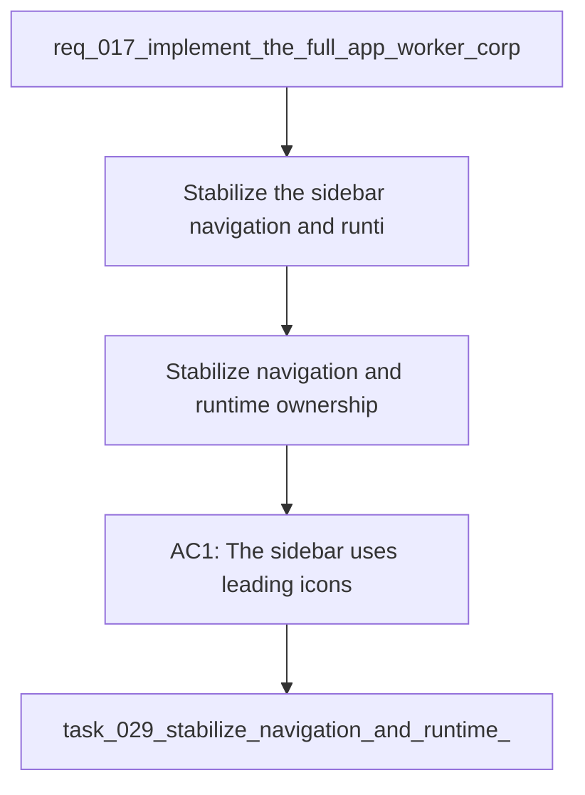

## item_061_stabilize_navigation_and_runtime_ownership - Stabilize navigation and runtime ownership
> From version: 1.1.0
> Schema version: 1.0
> Status: Done
> Understanding: 94%
> Confidence: 90%
> Progress: 100%
> Complexity: Medium
> Theme: General
> Reminder: Update status/understanding/confidence/progress and linked request/task references when you edit this doc.

# Problem
- Stabilize the sidebar navigation and runtime ownership so the app has a clear execution context.
- Keep the runtime controls, site scope, and navigation affordances easy to find without adding clutter.
- Preserve the current behavior while making the boundary between app shell and runtime controls obvious.

# Scope
- In: leading icons, runtime placement, site selector ownership, and sync-status ownership.
- Out: worker protocol changes, corpus schema changes, and ops-screen decomposition.

# Acceptance criteria
- AC1: The sidebar uses leading icons and remains easy to scan.
- AC2: Runtime controls and site scope live in the intended shell location and are clearly owned.
- AC3: The active runtime context remains visible without changing behavior.
- AC4: Navigation and runtime placement stay usable on smaller screens and with keyboard navigation.
- AC5: The app's ownership model for sidebar, settings, and sync stays consistent.

# AC Traceability
- AC1 -> Scope: The sidebar uses leading icons and remains easy to scan.. Proof: capture validation evidence in this doc.
- AC2 -> Scope: Runtime controls and site scope live in the intended shell location and are clearly owned.. Proof: capture validation evidence in this doc.
- AC3 -> Scope: The active runtime context remains visible without changing behavior.. Proof: capture validation evidence in this doc.
- AC4 -> Scope: Navigation and runtime placement stay usable on smaller screens and with keyboard navigation.. Proof: capture validation evidence in this doc.
- AC5 -> Scope: The app's ownership model for sidebar, settings, and sync stays consistent.. Proof: capture validation evidence in this doc.

# Decision framing
- Product framing: Required
- Product signals: navigation and discoverability, experience scope
- Product follow-up: Keep the linked product brief aligned with the navigation and runtime ownership plan.
- Architecture framing: Required
- Architecture signals: state and sync, shell ownership boundaries
- Architecture follow-up: Keep the linked architecture decision aligned with the navigation and runtime ownership plan.

# Links
- Product brief(s): `logics/product/prod_003_navigation_and_runtime_control_clarity.md`
- Architecture decision(s): `logics/architecture/adr_022_separate_runtime_controls_from_sync_operations.md`
- Request: `req_017_implement_the_full_app_worker_corpus_and_shell_plan`
- Primary task(s): `task_029_stabilize_navigation_and_runtime_ownership`
<!-- When creating a task from this file, add: Derived from `this file path` in the task # Links section -->

# AI Context
- Summary: Stabilize navigation and runtime ownership.
- Keywords: navigation, runtime, sidebar, site scope, settings, sync ownership
- Use when: Use when implementing or reviewing the navigation and runtime ownership stream.
- Skip when: Skip when the change is unrelated to the navigation and runtime boundary.
# Priority
- Impact: High
- Urgency: High

# Notes
- Derived from request `req_017_implement_the_full_app_worker_corpus_and_shell_plan`.

# Report
- Implemented the navigation and runtime ownership slice in `task_029_stabilize_navigation_and_runtime_ownership`, including leading icons, clearer runtime placement, and stable shell ownership boundaries.
- The sidebar, settings, and sync surfaces now follow the intended ownership model without changing the underlying worker behavior.
- Validation for the implemented slice is captured in the downstream task report, including the 164/164 passing test run.
