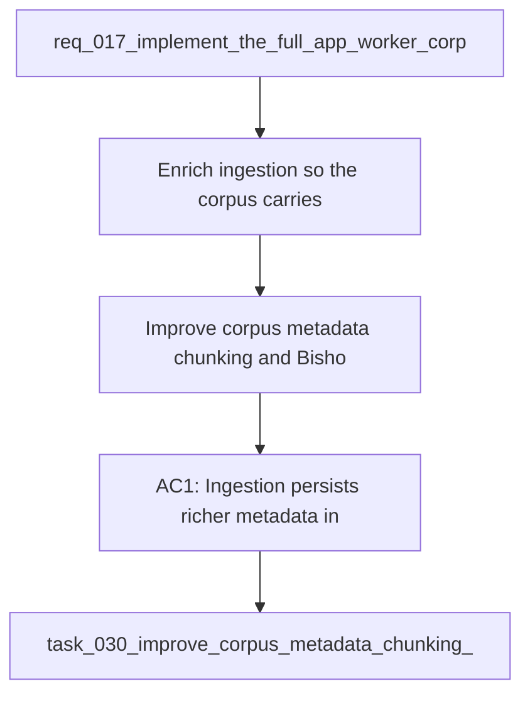

## item_062_improve_corpus_metadata_chunking_and_bishop_hints - Improve corpus metadata chunking and Bishop hints
> From version: 1.1.0
> Schema version: 1.0
> Status: Done
> Understanding: 100%
> Confidence: 100%
> Progress: 100%
> Complexity: Medium
> Theme: General
> Reminder: Update status/understanding/confidence/progress and linked request/task references when you edit this doc.
> Maintenance edit: refreshed Mermaid signature after workflow sync.

# Problem
- Enrich ingestion so the corpus carries enough structure and context to improve retrieval quality.
- Make Bishop hints less generic by using stronger metadata and chunk traceability.
- Preserve the permission-aware, local-first pipeline while improving corpus signals.

# Scope
- In: source metadata, section-aware chunking, retrieval signals, Bishop hint inputs, and test coverage for the quality improvements.
- Out: worker runtime changes, ops-shell layout, and theme polish.

# Acceptance criteria
- AC1: Ingestion persists richer metadata including source and structural context where available.
- AC2: Chunking preserves section or heading context so chunks remain traceable to the source passage.
- AC3: Retrieval relevance improves for short or vague questions when the corpus contains matching material.
- AC4: Bishop hints use the richer corpus signal and are less likely to fall back to generic advice.
- AC5: The new behavior is covered by tests for corpus loading, retrieval quality, and Bishop hint generation.

# AC Traceability
- AC1 -> Scope: Ingestion persists richer metadata including source and structural context where available.. Proof: capture validation evidence in this doc.
- AC2 -> Scope: Chunking preserves section or heading context so chunks remain traceable to the source passage.. Proof: capture validation evidence in this doc.
- AC3 -> Scope: Retrieval relevance improves for short or vague questions when the corpus contains matching material.. Proof: capture validation evidence in this doc.
- AC4 -> Scope: Bishop hints use the richer corpus signal and are less likely to fall back to generic advice.. Proof: capture validation evidence in this doc.
- AC5 -> Scope: The new behavior is covered by tests for corpus loading, retrieval quality, and Bishop hint generation.. Proof: capture validation evidence in this doc.

# Decision framing
- Product framing: Required
- Product signals: retrieval quality, experience scope
- Product follow-up: Keep the linked product brief aligned with the corpus quality plan.
- Architecture framing: Required
- Architecture signals: data model and persistence, state and sync, security and identity
- Architecture follow-up: Keep the linked architecture decision aligned with the corpus quality plan.

# Links
- Product brief(s): `logics/product/prod_006_improve_ingestion_metadata_and_chunking_for_bishop_hints.md`
- Architecture decision(s): `logics/architecture/adr_003_hybrid_knowledge_store_and_retrieval_model.md`, `logics/architecture/adr_016_deepvault_persistence_and_storage_layout.md`, `logics/architecture/adr_026_improve_ingestion_metadata_and_chunking_for_bishop_hints.md`
- Request: `req_017_implement_the_full_app_worker_corpus_and_shell_plan`
- Primary task(s): `task_030_improve_corpus_metadata_chunking_and_bishop_hints`
<!-- When creating a task from this file, add: Derived from `this file path` in the task # Links section -->

# AI Context
- Summary: Improve corpus metadata chunking and Bishop hints.
- Keywords: corpus, metadata, chunking, bishop, hints, retrieval, ranking
- Use when: Use when implementing or reviewing the corpus quality stream.
- Skip when: Skip when the change is unrelated to retrieval quality or hint generation.
# Priority
- Impact: High
- Urgency: High

# Notes
- Derived from request `req_017_implement_the_full_app_worker_corpus_and_shell_plan`.
