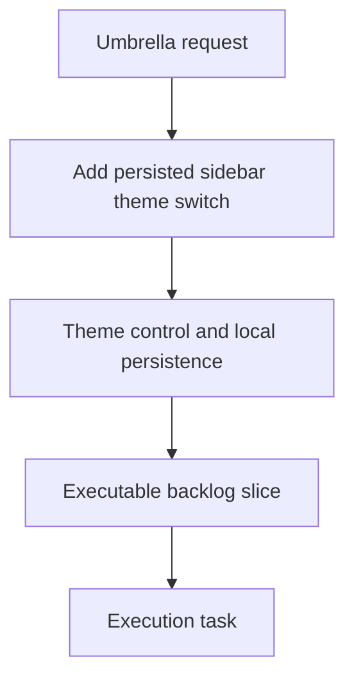

## item_063_add_persisted_sidebar_theme_switch - Add persisted sidebar theme switch
> From version: 1.1.0
> Schema version: 1.0
> Status: Ready
> Understanding: 94%
> Confidence: 90%
> Progress: 0%
> Complexity: Medium
> Theme: General
> Reminder: Update status/understanding/confidence/progress and linked request/task references when you edit this doc.

# Problem
- Add a discrete light/dark theme switch to the sidebar and persist the user's choice locally.
- Keep the control visually secondary so it does not compete with navigation.
- Apply the chosen theme consistently across the shell, panels, and modals.

# Scope
- In: sidebar placement, switch affordance, local persistence, root-level shell application, and reload behavior.
- Out: broader redesigns, extra color modes, and backend preference sync.

# Acceptance criteria
- AC1: The sidebar exposes a discrete light/dark theme control at the bottom of the menu.
- AC2: The control feels native, discreet, and visually refined.
- AC3: The selected theme is persisted locally and restored on reload.
- AC4: The theme applies consistently across the shell, panels, and modal surfaces.
- AC5: The change is clear enough to implement as a bounded backlog slice.

# AC Traceability
- AC1 -> Scope: The sidebar exposes a discrete light/dark theme control at the bottom of the menu.. Proof: capture validation evidence in this doc.
- AC2 -> Scope: The control feels native, discreet, and visually refined.. Proof: capture validation evidence in this doc.
- AC3 -> Scope: The selected theme is persisted locally and restored on reload.. Proof: capture validation evidence in this doc.
- AC4 -> Scope: The theme applies consistently across the shell, panels, and modal surfaces.. Proof: capture validation evidence in this doc.
- AC5 -> Scope: The change is clear enough to implement as a bounded backlog slice.. Proof: capture validation evidence in this doc.

# Decision framing
- Product framing: Required
- Product signals: navigation and discoverability, experience scope
- Product follow-up: Keep the linked product brief aligned with the sidebar theme plan.
- Architecture framing: Required
- Architecture signals: data model and persistence, state and sync
- Architecture follow-up: Keep the linked architecture decision aligned with the sidebar theme plan.

# Links
- Product brief(s): `logics/product/prod_007_add_a_discrete_light_and_dark_theme_switch_in_the_sidebar.md`
- Architecture decision(s): `logics/architecture/adr_025_add_a_discrete_light_and_dark_theme_switch_with_persisted_shell_mode.md`
- Request: `req_017_implement_the_full_app_worker_corpus_and_shell_plan`
- Primary task(s): `task_031_add_persisted_sidebar_theme_switch`
<!-- When creating a task from this file, add: Derived from `this file path` in the task # Links section -->

# AI Context
- Summary: Add persisted sidebar theme switch.
- Keywords: sidebar, theme, persistence, shell, light, dark, local preference
- Use when: Use when implementing or reviewing the theme and shell polish stream.
- Skip when: Skip when the change is unrelated to theme persistence or shell styling.
# Priority
- Impact: Medium
- Urgency: Medium

# Notes
- Derived from request `req_017_implement_the_full_app_worker_corpus_and_shell_plan`.
