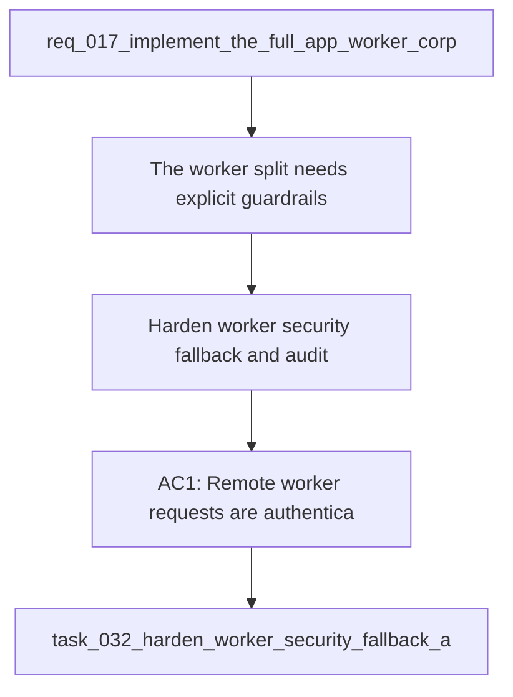

## item_064_harden_worker_security_fallback_and_audit_boundaries - Harden worker security, fallback, and audit boundaries
> From version: 1.1.0
> Schema version: 1.0
> Status: Ready
> Understanding: 94%
> Confidence: 92%
> Progress: 0%
> Complexity: High
> Theme: General
> Reminder: Update status, understanding, confidence, progress and linked request/task references when you edit this doc.

# Problem
- The worker split needs explicit guardrails for remote transport, fallback, and audit so the app can trust the published corpus and job history.
- The current implementation slice covers boundary and CLI parity, but it does not yet fully codify the operational safety model from ADR 023.
- Without those rules, remote-worker usage remains harder to reason about and harder to support during failure or version mismatch scenarios.

# Scope
- In: worker authentication and transport, explicit fallback states, version compatibility errors, audit metadata, retention and concurrency rules, and test coverage for failure and compatibility paths.
- Out: the worker boundary itself, CLI parity plumbing, ops-screen decomposition, theme polish, and corpus metadata enrichment.

# Acceptance criteria
- AC1: Remote worker requests are authenticated and reject unauthenticated or incompatible calls.
- AC2: App fallback states are explicit for reachable, unreachable, and incompatible worker or corpus conditions.
- AC3: Job and manifest records include launched-by, client, and effective-config details needed for audit.
- AC4: Concurrency and retention rules are codified instead of implied.
- AC5: Tests cover remote failure, compatibility, and fallback behavior.

# AC Traceability
- AC1 -> Scope: Remote worker requests are authenticated and reject unauthenticated or incompatible calls.. Proof: capture validation evidence in this doc.
- AC2 -> Scope: App fallback states are explicit for reachable, unreachable, and incompatible worker or corpus conditions.. Proof: capture validation evidence in this doc.
- AC3 -> Scope: Job and manifest records include launched-by, client, and effective-config details needed for audit.. Proof: capture validation evidence in this doc.
- AC4 -> Scope: Concurrency and retention rules are codified instead of implied.. Proof: capture validation evidence in this doc.
- AC5 -> Scope: Tests cover remote failure, compatibility, and fallback behavior.. Proof: capture validation evidence in this doc.

# Decision framing
- Product framing: Required
- Product signals: operational clarity, execution parity, security and trust
- Product follow-up: Keep the linked product brief aligned with the worker safety and fallback plan.
- Architecture framing: Required
- Architecture signals: runtime and boundaries, data model and persistence, security and identity
- Architecture follow-up: Keep the linked architecture decision aligned with the worker safety and fallback plan.

# Links
- Product brief(s): `logics/product/prod_008_make_ingestion_and_live_export_operable_across_app_and_cli.md`
- Architecture decision(s): `logics/architecture/adr_023_split_execution_runtime_from_the_app_and_share_corpus_artifacts.md`
- Request: `req_017_implement_the_full_app_worker_corpus_and_shell_plan`
- Derived from: `logics/request/req_017_implement_the_full_app_worker_corpus_and_shell_plan.md`

# AI Context
- Summary: Harden worker security, fallback, and audit boundaries.
- Keywords: worker, security, fallback, audit, retention, compatibility, remote worker
- Use when: Use when implementing or reviewing the remaining worker safety guardrails.
- Skip when: Skip when the change is unrelated to worker transport or fallback behavior.
# Priority
- Impact: High
- Urgency: High

# Notes
- Follow-up slice from the worker boundary plan and ADR 023.

# Links
- Primary task(s): `task_032_harden_worker_security_fallback_and_audit_boundaries`
