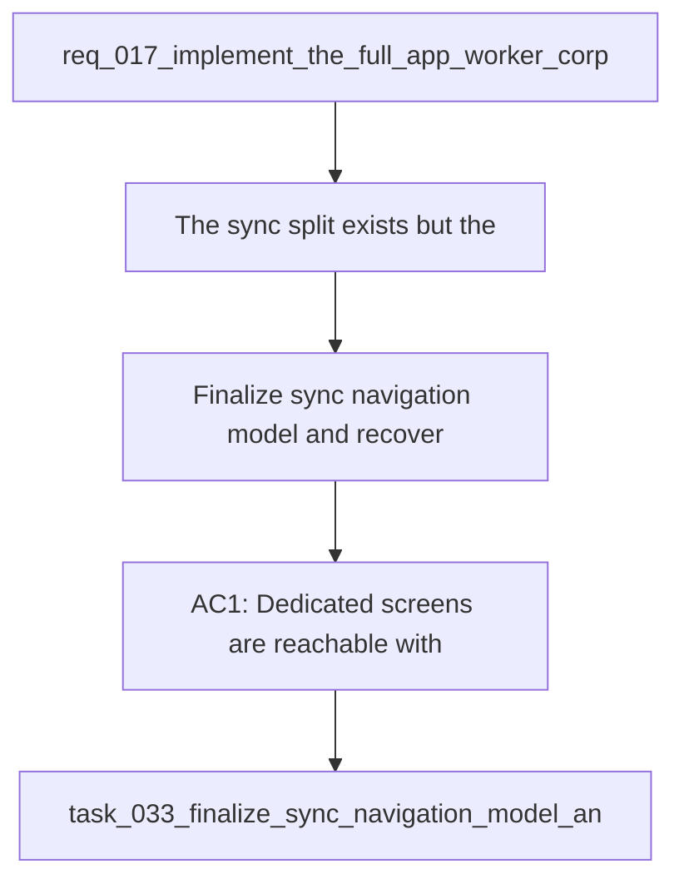

## item_065_finalize_sync_navigation_model_and_recovery_entry_points - Finalize sync navigation model and recovery entry points
> From version: 1.1.0
> Schema version: 1.0
> Status: Ready
> Understanding: 92%
> Confidence: 90%
> Progress: 0%
> Complexity: Medium
> Theme: General
> Reminder: Update status, understanding, confidence, progress and linked request/task references when you edit this doc.

# Problem
- The sync split exists, but the exact navigation model, recovery entry points, and deep-link behavior still need to be locked down so the experience does not feel fragmented.
- Operators need a clear way to move between summary, operations, history, config, and recovery without relearning the app each time.
- The product brief still leaves the first-iteration navigation shape open enough that the implementation could drift.

# Scope
- In: route, tab, or nested-panel selection; deep links and shortcuts; summary-to-detail handoff; recovery guidance; and keyboard navigation coverage.
- Out: worker protocol changes, corpus schema changes, and unrelated shell theme work.

# Acceptance criteria
- AC1: Dedicated screens are reachable with stable labels and a single obvious default path.
- AC2: Deep links or equivalent shortcuts preserve the current summary or operation context.
- AC3: Recovery guidance is reachable from the operational flow without hunting through the UI.
- AC4: Keyboard navigation and small-screen behavior remain usable after the model is finalized.
- AC5: Tests cover the summary-to-detail handoff and the navigation labels.

# AC Traceability
- AC1 -> Scope: Dedicated screens are reachable with stable labels and a single obvious default path.. Proof: capture validation evidence in this doc.
- AC2 -> Scope: Deep links or equivalent shortcuts preserve the current summary or operation context.. Proof: capture validation evidence in this doc.
- AC3 -> Scope: Recovery guidance is reachable from the operational flow without hunting through the UI.. Proof: capture validation evidence in this doc.
- AC4 -> Scope: Keyboard navigation and small-screen behavior remain usable after the model is finalized.. Proof: capture validation evidence in this doc.
- AC5 -> Scope: Tests cover the summary-to-detail handoff and the navigation labels.. Proof: capture validation evidence in this doc.

# Decision framing
- Product framing: Required
- Product signals: navigation and discoverability, operational clarity
- Product follow-up: Keep the linked product brief aligned with the navigation and recovery model.
- Architecture framing: Required
- Architecture signals: state and sync, app shell structure
- Architecture follow-up: Keep the linked architecture decision aligned with the navigation and recovery model.

# Links
- Product brief(s): `logics/product/prod_005_split_sync_status_into_dedicated_operations_screens.md`
- Architecture decision(s): `logics/architecture/adr_024_split_sync_status_into_dedicated_operations_screens.md`
- Request: `req_017_implement_the_full_app_worker_corpus_and_shell_plan`
- Derived from: `logics/request/req_017_implement_the_full_app_worker_corpus_and_shell_plan.md`

# AI Context
- Summary: Finalize sync navigation model and recovery entry points.
- Keywords: sync status, navigation, recovery, deep link, operations, history, config
- Use when: Use when implementing or reviewing the residual sync navigation follow-up.
- Skip when: Skip when the change is unrelated to sync screen routing or recovery access.
# Priority
- Impact: Medium
- Urgency: Medium

# Notes
- Follow-up slice from the sync status split and ADR 024.

# Links
- Primary task(s): `task_033_finalize_sync_navigation_model_and_recovery_entry_points`
