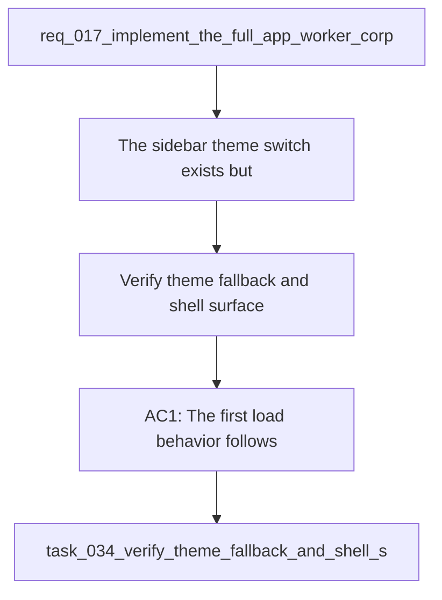

## item_066_verify_theme_fallback_and_shell_surface_coverage - Verify theme fallback and shell surface coverage
> From version: 1.1.0
> Schema version: 1.0
> Status: Done
> Understanding: 95%
> Confidence: 93%
> Progress: 100%
> Complexity: Medium
> Theme: General
> Reminder: Update status, understanding, confidence, progress and linked request/task references when you edit this doc.
> Maintenance edit: follow-up slice delivered and linked task completed.

# Problem
- The sidebar theme switch exists, but the fallback rule and shell-wide surface coverage still need explicit verification so the behavior stays predictable.
- The open product and ADR questions leave room for the control to drift between system-driven and user-driven behavior.
- If modal and panel surfaces do not consume the same tokens, the theme will feel inconsistent even when the switch works.

# Scope
- In: first-load fallback behavior, persisted preference precedence, surface-token coverage for panels and modals, accessibility checks, and regression tests.
- Out: broader visual redesigns, additional color modes, and backend preference storage.

# Acceptance criteria
- AC1: The first load behavior follows the intended system or persisted preference fallback rule.
- AC2: Once the user chooses a mode, the persisted preference becomes authoritative on reload.
- AC3: Shell tokens cover panels, modals, and navigation surfaces consistently.
- AC4: Accessibility and keyboard interaction remain intact for the theme control.
- AC5: Tests cover reload persistence and shell-wide application of the selected theme.

# AC Traceability
- AC1 -> Scope: The first load behavior follows the intended system or persisted preference fallback rule.. Proof: capture validation evidence in this doc.
- AC2 -> Scope: Once the user chooses a mode, the persisted preference becomes authoritative on reload.. Proof: capture validation evidence in this doc.
- AC3 -> Scope: Shell tokens cover panels, modals, and navigation surfaces consistently.. Proof: capture validation evidence in this doc.
- AC4 -> Scope: Accessibility and keyboard interaction remain intact for the theme control.. Proof: capture validation evidence in this doc.
- AC5 -> Scope: Tests cover reload persistence and shell-wide application of the selected theme.. Proof: capture validation evidence in this doc.

# Decision framing
- Product framing: Required
- Product signals: navigation and discoverability, shell polish
- Product follow-up: Keep the linked product brief aligned with the persisted theme behavior.
- Architecture framing: Required
- Architecture signals: data model and persistence, state and sync
- Architecture follow-up: Keep the linked architecture decision aligned with the persisted theme behavior.

# Links
- Product brief(s): `logics/product/prod_007_add_a_discrete_light_and_dark_theme_switch_in_the_sidebar.md`
- Architecture decision(s): `logics/architecture/adr_025_add_a_discrete_light_and_dark_theme_switch_with_persisted_shell_mode.md`
- Request: `req_017_implement_the_full_app_worker_corpus_and_shell_plan`
- Derived from: `logics/request/req_017_implement_the_full_app_worker_corpus_and_shell_plan.md`

# AI Context
- Summary: Verify theme fallback and shell surface coverage.
- Keywords: theme, persistence, fallback, shell, panels, modals, accessibility
- Use when: Use when implementing or reviewing the remaining theme follow-up.
- Skip when: Skip when the change is unrelated to shell appearance persistence.
# Priority
- Impact: Medium
- Urgency: Medium

# Notes
- Follow-up slice from the persisted sidebar theme plan and ADR 025.

# Links
- Primary task(s): `task_034_verify_theme_fallback_and_shell_surface_coverage`
