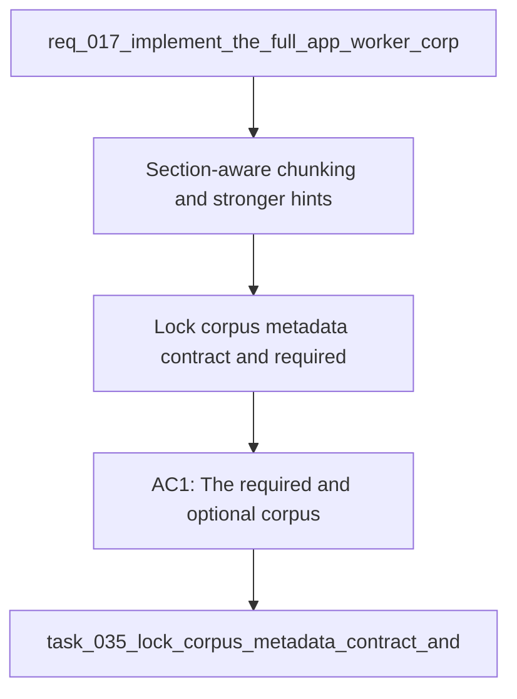

## item_067_lock_corpus_metadata_contract_and_required_fields - Lock corpus metadata contract and required fields
> From version: 1.1.0
> Schema version: 1.0
> Status: Ready
> Understanding: 93%
> Confidence: 91%
> Progress: 0%
> Complexity: Medium
> Theme: General
> Reminder: Update status, understanding, confidence, progress and linked request/task references when you edit this doc.

# Problem
- Section-aware chunking and stronger hints exist, but the corpus contract still needs a clear line between required metadata and optional extensions so future ingestion changes stay stable.
- The open product question around mandatory structural fields could otherwise lead to drift between documents, scoring, and hint generation.
- A stable contract is needed before the next round of corpus changes expands the shape further.

# Scope
- In: required vs optional corpus metadata fields, schema-version expectations, retrieval signal contract, and tests that lock the document loading and hinting behavior.
- Out: worker boundary changes, UI shell work, and unrelated sync or theme features.

# Acceptance criteria
- AC1: The required and optional corpus metadata fields are explicitly documented and validated.
- AC2: The schema and loading rules enforce the contract without breaking existing corpus content.
- AC3: Retrieval and Bishop hint generation continue to consume the same signal contract across documents.
- AC4: Tests cover corpus loading, signal extraction, and hint generation against the locked contract.

# AC Traceability
- AC1 -> Scope: The required and optional corpus metadata fields are explicitly documented and validated.. Proof: capture validation evidence in this doc.
- AC2 -> Scope: The schema and loading rules enforce the contract without breaking existing corpus content.. Proof: capture validation evidence in this doc.
- AC3 -> Scope: Retrieval and Bishop hint generation continue to consume the same signal contract across documents.. Proof: capture validation evidence in this doc.
- AC4 -> Scope: Tests cover corpus loading, signal extraction, and hint generation against the locked contract.. Proof: capture validation evidence in this doc.

# Decision framing
- Product framing: Required
- Product signals: retrieval quality, experience scope
- Product follow-up: Keep the linked product brief aligned with the corpus metadata contract.
- Architecture framing: Required
- Architecture signals: data model and persistence, state and sync
- Architecture follow-up: Keep the linked architecture decision aligned with the corpus metadata contract.

# Links
- Product brief(s): `logics/product/prod_006_improve_ingestion_metadata_and_chunking_for_bishop_hints.md`
- Architecture decision(s): `logics/architecture/adr_026_improve_ingestion_metadata_and_chunking_for_bishop_hints.md`
- Request: `req_017_implement_the_full_app_worker_corpus_and_shell_plan`
- Derived from: `logics/request/req_017_implement_the_full_app_worker_corpus_and_shell_plan.md`

# AI Context
- Summary: Lock corpus metadata contract and required fields.
- Keywords: corpus, metadata, schema, retrieval, hints, validation, contract
- Use when: Use when implementing or reviewing the remaining corpus contract follow-up.
- Skip when: Skip when the change is unrelated to corpus metadata shape.
# Priority
- Impact: Medium
- Urgency: Medium

# Notes
- Follow-up slice from the corpus quality plan and ADR 026.

# Links
- Primary task(s): `task_035_lock_corpus_metadata_contract_and_required_fields`
