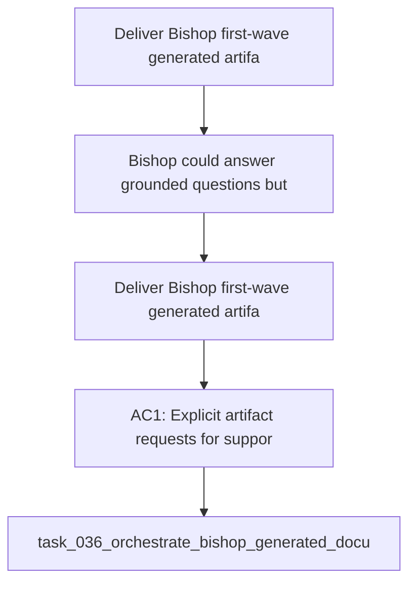

## item_068_deliver_bishop_first_wave_generated_artifact_contract - Deliver Bishop first-wave generated artifact contract
> From version: 1.3.0
> Schema version: 1.0
> Status: Done
> Understanding: 96%
> Confidence: 94%
> Progress: 100%
> Complexity: Medium
> Theme: Product / Architecture
> Reminder: Update status, understanding, confidence, progress and linked request/task references when you edit this doc.
> Maintenance edit: first-wave artifact contract shipped in app and tests.

# Problem
- Bishop could answer grounded questions, but it could not hand back a downloadable file inside the current chat turn.
- Users asking for a `.txt`, `.md`, `.json`, or `.csv` deliverable hit a copy-paste dead-end that made the assistant feel artificially constrained.
- The response contract also lacked a stable way to distinguish a ready artifact, an unsupported format, and an invalid artifact payload.

# Scope
- In: explicit artifact intent detection, bounded first-wave formats (`.txt`, `.md`, `.json`, `.csv`), visible `Download` actions in Bishop, trace-panel artifact state, and focused validation coverage.
- Out: worker-backed rich formats, arbitrary filesystem writes, binary office file generation, and background artifact persistence.

# Acceptance criteria
- AC1: Explicit artifact requests for supported text-like formats return a downloadable artifact in the same Bishop turn.
- AC2: Artifact-bearing answers keep a normal Bishop text response and do not collapse into file-only output.
- AC3: The Bishop message header exposes `Download` before the confidence and improvement pills when an artifact is ready.
- AC4: The right-side trace panel exposes a dedicated `Artifact` row under `Confidence`, with explicit unsupported or failure states when needed.
- AC5: Tests cover supported artifact packaging, answer-only behavior, unsupported formats, malformed remote payloads, and download affordances.

# AC Traceability
- AC1 -> Scope: Explicit artifact requests for supported text-like formats return a downloadable artifact in the same Bishop turn.. Proof: capture validation evidence in this doc.
- AC2 -> Scope: Artifact-bearing answers keep a normal Bishop text response and do not collapse into file-only output.. Proof: capture validation evidence in this doc.
- AC3 -> Scope: The Bishop message header exposes `Download` before the confidence and improvement pills when an artifact is ready.. Proof: capture validation evidence in this doc.
- AC4 -> Scope: The right-side trace panel exposes a dedicated `Artifact` row under `Confidence`, with explicit unsupported or failure states when needed.. Proof: capture validation evidence in this doc.
- AC5 -> Scope: Tests cover supported artifact packaging, answer-only behavior, unsupported formats, malformed remote payloads, and download affordances.. Proof: capture validation evidence in this doc.

# Decision framing
- Product framing: Required
- Product signals: user completion, friction removal, discoverable download controls
- Product follow-up: Keep richer or larger document formats behind an explicit worker-boundary follow-up.
- Architecture framing: Required
- Architecture signals: response contract stability, browser download path, worker escalation boundary
- Architecture follow-up: Keep the artifact response contract and richer-format boundary aligned with the linked ADR and spec.

# Links
- Product brief(s): `logics/product/prod_009_enable_bishop_generated_document_artifacts.md`
- Architecture decision(s): `logics/architecture/adr_028_bound_bishop_generated_artifact_response_and_download_contract.md`
- Specification(s): `logics/specs/spec_007_bishop_generated_artifact_response_and_download_contract.md`
- Request: (none yet)
- Derived from: `logics/product/prod_009_enable_bishop_generated_document_artifacts.md`

# AI Context
- Summary: Deliver Bishop first-wave generated artifact contract.
- Keywords: bishop, artifact, download, response contract, traceability, first wave
- Use when: Use when reviewing or extending the first shipped Bishop artifact path.
- Skip when: Skip when the work is unrelated to Bishop-generated downloads.

# Priority
- Impact: Medium
- Urgency: Medium

# Notes
- The shipped app packages the final grounded answer into a bounded local artifact for supported formats.
- Artifact packaging trims obvious chat wrapper prose so downloads keep the requested payload instead of copy-paste instructions.
- Artifact-bearing turns normalize file-only model replies back into a conversational Bishop message in chat.
- Unsupported formats surface an explicit notice instead of a broken download control.
- Richer document formats remain follow-up work behind the worker boundary.

# Validation evidence
- `rtk npm run test -- tests/bishop.spec.ts tests/app-ui.spec.tsx tests/bishop-panel.spec.tsx tests/use-bishop-conversation.spec.tsx tests/file-download.spec.ts`
- `rtk npm run typecheck`

# Links
- Primary task(s): `task_036_orchestrate_bishop_generated_document_artifacts`
