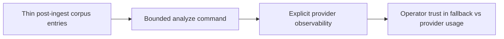

## item_069_ship_bounded_post_ingest_analysis_command - Ship bounded post-ingest analysis command
> From version: 1.3.2
> Schema version: 1.0
> Status: Done
> Understanding: 98%
> Confidence: 95%
> Progress: 100%
> Complexity: Medium
> Theme: Product / Architecture
> Reminder: Update status, understanding, confidence, progress, and linked request/task references whenever delivery observability or validation evidence changes.

# Problem

- Ingest stayed deterministic, but difficult files still lacked an additive post-processing path that could enrich summaries, structure, and diagnostics without mutating the baseline contract.
- Operators needed a separate command with explicit selection, exclusion, and output states so corpus enrichment could be run intentionally after ingest.

# Scope
- In: a dedicated `npm run analyze` command, additive `document.analysis` blocks, deterministic selection/exclusion rules, and analysis-aware retrieval fallbacks.
- In: a bounded derived output file under `data/runtime/analyzed-corpus.json`.
- Out: mandatory remote-provider execution for every run, broad UI automation, or replacing raw corpus evidence with analyzed prose.

# Acceptance criteria
- AC1: A standalone analysis command reads an existing corpus and writes additive analysis state.
- AC2: Documents expose explicit `analyzed`, `excluded`, and `stale` states with persisted reasons.
- AC3: Retrieval and source previews can prefer the additive analysis summary/sections when fresh.
- AC4: Baseline corpus behavior remains available when analysis is absent.

# Links
- Product brief(s): `logics/product/prod_010_add_a_post_ingest_ai_analysis_command_for_corpus_enrichment.md`
- Architecture decision(s): `logics/architecture/adr_029_bound_post_ingest_analysis_contract_and_runtime_output.md`
- Task(s): `logics/tasks/task_037_orchestrate_post_ingest_ai_analysis_command_for_corpus_enrichment.md`

# Validation evidence
- `rtk npm run typecheck`
- `rtk npm run check`

# Delivery update
- `npm run analyze` now emits both `data/runtime/analyzed-corpus.json` and `data/runtime/analyze-report.json`.
- The run report includes bounded operability metrics for `selected`, `analyzed`, `excluded`, `failed`, `reused`, `stale`, plus heuristic token and cost estimates.
- `analyzeCorpusDocuments()` is now async with a real provider-backed path: pass `--provider anthropic|openai|gemini` and the matching env API key to get structured AI analysis (summary, keywords, sections, documentType, confidence) per candidate document, with guaranteed heuristic fallback if the call fails or the key is absent.
- `analyze-report.json` now includes `actualInputTokens`, `actualOutputTokens`, and `tokenCountMode: 'actual' | 'estimated'` — operators can see whether the token figures come from real API responses or per-document estimates.
- The OpenAI analyze integration now calls `v1/responses` and records detailed provider error messages inside `fallbackReason`, so `http_400` runs can be diagnosed without guessing at the payload mismatch.
- The analysis output now separates requested provider intent from actual execution: remote success keeps the real provider, while fallback writes `provider: local`, preserves `requestedProvider`, and stores a concrete `fallbackReason`.
- The run report now also exposes `providerAttempts`, `providerSuccesses`, `providerFallbacks`, and grouped `providerFailureReasons` so provider usage is observable instead of inferred.
- The CLI now logs periodic progress and elapsed-time checkpoints during analyze runs, reducing ambiguity when a 200-document provider-backed batch is still legitimately working.
- Successful analyze runs with actual provider tokens now append a deduplicated local AI usage event, so the AI stats panel reflects analysis token consumption too.
- Wave 4 validation set: 9 behavioral tests covering all exclusion types, selection reasons, budget cap, cross-run reuse, and token reporting mode. All ACs covered.
